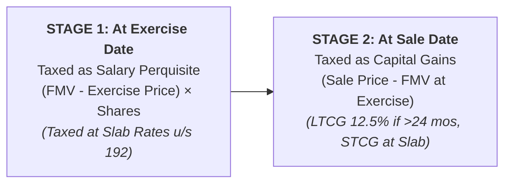

# NRI Tax Laws, DTAA Tax Credit, Foreign Assets, and ESOP/RSU Taxation

## 1. Statutory Residential Status Tests (Section 6)

An individual is an **INDIAN RESIDENT** in FY 2026-27 if they satisfy **ANY ONE** of the following basic conditions:

* **Condition A**: Physical presence in India for **182 days or more** during the financial year.
* **Condition B**: Physical presence in India for **60 days or more** during the FY **AND** **365 days or more** during the preceding 4 financial years.

> [!NOTE]
> - **Statutory Exception for Employment Abroad**: For Indian citizens or Persons of Indian Origin (PIO) leaving India for employment abroad, the 60-day threshold in Condition B is extended to **182 days**.
> - **Deemed Resident (Section 6(1A))**: An Indian citizen having total Indian-sourced income > ₹15 Lakhs is deemed resident in India if they are not liable to tax in any other country by reason of domicile/residence.

---

## 2. NRI Taxability & Double Taxation Relief (DTAA & Form 67)

### Scope of Taxable Income for NRI
* **Taxable in India**: Income accruing, arising, or received in India (NRO interest, Indian rental income, capital gains from Indian shares/property).
* **EXEMPT from Indian Tax**: Foreign salary, foreign business income, and foreign investment returns.

### Double Taxation Avoidance Agreement (DTAA - Section 90/91)
* If tax has been withheld or paid in a foreign country (US, UK, UAE, Singapore, Germany, Canada), the taxpayer can claim **Foreign Tax Credit (FTC)** in India.

> [!IMPORTANT]
> **Mandatory Compliance (Form 67)**: Form 67 **MUST** be electronically filed on the Income Tax e-filing portal on or before the due date of filing ITR under Section 139(1) along with foreign tax payment proof.

---

## 3. ESOP and RSU Taxation Laws for Salaried Employees

Employee Stock Options (ESOPs) and Restricted Stock Units (RSUs) are taxed at **TWO DISTINCT STAGES**:

### Stage 1: At the Time of Exercise / Vesting (Taxed as Salary Perquisite)
* **Perquisite Value** = $(\text{Fair Market Value on Exercise Date} - \text{Exercise Price}) \times \text{Number of Shares}$.
* **Tax Rate**: Added to gross salary and taxed at applicable slab rate (Old or New regime).
* **Employer TDS**: Employer deducts TDS under Section 192 on perquisite value.

### Stage 2: At the Time of Sale / Transfer (Taxed as Capital Gains)
* **Capital Gain** = $\text{Sale Price} - \text{Fair Market Value on Exercise Date}$.
* **Foreign RSUs / US Stocks (e.g. Alphabet, Microsoft, Amazon shares)**:
  - Holding Period > 24 months = **Long-Term Capital Gain (LTCG)** taxed at **12.5%** without indexation.
  - Holding Period $\le$ 24 months = **Short-Term Capital Gain (STCG)** taxed at slab rates.

> [!CAUTION]
> **Mandatory Schedule FA Reporting**: Resident taxpayers holding US stocks/RSUs **MUST** report foreign accounts, shares, and custodial assets in **SCHEDULE FA** of ITR-2 / ITR-3! Failure attracts ₹10 Lakh penalty under the Black Money Act.
