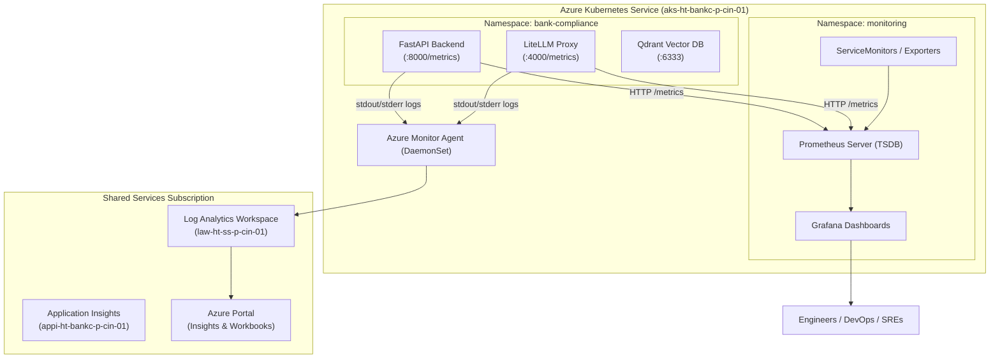

# Comprehensive Guide: AKS Hybrid Observability (Azure Container Insights + Prometheus & Grafana)

## 1. Architecture Overview

This enterprise repository implements the **Hybrid Observability Pattern** for Azure Kubernetes Service (`aks-ht-bankc-p-cin-01`). Instead of choosing between Azure-native tools or open-source tooling, we leverage **both** for their distinct strengths at **near-zero cost**:



---

## 2. Division of Responsibilities

| Observability Pillar | Option 1: Azure Container Insights (Native) | Option 2: Prometheus + Grafana (Self-Hosted) |
| :--- | :--- | :--- |
| **Primary Focus** | Centralized Logs, Platform Audit, Azure Security | Real-time Metrics, Custom AI/LLM Dashboards |
| **Data Ingestion** | Pod `stdout`/`stderr`, K8s events, Node OS logs | Numerical time-series metrics via HTTP `/metrics` |
| **Query Language** | **KQL** (Kusto Query Language) | **PromQL** (Prometheus Query Language) |
| **Visualization** | Azure Portal (Insights tab, Azure Workbooks) | Grafana Web Dashboards (`http://localhost:3000`) |
| **Alerting** | Azure Monitor Action Groups (Email/SMS/Webhooks) | Alertmanager (Slack/PagerDuty/Webhooks) |
| **Cost** | **$0 extra** (within 5 GB/month free Log Analytics tier) | **$0 software license** (runs on existing worker nodes) |

---

## 3. Option 1: Azure Container Insights Setup & KQL Queries

### A. Terraform Configuration
Container Insights is enabled via the `oms_agent` block in [main.tf](file:///c:/Users/RichT/OneDrive/Documents/Repos/terraform-azure-iac/workloads/bank-compliance-ai-aks/main.tf):

```hcl
resource "azurerm_kubernetes_cluster" "bank_compliance" {
  name = module.bankc_aks_name.name
  # ...
  oms_agent {
    log_analytics_workspace_id      = data.azurerm_log_analytics_workspace.shared.id
    msi_auth_for_monitoring_enabled = true
  }
}

resource "azurerm_monitor_diagnostic_setting" "aks_diagnostics" {
  name                       = "diag-${module.bankc_aks_name.name}"
  target_resource_id         = azurerm_kubernetes_cluster.bank_compliance.id
  log_analytics_workspace_id = data.azurerm_log_analytics_workspace.shared.id

  enabled_log { category = "kube-apiserver" }
  enabled_log { category = "kube-audit-admin" }
  enabled_log { category = "kube-controller-manager" }
  enabled_log { category = "cluster-autoscaler" }
  metric      { category = "AllMetrics" }
}
```

### B. Viewing in Azure Portal
1. Navigate to **Azure Portal** $\rightarrow$ **Kubernetes services** $\rightarrow$ `aks-ht-bankc-p-cin-01`.
2. Select **Insights** under the *Monitoring* section.
3. Access tabs:
   * **Cluster:** Overview of node CPU and memory utilization.
   * **Nodes:** Health status of the VM scale set instances.
   * **Controllers:** Real-time container restarts and pod execution status.
   * **Containers:** Detailed logs and status per container.

### C. Curated KQL Queries (Log Analytics)

Run these queries in **Log Analytics Workspace** (`law-ht-ss-p-cin-01`):

#### 1. Find Application Errors & Exceptions (500s / Exceptions):
```kql
ContainerLogV2
| where TimeGenerated > ago(1h)
| where PodNamespace == "bank-compliance"
| where LogMessage has "error" or LogMessage has "exception" or LogMessage has "500"
| project TimeGenerated, PodName, ContainerName, LogMessage
| order by TimeGenerated desc
```

#### 2. Detect OOMKilled or Crashing Pods:
```kql
KubePodInventory
| where TimeGenerated > ago(24h)
| where Namespace == "bank-compliance"
| where PodStatus in ("Failed", "CrashLoopBackOff", "Terminating") or ContainerStatusReason == "OOMKilled"
| summarize RestartCount = max(ContainerRestartCount) by PodName, ContainerStatusReason, bin(TimeGenerated, 1h)
| order by TimeGenerated desc
```

#### 3. Pod CPU & Memory Consumption Breakdown:
```kql
Perf
| where TimeGenerated > ago(1h)
| where ObjectName == "K8SContainer"
| where CounterName in ("cpuUsageNanoCores", "memoryWorkingSetBytes")
| summarize AvgValue = avg(CounterValue) by InstanceName, CounterName, bin(TimeGenerated, 5m)
| render timechart
```

---

## 4. Option 2: Self-Hosted Prometheus + Grafana Setup & Dashboard Access

### A. Quick Deployment (1-Click)

The repository provides automated deployment scripts in [`app/bank-compliance/k8s/monitoring/`](file:///c:/Users/RichT/OneDrive/Documents/Repos/terraform-azure-iac/app/bank-compliance/k8s/monitoring/):

#### On Windows (PowerShell):
```powershell
# Authenticate with AKS
az aks get-credentials --resource-group rg-ht-bankc-p-cin-01 --name aks-ht-bankc-p-cin-01

# Run deployment script
.\app\bank-compliance\k8s\monitoring\deploy-monitoring.ps1
```

#### On Linux / macOS / Bash:
```bash
az aks get-credentials --resource-group rg-ht-bankc-p-cin-01 --name aks-ht-bankc-p-cin-01
chmod +x app/bank-compliance/k8s/monitoring/deploy-monitoring.sh
./app/bank-compliance/k8s/monitoring/deploy-monitoring.sh
```

---

### B. Opening and Viewing Dashboards

#### 1. Open Grafana:
```powershell
kubectl port-forward svc/monitoring-grafana 3000:80 -n monitoring
```
* **URL:** `http://localhost:3000`
* **Username:** `admin`
* **Password:** `AdminSecurePassword123!` *(configured in values.yaml)*

#### 2. Open Prometheus Query & Targets UI:
```powershell
kubectl port-forward svc/monitoring-kube-prometheus-prometheus 9090:9090 -n monitoring
```
* **URL:** `http://localhost:9090`
* Check scraped endpoints: Go to **Status** $\rightarrow$ **Targets**.

---

### C. Built-in Grafana Dashboards Included

Once inside Grafana, click **Dashboards** $\rightarrow$ **Browse** to open pre-loaded dashboards:

| Dashboard Name | Purpose | Key Metrics |
| :--- | :--- | :--- |
| **Kubernetes / Compute Resources / Cluster** | Cluster-wide utilization | Total CPU/RAM committed vs capacity |
| **Kubernetes / Compute Resources / Namespace (Pods)** | Resource consumption per namespace | Pod CPU limits, memory working sets, network I/O |
| **Kubernetes / Compute Resources / Pod** | Single pod drill-down | Container restarts, throttling, memory RSS |
| **Node Exporter / Use Method / Node** | VM hardware health | Disk IOPS, filesystem storage usage, OS load |

---

## 5. Custom AI / LLM Observability with PromQL

The AI app pods ([`bankc-backend`](file:///c:/Users/RichT/OneDrive/Documents/Repos/terraform-azure-iac/app/bank-compliance/k8s/backend-deployment.yaml) and [`litellm-proxy`](file:///c:/Users/RichT/OneDrive/Documents/Repos/terraform-azure-iac/app/bank-compliance/k8s/litellm/deployment.yaml)) are annotated and monitored by Prometheus.

### Curated PromQL Cheatsheet

#### 1. Request Rate per Second (RPS) on FastAPI Backend:
```promql
sum(rate(http_requests_total{app="bankc-backend"}[2m])) by (handler, status)
```

#### 2. LiteLLM Proxy Request Latency (95th Percentile):
```promql
histogram_quantile(0.95, sum(rate(litellm_request_duration_seconds_bucket[5m])) by (le, model))
```

#### 3. Total LLM Token Consumption Rate (Input + Output Tokens):
```promql
sum(rate(litellm_tokens_total[5m])) by (model, token_type)
```

#### 4. Pod Memory Usage vs Limit Percentage:
```promql
sum(container_memory_working_set_bytes{namespace="bank-compliance", container!=""}) by (pod)
/ 
sum(container_spec_memory_limit_bytes{namespace="bank-compliance", container!=""}) by (pod) * 100
```

#### 5. Pod CPU Throttling Rate:
```promql
sum(rate(container_cpu_cfs_throttled_periods_total{namespace="bank-compliance"}[5m])) by (pod)
/ 
sum(rate(container_cpu_cfs_periods_total{namespace="bank-compliance"}[5m])) by (pod) * 100
```

---

## 6. Resource Footprint & Cost Breakdown

| Component | CPU Request | RAM Request | Storage | Azure Cost Impact |
| :--- | :--- | :--- | :--- | :--- |
| **Azure Monitor Agent (AMA)** | ~20m | ~100Mi | None (Ephemeral) | Free ingestion under 5GB/mo |
| **Prometheus Server** | 100m | 256Mi | 5GB Managed CSI | ~$0.50/month for 5GB disk |
| **Grafana Server** | 50m | 128Mi | 2GB Managed CSI | ~$0.20/month for 2GB disk |
| **Node Exporter + Kube-State** | 20m | 64Mi | None | $0 |
| **Total Overhead** | **~190m CPU** | **~548Mi RAM** | **7GB Disk** | **< $1.00 / month total** |

---

## 7. Troubleshooting & FAQ

### Q1: How do I verify Prometheus is scraping the backend and LiteLLM?
Open Prometheus UI at `http://localhost:9090/targets`. Verify that:
* `serviceMonitor/bank-compliance/bankc-backend-monitor` shows state **UP (1/1)**.
* `serviceMonitor/bank-compliance/litellm-proxy-monitor` shows state **UP (1/1)**.

### Q2: What if I forget the Grafana password?
Reset it dynamically with `kubectl`:
```powershell
kubectl exec -it deployment/monitoring-grafana -n monitoring -c grafana -- grafana-cli admin reset-admin-password "NewSecurePassword123!"
```

### Q3: How do I cleanly uninstall Prometheus and Grafana?
```powershell
helm uninstall monitoring -n monitoring
kubectl delete namespace monitoring
```
