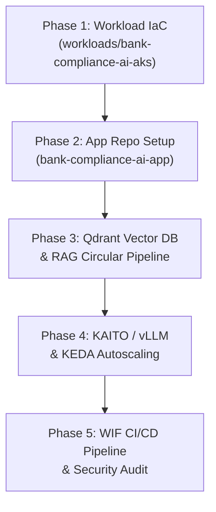

# Banking Regulatory Compliance AI Copilot (`bank-compliance-ai`) Architecture & Implementation Plan

This document outlines the architecture, repository separation pattern, infrastructure layout, and implementation roadmap for **BankCompliance AI** — a Cloud-Native, AI-Powered Banking Regulatory & Compliance Copilot built on **Azure Kubernetes Service (AKS)**.

---

## 🎯 Executive Overview & Problem Statement

Global banks (such as JPMorgan Chase, HDFC Bank, HSBC, and Citi) process thousands of pages of central bank circulars, regulatory guidelines (RBI / SEC / Basel III), and compliance updates. Compliance officers and branch managers require immediate, accurate, and fully auditable answers to operational questions without risking PII data leaks or sending sensitive corporate context to unvetted third-party services.

**BankCompliance AI** provides an enterprise-grade solution featuring:
1. **Self-Hosted Vector Search (Qdrant on AKS)**: Fast, private HNSW vector search over thousands of regulatory circulars.
2. **AI Model Serving on AKS (vLLM / KAITO Operator)**: High-throughput open-source SLMs (`Phi-3-mini` / `Llama-3`) running locally inside Kubernetes pods.
3. **Strict AI Security & PII Shield**: Azure AI Content Safety (`F0` SKU) + PII Masking Engine (auto-redacting PAN cards, Aadhaar numbers, and bank account numbers).
4. **Token-Aware Autoscaling (KEDA)**: Event-driven scaling of AI pods based on incoming prompt queue depth.

---

## 🏛️ Multi-Repository Architecture Pattern

To follow enterprise Cloud Adoption Framework (CAF) role-separation standards, this project is decoupled into **two separate GitHub repositories**:

```
 ┌────────────────────────────────────────────────────────┐
 │ 📁 REPO 1: terraform-azure-iac  (Infrastructure Repo)   │
 ├────────────────────────────────────────────────────────┤
 │ • platform/bootstrap, hub, shared-services             │
 │ • workloads/bank-compliance-ai-aks  (New Workload IaC) │
 │   ├── AKS Free Tier Cluster (aks-ht-bankc-p-cin-01)    │
 │   ├── Content Safety F0 SKU (cs-ht-bankc-p-cin-01)      │
 │   └── Spoke VNet, Managed Identities, APIM Gateway     │
 │ • Owned by: Cloud Platform & DevOps Engineering Team   │
 └──────────────────────────┬─────────────────────────────┘
                            │ Provisions AKS Cluster
                            ▼
 ┌────────────────────────────────────────────────────────┐
 │ 📁 REPO 2: bank-compliance-ai-app (Application Repo)   │
 ├────────────────────────────────────────────────────────┤
 │ • app/backend/ (Python FastAPI, Qdrant Client, vLLM)   │
 │ • app/frontend/ (React Web SPA)                        │
 │ • Dockerfile & docker-compose.yml                      │
 │ • k8s/ & helm/ (Kubernetes Manifests & Helm Charts)    │
 │ • .github/workflows/ (Build ➔ Push ghcr.io ➔ AKS Helm) │
 │ • Container Registry: ghcr.io (100% FREE Tier)         │
 │ • Owned by: AI & Software Engineering Team             │
 └──────────────────────────┘
```

---

## 🏗️ Detailed Tech Stack & Infrastructure Specifications

### 1. Infrastructure Layer (`terraform-azure-iac` -> `workloads/bank-compliance-ai-aks`)
- **Control Plane**: AKS Free Tier (`sku_tier = "Free"`, ₹0 control plane cost).
- **Node Pool**: Burstable CPU node (`Standard_B4ms`: 4 vCPU, 16GB RAM) with `os_disk_type = "Ephemeral"` for **₹0 OS disk fees** and **5.0 GB free headroom buffer**.
- **Cluster Pause Governance**: Automated `az aks stop` / `az aks start` lifecycle script to ensure **$0 compute cost** when idle (**₹27/day** during active learning).
- **AKS Workload Identity**: `azure_workload_identity_enabled = true` & OIDC issuer for passwordless pod-to-Azure authentication.
- **Container Registry**: **GitHub Container Registry (`ghcr.io`)** (100% FREE OCI Container Registry with native GitHub Actions OIDC auth).
- **Security & Guardrails**: Azure AI Content Safety (`cs-ht-bankc-p-cin-01`, `F0` Free SKU) + Azure Policy for AKS enabled.
- **Enterprise Hybrid API Gateway Architecture (Gold Standard — $0 Cost)**:
  - **Edge Layer**: **Azure APIM Gateway** (`apim-ht-ss-p-cin-01`, `Consumption_0` $0 tier) satisfies Central Bank & Security Compliance (IP rate-limiting, OAuth2/JWT tokens, CORS, WAF).
  - **In-Cluster Layer**: **LiteLLM Proxy Pod on AKS** handles AI Token Budgeting, Prompt KV Caching, and automatic fallback from local `vLLM/KAITO` SLM to Azure OpenAI (`gpt-5.4-nano`).

### 2. Application & Kubernetes Layer (`bank-compliance-ai-app`)
- **Vector Search Cluster**: **Qdrant Vector Database** deployed on AKS using official Helm charts with Persistent Volume Claims (`PVC`) for HNSW index storage.
- **Model Serving Operator**: **KAITO (Kubernetes AI Toolchain Operator)** deploying `Phi-3-mini` / `vLLM` inference servers on AKS.
- **Autoscaling & FinOps**: **KEDA (`ScaledObject`)** zero-pod scaling (`minReplicaCount: 0`) scaling worker pods based on queue depth.
- **PII Masking Engine**: Regex & Named Entity Recognition (NER) masking Indian PAN cards (`[PAN-REDACTED]`), Aadhaar numbers (`[AADHAAR-REDACTED]`), and account numbers.
- **Citation Engine**: Every AI response includes exact circular numbers, publication dates, and clause paragraph links for 100% legal auditability.

---

## 🗺️ Step-by-Step Implementation Roadmap



### Phase 1: Infrastructure IaC (`terraform-azure-iac`)
- Create `workloads/bank-compliance-ai-aks/main.tf`.
- Provision AKS Free Tier cluster, ACR, Spoke VNet peering to Hub, and AI Content Safety (`F0`).
- Configure Managed Identities & RBAC role assignments.

### Phase 2: Application Repository Initialization (`bank-compliance-ai-app`)
- Initialize separate Git repository `bank-compliance-ai-app`.
- Add Python FastAPI backend, `Dockerfile`, Kubernetes manifests (`k8s/`), and Helm charts (`helm/`).

### Phase 3: Qdrant Vector Search & Regulatory RAG Pipeline
- Deploy Qdrant Helm chart on AKS cluster.
- Ingest RBI Master Directions, KYC guidelines, and Basel III circulars into Qdrant HNSW vector collection.

### Phase 4: KAITO Model Serving & KEDA Autoscaling
- Deploy KAITO workspace CRD for `Phi-3-mini` local inference.
- Configure KEDA `ScaledObject` for token queue autoscaling.

### Phase 5: WIF CI/CD & End-to-End Testing
- Set up GitHub Actions WIF OIDC pipeline in `bank-compliance-ai-app`.
- Automated build: Docker build ➔ Push to ghcr.io ➔ `helm upgrade --install` to AKS.

---

## 📊 Monitoring, Telemetry & Observability Specifications

| Telemetry Pillar | Technology Stack | Measured Metrics / Log Category |
| :--- | :--- | :--- |
| **Container & Pod Health** | **Azure Monitor Container Insights** | K8s Pod CPU/RAM usage, OOM pod restart events, node pressure logs streamed to central Log Analytics (`law-ht-ss-p-cin-01`). |
| **Distributed AI Tracing** | **OpenTelemetry (OTel) + App Insights** | End-to-end request tracing (SPA ➔ APIM ➔ LiteLLM Proxy ➔ FastAPI ➔ Qdrant DB ➔ vLLM/OpenAI). |
| **LLM Inference Telemetry** | **vLLM / LiteLLM Prometheus Metrics** | Time-to-First-Token (TTFT), Token Generation Rate (tokens/sec), Prompt Token Count, Completion Token Count, and KV Cache utilization. |
| **Vector DB Performance** | **Qdrant Metrics Exporter** | HNSW vector query latency (ms), vector collection indexing speed, and PVC storage utilization. |
| **SecOps Audit Logging** | **Log Analytics Audit Logs & Metric Alerts** | Content Safety blocked calls (`alert-cs-jailbreak-detected`), PII redaction audit logs, and APIM 429 rate-limiting events. |

---

## 💰 Cost Optimization Summary

| Service Component | Selected SKU / Mode | Monthly Running Cost |
| :--- | :--- | :---: |
| **AKS Cluster Control Plane** | `sku_tier = "Free"` | **$0.00 / month** |
| **AKS Compute Node Pool** | 1x `Standard_B4ms` (`az aks stop` when idle) | **$0 – $9.70 / month** (₹27/day) |
| **OS Disk Storage** | `os_disk_type = "Ephemeral"` | **$0.00 / month** (100% FREE) |
| **Container Registry** | **GitHub Container Registry (`ghcr.io`)** | **$0.00 / month** (100% FREE) |
| **Azure AI Content Safety** | `F0` Free SKU (5,000 calls/mo) | **$0.00 / month** |
| **Qdrant Vector Database** | Open-source Helm pod on AKS PVC | **$0.00 / month** |
| **APIM Gateway & LAW** | `Consumption` / Shared LAW (5GB Free) | **$0.00 / month** |
| **Total Estimated Cost** | **Hybrid Cloud-Native Stack** | **~$0.00 – $9.70 / month** (₹27/day active) |
