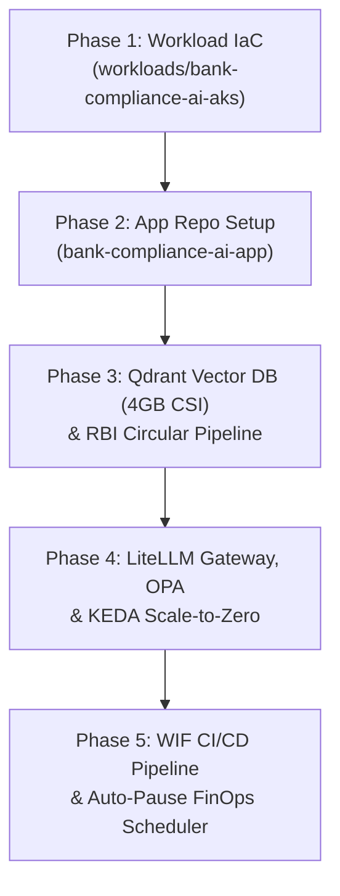

# Banking Regulatory Compliance AI Copilot (`bank-compliance-ai`) Architecture & Implementation Plan

This document outlines the architecture, repository separation pattern, infrastructure layout, and implementation roadmap for **BankCompliance AI** — an Enterprise Cloud-Native, AI-Powered Banking Regulatory & Compliance Copilot built on **Azure Kubernetes Service (AKS)**.

---

## 🎯 Executive Overview & Problem Statement

Global and regional financial institutions (e.g., HDFC Bank, SBI, ICICI, Citi, HSBC) process thousands of pages of central bank circulars, Master Directions (RBI / SEC / Basel III), and statutory compliance updates. Compliance officers, legal teams, and branch managers require immediate, auditable answers to operational questions without risking PII data leaks or sending sensitive corporate context to unvetted third-party services.

**BankCompliance AI** delivers an enterprise-grade solution featuring:
1. **Self-Hosted Vector Search on AKS (Qdrant on 4GB Azure Managed Disk)**: Fast, private HNSW vector search over official RBI Master Directions.
2. **Enterprise AI Gateway (LiteLLM Proxy on AKS)**: Lightweight (<200MB RAM) proxy container handling department token budgeting, instant KV prompt caching for repeat questions, and sub-second inference routing directly to Azure OpenAI (`gpt-5.4-nano`) — eliminating heavy on-cluster GPU/CPU model hosting overhead.
3. **Strict AI Security & PII Masking Shield**: Azure AI Content Safety (`F0` Free SKU) + regex/NER PII Masking Engine (auto-redacting Indian PAN cards, Aadhaar numbers, and bank account numbers).
4. **FinOps Token-Aware Autoscaling (KEDA)**: Event-driven **Scale-to-Zero (`minReplicaCount: 0`)** when no queries are active.
5. **Banking DevSecOps Guardrails (Azure Policy for AKS)**: Built-in OPA Gatekeeper admission controller blocking root pods and enforcing CPU/RAM resource limits.

---

## 🏛️ Architectural Rationale & Design Decision Justifications

### 1. Why Option A (LiteLLM AI Gateway ➔ Azure OpenAI) instead of Local On-Cluster SLMs?
* **Sub-Second Response SLA (<800ms):** Branch compliance officers and legal auditors require instant answers during live customer interactions. Running 3B–8B models on CPU nodes results in 5–8 second latency.
* **Zero Burstable CPU Credit Risk:** `Standard_B4ms` is a burstable VM. Cloud routing keeps node CPU at ~2–5%, guaranteeing the VM credit bank stays 100% full and never throttles.
* **Ultra-Light RAM Footprint (<200MB):** Leaves 15+ GB of node RAM completely free for Qdrant vector caching, Redis, and FastAPI workers.
* **Enterprise Banking Governance:** LiteLLM provides centralized token quotas (e.g., max 5k tokens/day per department) and semantic KV caching (serving repeat compliance questions in <20ms at $0 cost).
* **Banking Regulatory Compliance (Zero Data Retention):** Microsoft enterprise agreements legally guarantee that zero prompt data is retained, logged, or used for model training.

### 2. Why Azure Kubernetes Service (AKS) instead of Azure App Service / Web Apps?
* **Self-Hosted Vector Database (Qdrant on Managed Disk):** App Service is stateless and cannot host complex distributed vector databases with persistent block storage (`PVC`). On AKS, FastAPI and Qdrant communicate over private cluster networking with sub-millisecond (<1ms) latency.
* **Regulatory Multi-Cloud Exit Strategy:** Banking regulations (RBI, ECB, US Fed) mandate that banks avoid single-cloud lock-in. Packaging BankCompliance AI into standard Dockerfiles and Helm charts allows it to run identically on AWS EKS or on-premise OpenShift with zero code changes.
* **Zero-Trust Pod Isolation & Microsegmentation:** Kubernetes `NetworkPolicies` allow hard-blocking traffic between different banking departments sharing the same cluster.
* **True Scale-to-Zero FinOps (KEDA):** AI worker pods automatically scale down to `0 replicas` when no queries are in queue.

### 3. Why 4GB Azure Managed Disk (`managed-csi`) for Qdrant?
* **Azure Hardware Baseline (`E1` Tier):** 4 GiB is the absolute minimum disk tier manufactured by Azure (~$0.15/month).
* **Native Persistence:** Data permanently survives `az aks stop` / `az aks start` cycles with zero snapshot restore scripting.
* **Ample Capacity:** 4 GiB holds over 400,000 vector chunks, easily storing the entire ~30–50 MB RBI regulatory corpus with 10x headroom.

---

## 🏛️ Multi-Repository Architecture Pattern

To follow enterprise Cloud Adoption Framework (CAF) role-separation standards, this project is decoupled into **two separate GitHub repositories**:

```
 ┌────────────────────────────────────────────────────────┐
 │ 📁 REPO 1: terraform-azure-iac  (Infrastructure Repo)   │
 ├────────────────────────────────────────────────────────┤
 │ • platform/bootstrap, hub, shared-services             │
 │ • workloads/bank-compliance-ai-aks  (New Workload IaC) │
 │   ├── AKS Free Tier Cluster (aks-ht-bankc-p-cin-01)    │
 │   ├── Azure CNI Overlay Subnet (10.42.1.0/24)          │
 │   ├── Azure Policy / OPA Gatekeeper Enabled            │
 │   ├── Workload Identity (OIDC Federated Credentials)   │
 │   ├── Azure AI Content Safety F0 SKU (Southeast Asia)  │
 │   └── Spoke VNet Bi-directional Hub Peering            │
 │ • Owned by: Cloud Platform & DevOps Engineering Team   │
 └──────────────────────────┬─────────────────────────────┘
                            │ Provisions AKS Cluster
                            ▼
 ┌────────────────────────────────────────────────────────┐
 │ 📁 REPO 2: bank-compliance-ai-app (Application Repo)   │
 ├────────────────────────────────────────────────────────┤
 │ • app/backend/ (Python FastAPI, Qdrant Client, OTel)   │
 │ • app/frontend/ (React Web SPA)                        │
 │ • k8s/ & helm/ (Qdrant Helm, LiteLLM, KEDA ScaledObj)  │
 │ • .github/workflows/ (Build ➔ Push ghcr.io ➔ AKS Helm) │
 │ • .github/workflows/finops-scheduler.yml (Auto-stop)   │
 │ • Container Registry: ghcr.io (100% FREE Tier)         │
 │ • Owned by: AI & Software Engineering Team             │
 └────────────────────────────────────────────────────────┘
```

---

## 🏗️ Detailed Tech Stack & Infrastructure Specifications

### 1. Infrastructure Layer (`terraform-azure-iac` -> `workloads/bank-compliance-ai-aks`)
- **Control Plane**: AKS Free Tier (`sku_tier = "Free"`, $0.00 control plane cost).
- **Node Pool**: Burstable CPU node (`Standard_B4ms`: 4 vCPU, 16GB RAM) with `os_disk_type = "Ephemeral"` for **$0.00 OS disk fees**.
- **Networking**: **Azure CNI Overlay** (`10.42.0.0/16` spoke VNet, `10.42.1.0/24` node subnet, `192.168.0.0/16` pod CIDR) to eliminate private VNet IP exhaustion.
- **Cluster Pause Governance**: Automated `az aks stop` / `az aks start` lifecycle workflow to ensure **$0.00 compute cost when idle** (~₹25/day during active learning).
- **AKS Workload Identity**: `workload_identity_enabled = true` & `oidc_issuer_enabled = true` for passwordless pod-to-Azure authentication.
- **Security Guardrails**: `azure_policy_enabled = true` deploying Open Policy Agent (OPA Gatekeeper) to enforce banking container compliance.
- **Container Registry**: **GitHub Container Registry (`ghcr.io`)** (100% FREE OCI Container Registry with native GitHub Actions OIDC auth).
- **Enterprise Hybrid Gateway Architecture**:
  - **Edge Layer**: **Azure APIM Gateway** (`apim-ht-ss-p-cin-01`, `Consumption_0` $0 tier) for IP rate-limiting (20 calls/min) and CORS protection.
  - **In-Cluster Layer**: **LiteLLM Proxy Pod on AKS** for AI Token Budgeting, Prompt KV Caching, and sub-second routing to Azure OpenAI (`gpt-5.4-nano`).

### 2. Application & Kubernetes Layer (`bank-compliance-ai-app`)
- **Vector Search Cluster**: **Qdrant Vector Database** deployed on AKS using official Helm chart backed by a **4GB Azure Managed Disk (`storageClassName: managed-csi`, ~$0.15/mo)** for permanent persistence across cluster pauses.
- **Autoscaling & FinOps**: **KEDA (`ScaledObject`)** zero-pod scaling (`minReplicaCount: 0`) scaling worker pods down to 0 when idle.
- **PII Masking Engine**: Regex & Named Entity Recognition (NER) masking Indian PAN cards (`[PAN-REDACTED]`), Aadhaar numbers (`[AADHAAR-REDACTED]`), and bank account numbers *before* sending prompts to the LLM.
- **Hierarchical Citation Engine**: Every AI response includes exact RBI circular numbers, publication dates, and clause paragraph links (e.g. `[RBI KYC Master Direction - Section 4.2(a)]`) for 100% legal auditability.

---

## 🗺️ Step-by-Step Implementation Roadmap



### Phase 1: Infrastructure IaC (`terraform-azure-iac`)
- Create `workloads/bank-compliance-ai-aks/`.
- Provision AKS Free Tier cluster with Azure CNI Overlay, Workload Identity, Azure Policy (OPA), and Ephemeral OS Disk.
- Provision Spoke VNet (`10.42.0.0/16`) with bi-directional peering to `platform/hub`.
- Provision Azure AI Content Safety (`cs-ht-bankc-p-sea-01`, `F0` Free SKU in Southeast Asia).
- Wire User-Assigned Managed Identity (`uami-ht-bankc-p-cin-01`) for pod federated credentials.

### Phase 2: Application Repository Initialization (`bank-compliance-ai-app`)
- Initialize separate Git repository `bank-compliance-ai-app`.
- Add Python FastAPI backend, `Dockerfile`, Kubernetes manifests (`k8s/`), and Helm charts (`helm/`).

### Phase 3: Qdrant Vector Search & Regulatory RAG Pipeline
- Deploy Qdrant Helm chart on AKS with 4GB Persistent Volume Claim (`storageClassName: managed-csi`).
- Ingest core RBI Master Directions (KYC, IT Governance, Outsourcing, Digital Payments, Cards, PSL) into structured vector collections (~30–50 MB).

### Phase 4: LiteLLM AI Gateway, OPA Policies & KEDA Autoscaling
- Deploy LiteLLM Proxy pod with token budgeting and prompt KV caching.
- Configure KEDA `ScaledObject` for Scale-to-Zero worker pod management.
- Apply Azure Policy / OPA Gatekeeper constraints (non-root containers, CPU/memory limits).

### Phase 5: WIF CI/CD & FinOps Scheduler
- Set up GitHub Actions WIF OIDC pipeline in `bank-compliance-ai-app` (Build ➔ Push `ghcr.io` ➔ Helm deploy to AKS).
- Configure automated GitHub Actions FinOps cron scheduler (`finops-scheduler.yml`) for automated cluster stop/start.

---

## 📊 Monitoring, Telemetry & Observability Specifications

| Telemetry Pillar | Technology Stack | Measured Metrics / Log Category |
| :--- | :--- | :--- |
| **Container & Pod Health** | **Azure Monitor Container Insights** | K8s Pod CPU/RAM usage, OOM pod restart events, node pressure logs streamed to central Log Analytics (`law-ht-ss-p-cin-01`). |
| **Distributed AI Tracing** | **OpenTelemetry (OTel) + App Insights** | End-to-end request tracing (SPA ➔ APIM ➔ LiteLLM Proxy ➔ FastAPI ➔ Qdrant DB ➔ Azure OpenAI). |
| **LLM Inference Telemetry** | **LiteLLM Prometheus Metrics** | Time-to-First-Token (TTFT), Token Generation Rate (tokens/sec), Prompt Token Count, Completion Token Count, and KV Cache hit ratio. |
| **Vector DB Performance** | **Qdrant Metrics Exporter** | HNSW vector query latency (ms), vector collection indexing speed, and 4GB PVC storage utilization. |
| **SecOps Audit Logging** | **Log Analytics Audit Logs & Metric Alerts** | Content Safety blocked calls (`alert-cs-jailbreak-detected`), PII redaction audit logs, and APIM 429 rate-limiting events. |

---

## 💰 Cost Optimization Summary

| Service Component | Selected SKU / Mode | Monthly Running Cost |
| :--- | :--- | :---: |
| **AKS Cluster Control Plane** | `sku_tier = "Free"` | **$0.00 / month** |
| **AKS Compute Node Pool** | 1x `Standard_B4ms` (`az aks stop` when idle) | **$0 – $9.70 / month** (₹25/day active) |
| **OS Disk Storage** | `os_disk_type = "Ephemeral"` | **$0.00 / month** (100% FREE) |
| **Qdrant Vector Storage** | 4GB Azure Managed Disk (`managed-csi`, `E1` tier) | **~$0.15 / month** (₹12/mo) |
| **Container Registry** | **GitHub Container Registry (`ghcr.io`)** | **$0.00 / month** (100% FREE) |
| **Azure AI Content Safety** | `F0` Free SKU (5,000 calls/mo) | **$0.00 / month** |
| **APIM Gateway & LAW** | `Consumption_0` / Shared LAW (5GB Free) | **$0.00 / month** |
| **Total Estimated Cost** | **Hybrid Cloud-Native Stack** | **~$0.15 / month idle** (~₹25/day active) |

