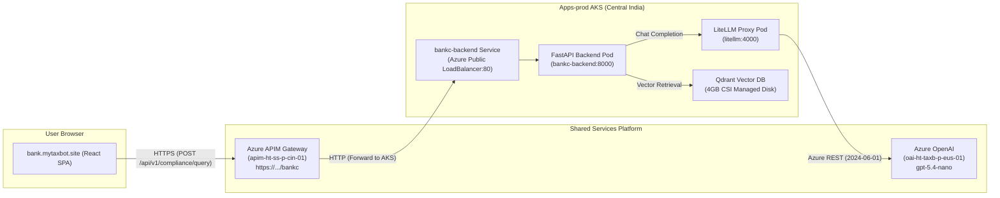

# 🏦 BankCompliance AI: Engineering Learnings, Debugging & Runbook

This document captures the real-world platform engineering, CI/CD, Kubernetes networking, and Azure AI integration issues encountered and resolved during the deployment of **BankCompliance AI (`bank.mytaxbot.site`)** on **Azure Kubernetes Service (AKS)** and **Azure API Management (APIM)**.

---

## 📑 Table of Contents
1. [Architecture Overview & Flow](#-architecture-overview--flow)
2. [Issue 1: GitHub Actions Dynamic Environment Context vs Step Outputs](#-issue-1-github-actions-dynamic-environment-context-vs-step-outputs)
3. [Issue 2: Oryx / Vite Build Breakage via UTF-8 Byte Order Mark (BOM)](#-issue-2-oryx--vite-build-breakage-via-utf-8-byte-order-mark-bom)
4. [Issue 3: Frontend Fallback to Localhost & ClusterIP Networking](#-issue-3-frontend-fallback-to-localhost--clusterip-networking)
5. [Issue 4: Content Security Policy (CSP) & Browser Mixed Content Restrictions](#-issue-4-content-security-policy-csp--browser-mixed-content-restrictions)
6. [Issue 5: Azure OpenAI API Version vs Model Release Version](#-issue-5-azure-openai-api-version-vs-model-release-version)
7. [Issue 6: Reasoning Model Parameters (`max_tokens` vs `max_completion_tokens`)](#-issue-6-reasoning-model-parameters-max_tokens-vs-max_completion_tokens)
8. [Issue 7: Kubernetes Image Caching (`imagePullPolicy` & Commit SHA Tagging)](#-issue-7-kubernetes-image-caching-imagepullpolicy--commit-sha-tagging)
9. [Platform Engineer Checklist & Golden Rules](#-platform-engineer-checklist--golden-rules)

---

## 🏛️ Architecture Overview & Flow



---

## 🔍 Detailed Issue Breakdown & Resolutions

### 1. ⚙️ GitHub Actions Dynamic Environment Context vs Step Outputs

#### Symptom:
* GitHub Actions workflow validator warning: `Context access might be invalid: IMAGE_TAG @[L66]`.

#### Root Cause:
* In GitHub Actions, static schema validation parses `${{ env.VARIABLE }}` expressions against statically declared variables in `env:` blocks.
* When variables are dynamically exported during a shell step via `echo "IMAGE_TAG=..." >> $GITHUB_ENV`, the static schema analyzer does not register them into the known compile-time schema, generating a context validation error.

#### Resolution:
Use standard GitHub Actions **Step Outputs** (`$GITHUB_OUTPUT`) with explicit step `id`s instead of polluting the global `env` context:

```yaml
# ❌ Before (Static context warning):
- name: Downcase Image Name
  run: |
    echo "IMAGE_TAG=${{ env.REGISTRY }}/$(echo ${{ env.IMAGE_NAME }} | tr '[A-Z]' '[a-z]'):latest" >> $GITHUB_ENV
- name: Build and Push
  uses: docker/build-push-action@v5
  with:
    tags: ${{ env.IMAGE_TAG }}

# ✅ After (Strictly typed Step Output):
- name: Downcase Image Name
  id: prep_tag
  run: |
    IMAGE_LOWER=$(echo "${{ env.REGISTRY }}/${{ env.IMAGE_NAME }}" | tr '[:upper:]' '[:lower:]')
    echo "image_tag=${IMAGE_LOWER}:latest" >> $GITHUB_OUTPUT
- name: Build and Push
  uses: docker/build-push-action@v5
  with:
    tags: ${{ steps.prep_tag.outputs.image_tag }}
```

---

### 2. 📦 Oryx / Vite Build Breakage via UTF-8 Byte Order Mark (BOM)

#### Symptom:
* Azure Static Web Apps build step fails inside Oryx:
  ```text
  [Failed to load PostCSS config: Failed to load PostCSS config: [SyntaxError] Unexpected token ' ', " {
  "name"... is not valid JSON
  ```

#### Root Cause:
* On Windows systems, PowerShell output redirection or editors can save text files as **UTF-8 with BOM** (the 3-byte prefix `0xEF 0xBB 0xBF` / Unicode `\uFEFF`).
* During `vite build`, PostCSS uses `cosmiconfig` / `lilconfig` (`jsonLoader`) to inspect `package.json`. Node’s native `JSON.parse(content)` fails when reading raw strings starting with byte 0 `\uFEFF`.

#### Resolution:
Strip the UTF-8 BOM from all configuration and source files:
```powershell
$utf8NoBom = New-Object System.Text.UTF8Encoding($false)
Get-ChildItem -Recurse -File 'frontend' | ForEach-Object {
    $bytes = [System.IO.File]::ReadAllBytes($_.FullName)
    if ($bytes.Length -ge 3 -and $bytes[0] -eq 0xEF -and $bytes[1] -eq 0xBB -and $bytes[2] -eq 0xBF) {
        $text = [System.Text.Encoding]::UTF8.GetString($bytes, 3, $bytes.Length - 3)
        [System.IO.File]::WriteAllText($_.FullName, $text, $utf8NoBom)
    }
}
```

---

### 3. 🌐 Frontend Fallback to Localhost & ClusterIP Networking

#### Symptom:
* Users accessing `https://bank.mytaxbot.site` receive:
  `⚠️ Unable to connect to BankCompliance AKS backend API. Please ensure the cluster and backend services are active.`

#### Root Cause:
1. `VITE_API_URL` was not supplied during the Static Web App build, so Vite evaluated `import.meta.env.VITE_API_URL || 'http://localhost:8000/...'` and baked `http://localhost:8000` into the bundle.
2. In the user's browser, requests were sent to the user's personal laptop (`localhost`).
3. The Kubernetes backend Service was defined as `type: ClusterIP`, meaning it had no public IP or external routing.

#### Resolution:
1. Changed `backend-deployment.yaml` service to `type: LoadBalancer` with an Azure DNS label:
   ```yaml
   apiVersion: v1
   kind: Service
   metadata:
     name: bankc-backend
     namespace: bank-compliance
     annotations:
       service.beta.kubernetes.io/azure-dns-label-name: "bankc-api-ht-cin"
   spec:
     type: LoadBalancer
     selector:
       app: bankc-backend
     ports:
       - name: http
         port: 80
         targetPort: 8000
   ```
2. Provided `VITE_API_URL` during CI/CD build:
   ```yaml
   - name: Deploy to Azure Static Web Apps
     uses: Azure/static-web-apps-deploy@v1
     env:
       VITE_API_URL: "https://apim-ht-ss-p-cin-01.azure-api.net/bankc/api/v1/compliance/query"
   ```

---

### 4. 🔒 Content Security Policy (CSP) & Browser Mixed Content Restrictions

#### Symptom:
* When accessing `https://bank.mytaxbot.site` (HTTPS), browser console logs `Blocked mixed content` or `Violates Content Security Policy directive`.

#### Root Cause:
1. **Mixed Content:** Browsers strictly prohibit secure HTTPS web pages from executing asynchronous HTTP fetch calls (`https://` ➔ `http://`).
2. **CSP Restrictions:** `staticwebapp.config.json` had `"Content-Security-Policy": "default-src 'self' https: data: ..."` which blocked all non-HTTPS network requests.

#### Resolution:
Configured the **Azure API Management (APIM)** gateway in Terraform HCL (`workloads/bank-compliance-ai-aks/main.tf`):
```hcl
resource "azapi_resource" "apim_bankc_api" {
  type      = "Microsoft.ApiManagement/service/apis@2022-08-01"
  name      = "bankc-compliance-api"
  parent_id = data.azurerm_api_management.shared.id

  body = {
    properties = {
      displayName          = "BankCompliance AI — Regulatory Copilot"
      path                 = "bankc"
      protocols            = ["https"]
      serviceUrl           = "http://bankc-api-ht-cin.centralindia.cloudapp.azure.com"
      subscriptionRequired = false
    }
  }
}
```
* APIM terminates SSL with a native Microsoft wildcard certificate (`*.azure-api.net`).
* The browser calls `https://apim-ht-ss-p-cin-01.azure-api.net/bankc/...` securely over HTTPS.
* APIM routes the request to AKS over internal/cloud networking.

---

### 5. 🤖 Azure OpenAI API Version vs Model Release Version

#### Symptom:
* LiteLLM Proxy logs:
  `litellm.exceptions.APIError: AzureException - Error code: 404 - {'error': {'code': '404', 'message': 'Resource not found'}}`

#### Root Cause:
* In `litellm/config.yaml`, `api_version` was incorrectly set to `"2026-03-17"` (which is the model release version, not Azure OpenAI's REST API specification).
* Azure OpenAI rejected the request because API version `2026-03-17` does not exist on Azure OpenAI's API plane.

#### Resolution:
Updated `config.yaml` to use a supported Azure OpenAI REST API version:
```yaml
model_list:
  - model_name: gpt-5.4-nano
    litellm_params:
      model: azure/gpt-5.4-nano
      api_base: https://oai-ht-taxb-p-eus-01.openai.azure.com/
      api_key: "os.environ/AZURE_API_KEY"
      api_version: "2024-06-01"  # ✅ Valid Azure OpenAI REST API version
```

---

### 6. 🧠 Reasoning Model Parameters (`max_tokens` vs `max_completion_tokens`)

#### Symptom:
* LiteLLM / Azure OpenAI returns:
  `400 Bad Request: Unsupported parameter: 'max_tokens' is not supported with this model. Use 'max_completion_tokens' instead.`

#### Root Cause:
* The newest generation of Azure OpenAI models (`gpt-5.4-nano`, o1/o3 reasoning models) enforce strict parameter schemas.
* Legacy parameters such as `max_tokens` and custom `temperature` values (other than default 1.0) are disallowed and return `400 Bad Request`.

#### Resolution:
Updated `app/api/routes.py` to use `max_completion_tokens`:
```python
# ❌ Before:
resp = await client.post(
    f"{settings.LITELLM_URL}/chat/completions",
    json={
        "model": settings.OPENAI_MODEL,
        "messages": [...],
        "temperature": 0.1,
        "max_tokens": 800,
    }
)

# ✅ After:
resp = await client.post(
    f"{settings.LITELLM_URL}/chat/completions",
    json={
        "model": settings.OPENAI_MODEL,
        "messages": [...],
        "max_completion_tokens": 800,
        "user": f"{request.department}:{request.session_id}"
    }
)
```

---

### 7. 🔄 Kubernetes Image Caching (`imagePullPolicy` & Commit SHA Tagging)

#### Symptom:
* After pushing code fixes and restarting Kubernetes deployments, pods continued to execute old Python code.

#### Root Cause:
* Kubernetes manifests used `image: ...:latest` with `imagePullPolicy: IfNotPresent`.
* When a node already had a local image tagged `:latest`, `kubectl rollout restart` did not re-pull the newly pushed layers from GHCR.

#### Resolution:
1. Changed `imagePullPolicy` to `Always` in `backend-deployment.yaml`.
2. Updated CI/CD pipeline to explicitly tag and set images by **Commit SHA**:
   ```yaml
   IMAGE_LOWER=$(echo "${{ env.REGISTRY }}/${{ env.IMAGE_NAME }}" | tr '[:upper:]' '[:lower:]')
   kubectl set image deployment/bankc-backend backend="${IMAGE_LOWER}:${{ github.sha }}" -n bank-compliance
   kubectl rollout status deployment/bankc-backend -n bank-compliance
   ```

---

### 8. 🏷️ Semantic PR Title Validation Failure (`action-semantic-pull-request`)

#### Symptom:
* GitHub Actions job `Validate PR Title (Conventional Commits)` fails with error:
  `No release type found in pull request title "Feature/phase11". Add a prefix to indicate what kind of release this pull request corresponds to.`

#### Root Cause:
* The repository enforces **Conventional Commits** (`amannn/action-semantic-pull-request@v5`) for automated SemVer changelog generation.
* Default branch-based titles (e.g. `Feature/phase11`) lack the required semantic type prefix.

#### Resolution:
* Rename the PR title on GitHub using a valid semantic prefix:
  * `feat: implement GenAIOps CI/CD quality gate, semantic caching, and Helm chart`
  * `fix: resolve LiteLLM 400 parameter issue`
  * `docs: update troubleshooting playbook`
* Valid prefixes: `feat`, `fix`, `docs`, `style`, `refactor`, `perf`, `test`, `build`, `ci`, `chore`, `revert`.

---

## 🏆 Platform Engineer Checklist & Golden Rules

| Category | Rule | Verification Command |
| :--- | :--- | :--- |
| **PR Titles** | Follow Conventional Commits: `feat:`, `fix:`, `docs:`, `chore:`. | Check PR title on GitHub UI. |
| **File Encoding** | Always save JSON/YAML/HCL as UTF-8 **without BOM**. | `$b = [System.IO.File]::ReadAllBytes('file'); $b[0..2]` |
| **GHA CI/CD** | Use `$GITHUB_OUTPUT` + `steps.<id>.outputs` for inter-step data. | Check workflow logs for context warnings. |
| **K8s Deployments** | Always use `imagePullPolicy: Always` and commit SHA tags. | `kubectl get deployment bankc-backend -o yaml \| grep image:` |
| **Public APIs** | Always front AKS HTTP services with Azure APIM for SSL/CORS. | `curl -i https://apim-ht-ss-p-cin-01.azure-api.net/bankc/healthz` |
| **Azure OpenAI** | Always verify REST `api-version` format (`YYYY-MM-DD`). | Test raw curl with `?api-version=2024-06-01` |
| **Reasoning Models** | Use `max_completion_tokens` instead of `max_tokens`. | Check LiteLLM pod logs for 400 parameter errors. |

---

*Authored by HappyTechies AI Platform Engineering Team.*
