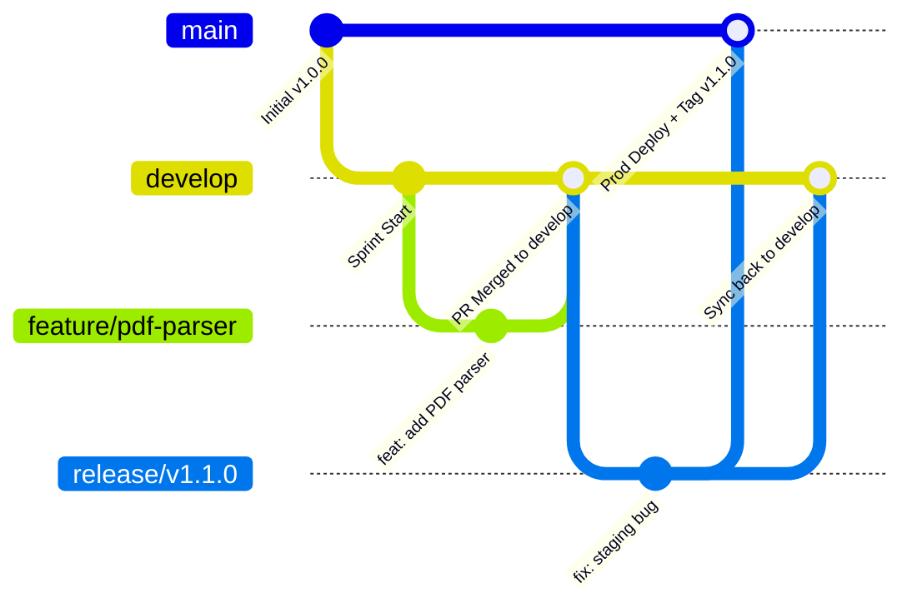

# Enterprise Git Branching & Merging Strategy Guide

## 🎯 Purpose & Scope

This document defines the enterprise **GitFlow & GitHub Flow** branching model, pull request workflow, and automated release tagging mechanism for this repository.

---

## 🌿 Branching Model Architecture



---

## 📋 Branch Types & Merge Rules

### 1. `feature/*` (Feature Branches)
* **Parent Branch:** `develop`
* **Naming Convention:** `feature/<short-description>` (e.g., `feature/add-pdf-parser`, `feature/adding-github-runners`)
* **Commit Message Format:** Conventional Commits (`feat: ...`, `fix: ...`)
* **Merge Rule:** Pull Request (PR) into **`develop`**. Requires 1 peer review + Passing DevSecOps security scan.
* **CI/CD Behavior:** Triggers automated SAST & SCA security scans.

### 2. `develop` (Integration Branch)
* **Role:** Central integration branch for ongoing sprint development.
* **Merge Rule:** Direct commits forbidden. Code arrives via approved PRs from `feature/*` branches.
* **CI/CD Behavior:** Runs SAST & SCA scans and non-production testing.

### 3. `release/*` (Release Staging Branches)
* **Parent Branch:** `develop`
* **Naming Convention:** `release/v1.1.0` or `release/1.0.0`
* **Role:** Staging environment testing, QA verification, and pre-release bug fixes.
* **Merge Rule:** Merged into **`main`** for production deployment, then merged back into **`develop`**.

### 4. `main` (Production Branch)
* **Role:** Production branch representing live cloud infrastructure and active software code.
* **Merge Rule:** Merged **ONLY** from `release/*` (or emergency `hotfix/*`).
* **CI/CD Behavior:** 
  1. Deploys application backend, frontend, documents, and CORS to Azure `Apps-prod`.
  2. **Automatically calculates and creates the Git Release Tag (`v1.1.0`) on GitHub**.

### 5. `hotfix/*` (Emergency Patch Branches)
* **Parent Branch:** `main`
* **Naming Convention:** `hotfix/<bug-description>` (e.g., `hotfix/fix-cors-origin`)
* **Merge Rule:** Merged into **`main`** (triggers production hotfix deploy + `v1.0.31` patch tag), then merged back into **`develop`**.

---

## 🏷️ Semantic Versioning (SemVer) Digit Breakdown

Release tags follow the **`vMAJOR.MINOR.PATCH`** standard:

$$\mathbf{v\underbrace{1}_{\text{1st Digit (MAJOR)}} . \underbrace{0}_{\text{2nd Digit (MINOR)}} . \underbrace{31}_{\text{3rd Digit (PATCH)}}}$$

```text
       v 1 . 0 . 31
         │   │   │
         │   │   └── 3rd Digit  =  PATCH (31)  ➔ Bug Fixes & Hotfixes (fix: ...)
         │   └────── 2nd Digit  =  MINOR (0)   ➔ New Features (feat: ...)
         └────────── 1st Digit  =  MAJOR (1)   ➔ Breaking Changes (BREAKING CHANGE: ...)
```

---

## 🤖 Automated CI/CD Tagging Integration

Both **GitHub Actions** ([.github/workflows/app-tax-advisor.yml](../.github/workflows/app-tax-advisor.yml)) and **Azure DevOps** ([pipelines/azure-cicd-app-tax-advisor.yml](../pipelines/azure-cicd-app-tax-advisor.yml)) automatically generate SemVer release tags upon deployment to `main` or `release/*`:

```yaml
# GitHub Actions SemVer Step
- name: Auto-Create Enterprise Git Release Tag (SemVer)
  if: github.event_name == 'workflow_dispatch' || ((github.ref == 'refs/heads/main' || startsWith(github.ref, 'refs/heads/release/')) && github.event_name == 'push')
  uses: mathieudutour/github-tag-action@v6.2
  with:
    github_token: ${{ secrets.GITHUB_TOKEN }}
    default_bump: patch
```
