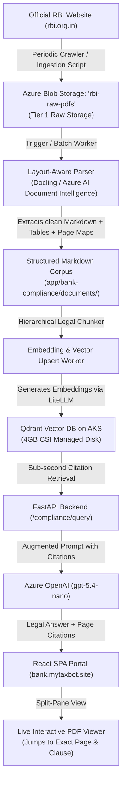

# Architecture & Execution Plan: Automated Regulatory Ingestion & Document Intelligence Platform

## 🎯 Executive Overview
This document specifies the architecture, data pipeline, and implementation roadmap for **Phase 10: Automated Raw Regulatory Document Ingestion & Interactive Split-Screen Document Intelligence**.

This system connects the raw regulatory PDFs issued by the Reserve Bank of India (RBI) with an automated layout-aware parsing pipeline, deep-linked vector embeddings in Qdrant on AKS, and an auditable side-by-side split-view React portal.

---

## 🏛️ System Architecture



---

## 📋 4-Phase Implementation Blueprint

### Phase 1: Raw Regulatory Data Lake (`platform/blob-storage`)
* **Storage Account Container:** `rbi-raw-pdfs` on `sthtssbpcin01` or `sthtbankcpcin01`.
* **Automated Crawler / Ingestion CLI:** Python script (`scripts/sync_rbi_raw_pdfs.py`) that checks for new RBI notifications, downloads the official PDF files, and stores them with SHA-256 integrity checksums.

### Phase 2: Layout-Aware Document Intelligence (`backend/parser`)
* **Engine:** Open-source `Docling` / `pdfplumber` running as an AKS batch job or Azure AI Document Intelligence (`F0` Free Tier).
* **Output:** Converts complex multi-column regulatory tables into clean Markdown tables, preserving Chapter, Section, and Subsection hierarchies.
* **Page Mapping:** Emits a metadata catalog mapping each clause to its starting and ending PDF page numbers.

### Phase 3: Deep-Linked Vector Database (`backend/qdrant`)
* **Qdrant Payload Schema:**
  ```json
  {
    "circular_no": "RBI/2023-24/108",
    "title": "Master Direction on IT Governance",
    "clause": "Section 8.1 - Cloud Security & Data Localization",
    "text": "All regulated entities storing transaction data...",
    "pdf_filename": "rbi_it_governance_2023.pdf",
    "page_number": 14,
    "page_end": 15
  }
  ```
* **Storage:** Utilizes the persistent 4GB Managed CSI volume on AKS (`aks-ht-bankc-p-cin-01`).

### Phase 4: Split-View Compliance Portal (`frontend/react`)
* **Split-Pane UI:**
  * **Left Pane (50%):** BankCompliance AI conversational chat, PII shield alerts, and legal analysis.
  * **Right Pane (50%):** Integrated PDF document viewer (`react-pdf` / PDF.js).
* **Deep-Link Navigation:** Clicking any legal citation (e.g. `[RBI/2023-24/108 - Page 14]`) automatically scrolls the live PDF directly to page 14 and highlights the corresponding clause.

---

## 💰 Cost & FinOps Profile

| Component | Service & SKU | Monthly Idle Cost |
| :--- | :--- | :---: |
| Raw PDF Lake | Azure Blob Storage (`Standard_LRS`) | ~$0.05 / mo |
| Document Parser | Open-source `Docling` on AKS Node | $0.00 / mo |
| Vector DB | Qdrant with 4GB CSI Disk on AKS | ~$0.60 / mo |
| Vector Embeddings | Azure OpenAI `text-embedding-3-small` | < $0.05 / mo |
| Frontend Hosting | Azure Static Web Apps (Free Tier) | $0.00 / mo |
| **Total Monthly Cost** | | **< $1.00 / month** |
