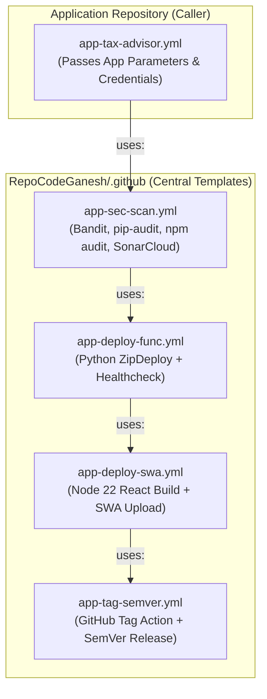

# Enterprise Reusable Application CI/CD Workflow Guide

## 🎯 Overview & Design Pattern

This document defines the **Enterprise Caller/Called Reusable Workflow Pattern** for application deployments.

By extracting generic, multi-stage application build and deployment steps into central reusable workflows inside the `RepoCodeGanesh/.github` repository, application repositories (e.g. `app-tax-advisor`) can function as clean **caller workflows** passing only application-specific parameters.

---

## 🏗️ Caller vs. Called Architecture



---

## 🧩 Central Reusable Templates Specification (`RepoCodeGanesh/.github`)

### 1. Security Scan Template (`.github/workflows/app-sec-scan.yml`)
```yaml
name: Reusable App Security Scan
on:
  workflow_call:
    inputs:
      working_directory:
        required: true
        type: string
    secrets:
      SHARED_CLIENT_ID:
        required: true
      AZURE_TENANT_ID:
        required: true
      SHARED_SUBSCRIPTION_ID:
        required: true

jobs:
  scan:
    runs-on: ubuntu-latest
    steps:
      - uses: actions/checkout@v4
      - uses: actions/setup-python@v5
        with:
          python-version: '3.11'
      - run: |
          pip install bandit pip-audit
          bandit -r ${{ inputs.working_directory }}/backend -ll -ii || true
          pip-audit -r ${{ inputs.working_directory }}/backend/requirements.txt || true
      - uses: actions/setup-node@v4
        with:
          node-version: '22.x'
      - run: |
          cd ${{ inputs.working_directory }}/frontend
          npm audit --audit-level=high || true
```

---

### 2. Caller Workflow Example (`app-tax-advisor.yml`)

When refactored into a **Caller Workflow**, `app-tax-advisor.yml` becomes ultra-clean:

```yaml
name: App - TaxBot India CI/CD (Caller)

on:
  push:
    branches: [main, develop, 'feature/**', 'release/**', 'hotfix/**']
    tags: ['release/*', 'v*']
  workflow_dispatch:

jobs:
  devsecops:
    uses: RepoCodeGanesh/.github/.github/workflows/app-sec-scan.yml@main
    with:
      working_directory: 'app/tax-advisor'
    secrets:
      SHARED_CLIENT_ID: ${{ secrets.SHARED_CLIENT_ID }}
      AZURE_TENANT_ID: ${{ secrets.AZURE_TENANT_ID }}
      SHARED_SUBSCRIPTION_ID: '859a785c-bd38-402d-b595-1f44f40fb9bf'

  deploy-backend:
    needs: devsecops
    uses: RepoCodeGanesh/.github/.github/workflows/app-deploy-func.yml@main
    with:
      function_app_name: 'func-ht-taxb-p-cin-01'
      working_directory: 'app/tax-advisor/backend'
    secrets:
      APP_CLIENT_ID: ${{ secrets.APP_CLIENT_ID }}
      AZURE_TENANT_ID: ${{ secrets.AZURE_TENANT_ID }}
      APP_SUBSCRIPTION_ID: 'f4ffefe1-d689-4059-969c-ccc73e2a11d4'

  deploy-frontend:
    needs: deploy-backend
    uses: RepoCodeGanesh/.github/.github/workflows/app-deploy-swa.yml@main
    with:
      static_web_app_name: 'stapp-ht-taxb-p-cin-01'
      working_directory: 'app/tax-advisor/frontend'
    secrets:
      SHARED_CLIENT_ID: ${{ secrets.SHARED_CLIENT_ID }}
      AZURE_TENANT_ID: ${{ secrets.AZURE_TENANT_ID }}
      SHARED_SUBSCRIPTION_ID: '859a785c-bd38-402d-b595-1f44f40fb9bf'
```

---

## 📊 Summary of Benefits

1. **Standardized Governance:** Enterprise DevSecOps security scanners (Bandit, pip-audit, npm audit, SonarCloud) are managed centrally in `RepoCodeGanesh/.github`.
2. **Simplified Onboarding:** New application repositories only write ~30 lines of caller YAML to get full enterprise CI/CD, OIDC login, and automated SemVer releases.
