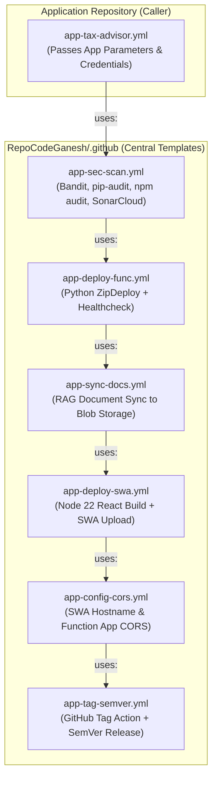

# Enterprise Reusable Application CI/CD Workflow Guide

## 🎯 Overview & Design Pattern

This document defines the **Enterprise Caller/Called Reusable Workflow Pattern** for application deployments.

By extracting generic, multi-stage application build and deployment steps into central reusable workflows inside the `RepoCodeGanesh/.github` repository, application repositories (e.g. `app-tax-advisor`) function as clean, lightweight **caller workflows** passing only application-specific parameters.

---

## 🏗️ Caller vs. Called Architecture



---

## 🧩 Central Reusable Templates Specification (`RepoCodeGanesh/.github`)

| Central Workflow File | Purpose | Parameters / Inputs |
| :--- | :--- | :--- |
| **`app-sec-scan.yml`** | SAST & SCA security scanning (Bandit, pip-audit, SonarCloud) | `working_directory`, `key_vault_name`, `shared_subscription_id` |
| **`app-deploy-func.yml`** | Packages Python Function App & deploys via ZipDeploy | `function_app_name`, `working_directory`, `app_subscription_id` |
| **`app-sync-docs.yml`** | Syncs local RAG text documents to Blob Storage using RBAC | `storage_account_name`, `container_name`, `source_directory`, `app_subscription_id` |
| **`app-deploy-swa.yml`** | Builds React SPA & deploys to Azure Static Web App | `static_web_app_name`, `working_directory`, `key_vault_name`, `shared_subscription_id` |
| **`app-config-cors.yml`** | Fetches SWA hostname & updates Function App CORS origins | `static_web_app_name`, `function_app_name`, `resource_group`, `app_subscription_id` |
| **`app-tag-semver.yml`** | Generates SemVer git tag & creates GitHub release with artifacts | `artifact_name`, `release_artifacts`, `default_bump`, `tag_prefix` |

---

## 💻 Caller Workflow Specification (`app-tax-advisor.yml`)

When refactored into a **Caller Workflow**, `app-tax-advisor.yml` becomes ultra-clean:

```yaml
name: App - TaxBot India CI/CD

on:
  push:
    branches: [main, develop, 'feature/**', 'release/**', 'hotfix/**']
    tags: ['release/*', 'v*']
    paths:
      - 'app/tax-advisor/**'
      - '.github/workflows/app-tax-advisor.yml'
  pull_request:
    branches: [main, develop]
    paths:
      - 'app/tax-advisor/**'
  workflow_dispatch:

permissions:
  id-token: write
  contents: write

jobs:
  devsecops-scan:
    name: DevSecOps SAST & SCA Scan
    uses: RepoCodeGanesh/.github/.github/workflows/app-sec-scan.yml@main
    with:
      working_directory: 'app/tax-advisor'
      key_vault_name: 'kv-ht-ss-p-cin-01'
      shared_subscription_id: '859a785c-bd38-402d-b595-1f44f40fb9bf'
    secrets:
      SHARED_CLIENT_ID: ${{ secrets.SHARED_CLIENT_ID }}
      AZURE_TENANT_ID: ${{ secrets.AZURE_TENANT_ID }}

  deploy-backend:
    name: Deploy Python Function App Backend
    needs: devsecops-scan
    uses: RepoCodeGanesh/.github/.github/workflows/app-deploy-func.yml@main
    with:
      function_app_name: 'func-ht-taxb-p-cin-01'
      working_directory: 'app/tax-advisor/backend'
      app_subscription_id: 'f4ffefe1-d689-4059-969c-ccc73e2a11d4'
    secrets:
      APP_CLIENT_ID: ${{ secrets.APP_CLIENT_ID }}
      AZURE_TENANT_ID: ${{ secrets.AZURE_TENANT_ID }}

  upload-documents:
    name: Upload RAG Documents
    needs: deploy-backend
    uses: RepoCodeGanesh/.github/.github/workflows/app-sync-docs.yml@main
    with:
      storage_account_name: 'sthttaxbpcin01'
      container_name: 'documents'
      source_directory: 'app/tax-advisor/documents'
      app_subscription_id: 'f4ffefe1-d689-4059-969c-ccc73e2a11d4'
    secrets:
      APP_CLIENT_ID: ${{ secrets.APP_CLIENT_ID }}
      AZURE_TENANT_ID: ${{ secrets.AZURE_TENANT_ID }}

  deploy-frontend:
    name: Build & Deploy React Frontend
    needs: upload-documents
    uses: RepoCodeGanesh/.github/.github/workflows/app-deploy-swa.yml@main
    with:
      static_web_app_name: 'stapp-ht-taxb-p-cin-01'
      working_directory: 'app/tax-advisor/frontend'
      key_vault_name: 'kv-ht-ss-p-cin-01'
      shared_subscription_id: '859a785c-bd38-402d-b595-1f44f40fb9bf'
    secrets:
      SHARED_CLIENT_ID: ${{ secrets.SHARED_CLIENT_ID }}
      AZURE_TENANT_ID: ${{ secrets.AZURE_TENANT_ID }}

  configure-cors:
    name: Configure CORS & APIM
    needs: deploy-frontend
    uses: RepoCodeGanesh/.github/.github/workflows/app-config-cors.yml@main
    with:
      static_web_app_name: 'stapp-ht-taxb-p-cin-01'
      function_app_name: 'func-ht-taxb-p-cin-01'
      resource_group: 'rg-ht-taxb-p-cin-01'
      app_subscription_id: 'f4ffefe1-d689-4059-969c-ccc73e2a11d4'
    secrets:
      APP_CLIENT_ID: ${{ secrets.APP_CLIENT_ID }}
      AZURE_TENANT_ID: ${{ secrets.AZURE_TENANT_ID }}

  create-release:
    name: Enterprise SemVer Release
    needs: configure-cors
    uses: RepoCodeGanesh/.github/.github/workflows/app-tag-semver.yml@main
    with:
      artifact_name: 'taxbot-backend-package'
      release_artifacts: 'functionapp.zip'
```

---

## 📊 Summary of Benefits

1. **Standardized Governance:** Security scanners, deployment engines, CORS config, and release taggers are managed centrally in `RepoCodeGanesh/.github`.
2. **Simplified Onboarding:** New application repositories only write lightweight caller YAML passing parameters to get full enterprise CI/CD, OIDC login, and automated SemVer releases.
