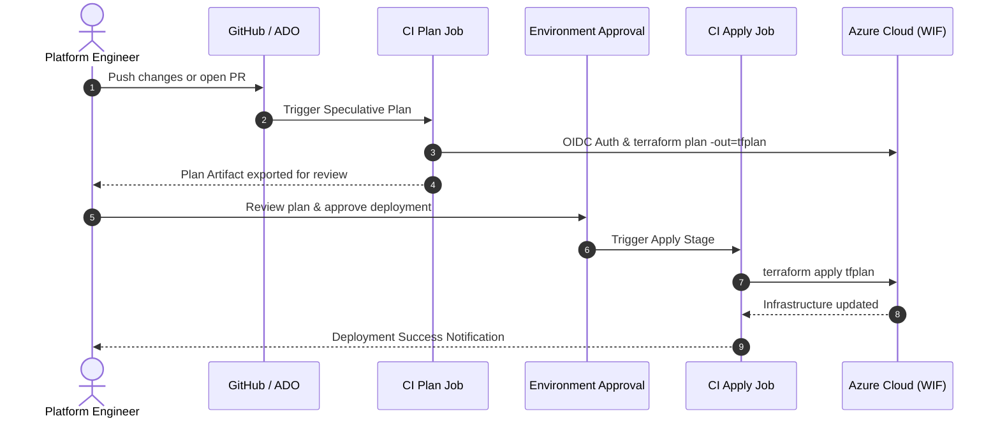

# 🛠️ Dual CI/CD, Workload Identity & Operations Runbook

* **Space:** `HappyTechies Cloud & AI Platform` $\rightarrow$ `DevSecOps & Operations`
* **Target Audience:** DevOps Engineers, Platform Engineers, SREs
* **Status:** `ACTIVE`

---

## 🎯 1. Dual CI/CD Architecture Overview

The Landing Zone supports dual CI/CD orchestration:
1. **GitHub Actions (GHA)**: Primary automation engine utilizing central organization templates in `RepoCodeGanesh/.github`.
2. **Azure DevOps (ADO)**: Enterprise secondary pipeline engine utilizing modular YAML templates in `pipelines/templates/`.

Both engines authenticate to Azure via **passwordless Workload Identity Federation (WIF)** using OpenID Connect (OIDC) tokens — **zero client secrets or passwords are stored in pipeline secrets**.

---

## 🔑 2. Workload Identity Federation (WIF) Mapping Matrix

Tenant ID: `4cef0d84-84d6-4ed0-8abe-773b015bcf99`

| Scope / Target | Azure DevOps Service Connection | GitHub Actions Secret | Entra ID App Registration (Client ID) | Federated Credential Subject |
| :--- | :--- | :--- | :--- | :--- |
| **Bootstrap** | `bootstrap` | `BOOTSTRAP_CLIENT_ID` | `DevOpsUniverse-Terraform-bootstrap`<br>`934ab83b-2f61-475e-bdbc-85c9eaed83e6` | `repo:RepoCodeGanesh/terraform-azure-iac:environment:bootstrap` |
| **Hub Network** | `hub-prod` | `HUB_CLIENT_ID` | `DevOpsUniverse-Terraform-hub-prod`<br>`78960c14-26d2-4a0c-ab21-579c3030155e` | `repo:RepoCodeGanesh/terraform-azure-iac:environment:hub-prod` |
| **Shared Services** | `shared-services` | `SHARED_CLIENT_ID` | `DevOpsUniverse-Terraform-shared-services`<br>`580ffcfd-51ee-4dc3-9204-d03cb438ff82` | `repo:RepoCodeGanesh/terraform-azure-iac:environment:shared-services` |
| **Apps (TaxBot & BankC)** | `app-prod` | `APP_CLIENT_ID` | `DevOpsUniverse-Terraform-app-prod`<br>`99ab7987-3989-46c3-bae9-92279be16608` | `repo:RepoCodeGanesh/terraform-azure-iac:environment:tax-advisor-prod` |

---

## 🔄 3. Standard Change Execution Workflow



---

## 🚨 4. Operational Troubleshooting Playbook

### Scenario 1: `429 Too Many Requests` (OpenAI Rate Throttling)
* **Alert Trigger:** `alert-openai-throttled-429` fires in Azure Monitor.
* **Root Cause:** Spike in user questions exceeding the allocated Tokens-Per-Minute (TPM).
* **Resolution:**
  1. Open Azure Portal $\rightarrow$ Azure OpenAI `oai-ht-taxb-p-eus-01`.
  2. Under **Model Deployments**, increase TPM allocation for `gpt-5.4-nano`.
  3. Verify LiteLLM prompt caching is active to absorb repeat questions.

### Scenario 2: AKS Cluster Stopped / Backend Unreachable
* **Symptom:** React frontend displays *"Unable to connect to BankCompliance AKS backend API"*.
* **Root Cause:** Cluster was auto-stopped by the FinOps scheduler.
* **Resolution:**
  1. Open GitHub Actions in the repository.
  2. Navigate to **FinOps Cluster Lifecycle Scheduler** (`.github/workflows/aks-auto-shutdown.yml`) $\rightarrow$ **Run workflow** $\rightarrow$ select action `start`.
  3. Or run Azure CLI:
     ```bash
     az aks start --resource-group rg-ht-bankc-p-cin-01 --name aks-ht-bankc-p-cin-01
     ```

### Scenario 3: Custom Domain Binding (`bank.mytaxbot.site`)
* **Step 1:** Run `terraform apply` with `enable_custom_domain = false` (creates Static Web App).
* **Step 2:** Copy default hostname output (e.g. `agreeable-beach-xxx.azurestaticapps.net`).
* **Step 3:** At your DNS registrar, create **CNAME record**:
  * **Host:** `bank`
  * **Points to:** `agreeable-beach-xxx.azurestaticapps.net`
* **Step 4:** Set `enable_custom_domain = true` in `prod.tfvars` and run `terraform apply`.
