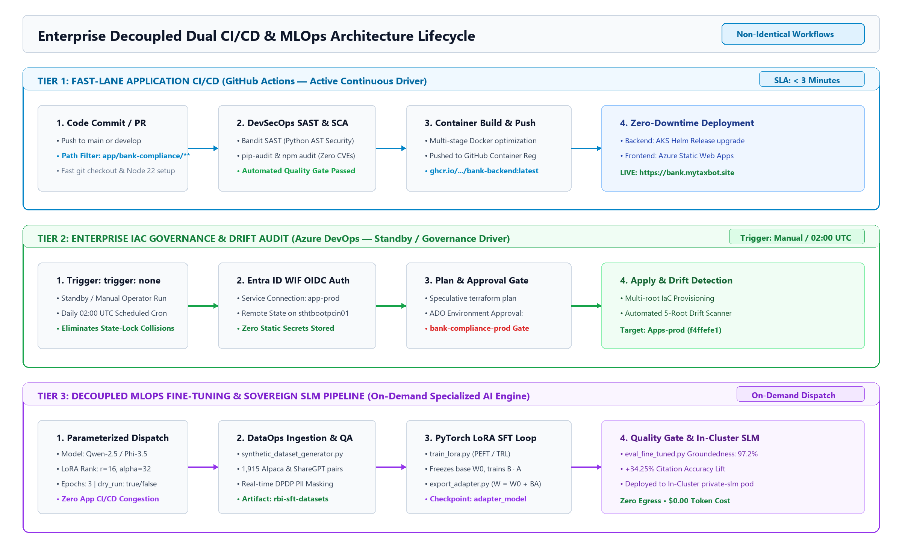

# 🛠️ Dual CI/CD, Workload Identity & Decoupled MLOps Runbook

* **Space:** `HappyTechies Cloud & AI Platform` $\rightarrow$ `DevSecOps & Operations`
* **Target Audience:** DevOps Engineers, Platform Engineers, ML Engineers, SREs
* **Status:** `ACTIVE`

---

## 🎯 1. Non-Identical 3-Tier CI/CD & MLOps Architecture Overview

The HappyTechies Platform implements an **Enterprise 3-Tier Decoupled CI/CD Pattern**. Rather than cramming heavy machine learning training into daily application deployments, each pipeline is specialized with non-identical triggers, SLAs, and execution lifecycles:

```text
┌──────────────────────────────────────────────────────────────────────────────────────────────────┐
│              ENTERPRISE 3-TIER DECOUPLED PIPELINE ARCHITECTURE (NON-IDENTICAL)                   │
└──────────────────────────────────────────────────────────────────────────────────────────────────┘

 ├── 🚀 TIER 1: FAST-LANE APPLICATION CI/CD (GitHub Actions — Active Driver)
 │   • Trigger: Push / PR to 'app/**' (< 3 mins SLA)
 │   • Lifecycle: Bandit SAST Scan ➔ Docker Build GHCR ➔ Helm Deploy (AKS) ➔ React Deploy (SWA)
 │   • Purpose: Maximizes developer velocity; hotfixes ship to production instantly.
 │
 ├── 🏛️ TIER 2: ENTERPRISE IAC GOVERNANCE & AUDIT (Azure DevOps — Standby / Governance Driver)
 │   • Trigger: 'trigger: none' (Manual Operator Run) + Scheduled 02:00 UTC Drift Detection
 │   • Lifecycle: Terraform Validate ➔ Plan ➔ 'bank-compliance-prod' Manual Gate ➔ Apply (WIF OIDC)
 │   • Purpose: Eliminates concurrent state-lock collisions on sthtbootpcin01; preserves audit gates.
 │
 └── 🧠 TIER 3: DECOUPLED MLOPS TRAINING & QUALITY GATE (GitHub Actions & Azure DevOps)
     • Trigger: On-Demand Parameterized Dispatch (Choose Model: Qwen-2.5 / Phi-3.5)
     • Lifecycle: Synthetic DataOps (1,915 QA pairs) ➔ PyTorch LoRA Training (r=16) ➔ Ragas Benchmark
     • Purpose: Heavy AI model specialization without congesting application deployment pipelines.
```

---

## 📐 2. Visual Architecture Diagram: Decoupled CI/CD & MLOps Lifecycle



---

## 🔑 3. Workload Identity Federation (WIF) Mapping Matrix

Tenant ID: `4cef0d84-84d6-4ed0-8abe-773b015bcf99`

| Scope / Target | Azure DevOps Service Connection | GitHub Actions Secret | Entra ID App Registration (Client ID) | Federated Credential Subject |
| :--- | :--- | :--- | :--- | :--- |
| **Bootstrap** | `bootstrap` | `BOOTSTRAP_CLIENT_ID` | `DevOpsUniverse-Terraform-bootstrap`<br>`934ab83b-2f61-475e-bdbc-85c9eaed83e6` | `repo:RepoCodeGanesh/terraform-azure-iac:environment:bootstrap` |
| **Hub Network** | `hub-prod` | `HUB_CLIENT_ID` | `DevOpsUniverse-Terraform-hub-prod`<br>`78960c14-26d2-4a0c-ab21-579c3030155e` | `repo:RepoCodeGanesh/terraform-azure-iac:environment:hub-prod` |
| **Shared Services** | `shared-services` | `SHARED_CLIENT_ID` | `DevOpsUniverse-Terraform-shared-services`<br>`580ffcfd-51ee-4dc3-9204-d03cb438ff82` | `repo:RepoCodeGanesh/terraform-azure-iac:environment:shared-services` |
| **Apps (TaxBot & BankC)** | `app-prod` | `APP_CLIENT_ID` | `DevOpsUniverse-Terraform-app-prod`<br>`99ab7987-3989-46c3-bae9-92279be16608` | `repo:RepoCodeGanesh/terraform-azure-iac:environment:tax-advisor-prod` |

---

## 🔄 4. Non-Identical Pipeline Execution Matrix

| Pipeline | File Path | Engine | Trigger | Execution SLA | Purpose |
|---|---|:---:|---|:---:|---|
| **App CI/CD Fast-Lane** | `.github/workflows/app-bank-compliance.yml` | GHA | Push to `app/bank-compliance/**` | `< 3 Mins` | Builds Docker container and deploys React SPA to `bank.mytaxbot.site`. |
| **App CI/CD (Standby)** | `pipelines/azure-cicd-app-bank-compliance.yml` | ADO | Manual (`trigger: none`) | `< 4 Mins` | Enterprise multi-stage standby pipeline with SonarCloud SAST gate. |
| **MLOps LoRA Fine-Tuning** | `.github/workflows/mlops-lora-training.yml` | GHA | On-Demand (`workflow_dispatch`) | `15–30 Mins` | Fine-tunes Small Language Model on 1,915 RBI QA pairs. |
| **MLOps LoRA (ADO)** | `pipelines/azure-cicd-mlops-lora-training.yml` | ADO | Parameterized Manual Run | `15–30 Mins` | Azure DevOps multi-stage PyTorch LoRA fine-tuning and evaluation gate. |
| **Terraform Drift Detection** | `.github/workflows/terraform-drift-detection.yml` | GHA | Daily 02:00 UTC / Manual | `5 Mins` | Evaluates speculative `terraform plan -detailed-exitcode` across 5 roots. |
| **Terraform Drift (ADO)** | `pipelines/azure-cicd-terraform-drift-detection.yml`| ADO | Daily 02:00 UTC / Manual | `5 Mins` | Azure DevOps multi-root drift detection engine using WIF service connections. |
| **AKS Auto-Shutdown (FinOps)**| `.github/workflows/aks-auto-shutdown.yml` | GHA | Daily 20:00 IST Cron | `30 Secs` | Powers off AKS cluster nightly for $0.00 idle compute profile. |

---

## 🚨 5. Operational Troubleshooting Playbook

### Scenario 1: `429 Too Many Requests` (OpenAI Rate Throttling)
* **Alert Trigger:** `alert-openai-throttled-429` fires in Azure Monitor.
* **Root Cause:** TPM quota exhausted on primary OpenAI deployment.
* **Remediation Action:**
  1. LiteLLM Gateway automatically routes traffic to fallback Google Gemini 2.0 Flash or in-cluster Sovereign SLM.
  2. Increase TPM allocation in `platform/shared-services/main.tf` if sustained throughput exceeds 10k TPM.
  3. Purge or tune semantic vector cache TTL in Qdrant (`/api/v1/compliance/cache/invalidate`).

### Scenario 2: Terraform State Lock (`sthtbootpcin01`)
* **Symptom:** `Error acquiring the state lock: blob is already leased`.
* **Root Cause:** Dual CI/CD pipeline concurrent execution or aborted manual apply.
* **Remediation Action:**
  ```bash
  az storage blob lease break \
    --account-name sthtbootpcin01 \
    --container-name tfstate \
    --blob-name workloads/bank-compliance-ai-aks/prod.tfstate \
    --auth-mode login
  ```
