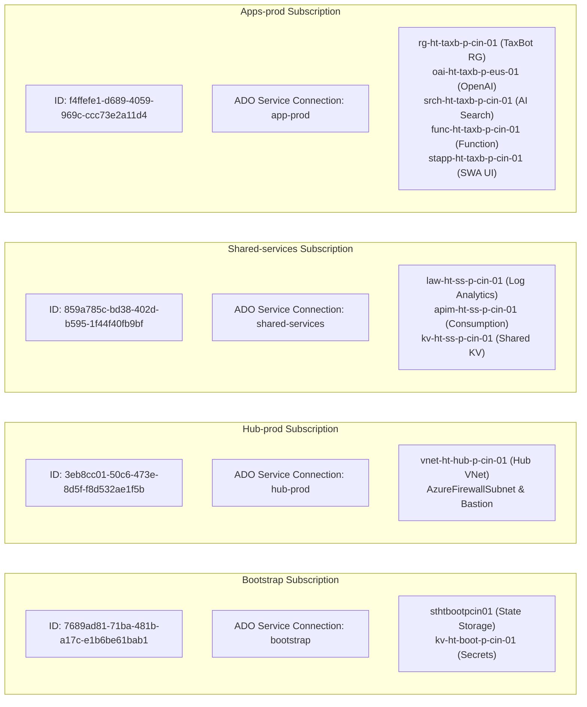
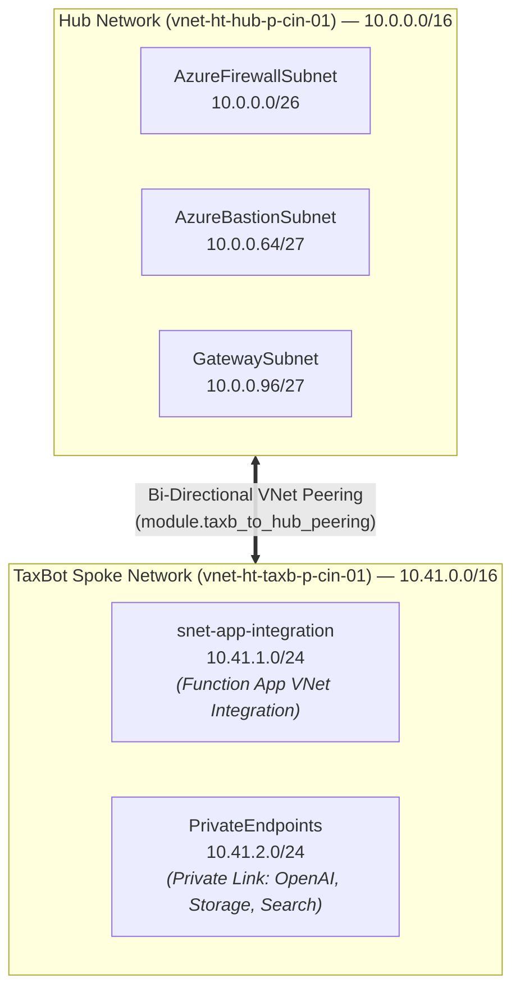
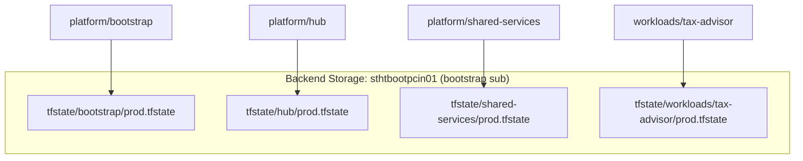
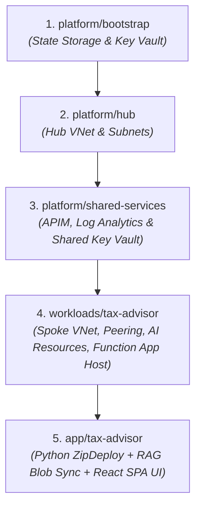

# Platform Guide 01 — Azure AI Landing Zone Overview

[← Back to Master Index](file:///c:/Users/RichT/OneDrive/Documents/Repos/migrate/terraform-azure-iac/docs/platform-guide/README.md)

---

## 🎯 Executive Overview

The **Azure AI Landing Zone** is an enterprise-grade, multi-subscription cloud platform built following the **Microsoft Cloud Adoption Framework (CAF)** Enterprise-Scale Landing Zone pattern. 

Provisioned using **Terraform Infrastructure as Code (IaC)** and **Dual CI/CD Pipelines (Azure DevOps & GitHub Actions)**, the platform hosts high-performance AI workloads—such as **TaxBot India (AI Income Tax Advisor)**—while maintaining near-zero idle running costs ($0–$15/month).

---

## 🏛️ Subscription Topology & Identity Mapping

The architecture segregates responsibilities across four distinct Azure subscriptions. Each subscription uses **Workload Identity Federation (WIF / OIDC)** via Entra ID App Registrations without hardcoded secrets.

### Subscription Summary Table

| Subscription Name | Azure Subscription ID | ADO Service Connection | Entra ID App Registration Client ID | Primary Role |
| :--- | :--- | :--- | :--- | :--- |
| **bootstrap** | `7689ad81-71ba-481b-a17c-e1b6be61bab1` | `bootstrap` | `934ab83b-2f61-475e-bdbc-85c9eaed83e6` | Remote Terraform `.tfstate` storage backend & bootstrap Key Vault |
| **Hub-prod** | `3eb8cc01-50c6-473e-8d5f-f8d532ae1f5b` | `hub-prod` | `78960c14-26d2-4a0c-ab21-579c3030155e` | Central Hub VNet, routing, firewall, bastion management |
| **Shared-services** | `859a785c-bd38-402d-b595-1f44f40fb9bf` | `shared-services` | `580ffcfd-51ee-4dc3-9204-d03cb438ff82` | Log Analytics workspace, APIM gateway, Shared Key Vault |
| **Apps-prod** | `f4ffefe1-d689-4059-969c-ccc73e2a11d4` | `app-prod` | `99ab7987-3989-46c3-bae9-92279be16608` | AI Workloads — TaxBot India (`workloads/tax-advisor` & `app/tax-advisor`) |

---

## 🌐 Hub-and-Spoke Network Architecture

The network layout enforces strict micro-segmentation with bi-directional VNet peering between the Hub and Workload Spokes.

### Network Subnet Reference

| VNet Name | CIDR Range | Subnet Name | Subnet CIDR | Purpose |
| :--- | :--- | :--- | :--- | :--- |
| `vnet-ht-hub-p-cin-01` | `10.0.0.0/16` | `AzureFirewallSubnet` | `10.0.0.0/26` | Central ingress/egress firewall inspection |
| | | `AzureBastionSubnet` | `10.0.0.64/27` | Secure management jumpbox access |
| | | `GatewaySubnet` | `10.0.0.96/27` | ExpressRoute / S2S VPN gateway |
| `vnet-ht-taxb-p-cin-01` | `10.41.0.0/16` | `snet-app-integration` | `10.41.1.0/24` | Swift VNet Integration for Python Function App |
| | | `PrivateEndpoints` | `10.41.2.0/24` | Private Endpoints for OpenAI, Storage, Search & Cosmos DB |

---

## 🔒 Multi-Root Terraform State Isolation

> [!IMPORTANT]
> **State Isolation Rule**: Never merge Terraform state files into a single root. Each layer (`platform/bootstrap`, `platform/hub`, `platform/shared-services`, and `workloads/tax-advisor`) runs as an independent Terraform root with its own isolated `.tfstate` file stored in `sthtbootpcin01`.

---

## 🚀 Strict Platform Deployment Sequence

Deploy platform roots in strict order to satisfy inter-layer dependencies:

