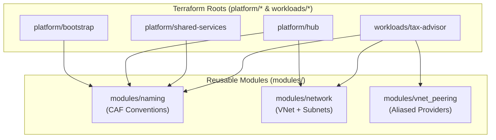

# Platform Guide 02 — Terraform IaC & Module Architecture

[← Back to Master Index](README.md)

---

## 🏗️ Repository Directory Structure

The repository maintains strict separation between **Platform Layers** (independent deployment roots with dedicated state files) and **Reusable Modules** (subscription-agnostic building blocks).

```
terraform-azure-iac/
├── platform/                     ── Platform Infrastructure Layers (Independent Roots)
│   ├── bootstrap/                ── Layer 1: Storage Account & Key Vault for TF State
│   ├── hub/                      ── Layer 2: Hub VNet, Firewall & Bastion Subnets
│   └── shared-services/          ── Layer 3: APIM Gateway, Log Analytics & Key Vault
├── workloads/                    ── Application Workload IaC Layers
│   └── tax-advisor/              ── Layer 4: TaxBot India (OpenAI, Search, Cosmos, Function)
├── modules/                      ── Reusable Subscription-Agnostic Modules
│   ├── naming/                   ── CAF Resource Naming Helper Module
│   ├── network/                  ── VNet & Subnet Wrapper Module
│   └── vnet_peering/             ── Cross-Subscription VNet Peering (Aliased Providers)
└── app/                          ── Application Codebase & RAG Assets
    └── tax-advisor/
        ├── frontend/             ── React SPA UI (Vite, Tailwind, Custom Domain)
        ├── backend/              ── Python 3.11 Azure Function (`function_app.py`)
        └── documents/            ── 10 Master Statutory Tax RAG Documents (FY 2026-27)
```

---

## 🧩 Module Dependency Architecture



---

## 🔍 Layer Breakdown & Resource Provisioning

### 1. Layer 1: Bootstrap (`platform/bootstrap`)
* **Target Subscription**: `bootstrap` (`7689ad81-71ba-481b-a17c-e1b6be61bab1`)
* **Backend State Location**: Stored locally on first run, then migrated to `sthtbootpcin01/tfstate/bootstrap/prod.tfstate`
* **Provisioned Resources**:
  * `azurerm_resource_group`: `rg-ht-boot-p-cin-01`
  * `azurerm_storage_account`: `sthtbootpcin01` (`Standard_LRS`, TLS 1.2, Blob container: `tfstate`)
  * `azurerm_key_vault`: `kv-ht-boot-p-cin-01` (Standard SKU with Azure RBAC authorization model)

### 2. Layer 2: Hub Network (`platform/hub`)
* **Target Subscription**: `Hub-prod` (`3eb8cc01-50c6-473e-8d5f-f8d532ae1f5b`)
* **Backend State Location**: `sthtbootpcin01/tfstate/hub/prod.tfstate`
* **Provisioned Resources**:
  * `azurerm_resource_group`: `rg-ht-hub-p-cin-01`
  * `module.hub_vnet`: `vnet-ht-hub-p-cin-01` (`10.0.0.0/16`) with `AzureFirewallSubnet`, `AzureBastionSubnet`, and `GatewaySubnet`

### 3. Layer 3: Shared Services (`platform/shared-services`)
* **Target Subscription**: `Shared-services` (`859a785c-bd38-402d-b595-1f44f40fb9bf`)
* **Backend State Location**: `sthtbootpcin01/tfstate/shared-services/prod.tfstate`
* **Provisioned Resources**:
  * `azurerm_resource_group`: `rg-ht-ss-p-cin-01`
  * `azurerm_log_analytics_workspace`: `law-ht-ss-p-cin-01` (`PerGB2018`, 30-day retention)
  * `azurerm_api_management`: `apim-ht-ss-p-cin-01` (`Consumption_0` SKU — $0 base cost)
  * `azurerm_key_vault`: `kv-ht-ss-p-cin-01` (Stores SWA deployment token)
  * `azurerm_service_plan`: `asp-ht-ss-p-cin-01` (Free `F1` tier host)

### 4. Layer 4: Workloads — TaxBot India (`workloads/tax-advisor`)
* **Target Subscription**: `Apps-prod` (`f4ffefe1-d689-4059-969c-ccc73e2a11d4`)
* **Backend State Location**: `sthtbootpcin01/tfstate/workloads/tax-advisor/prod.tfstate`
* **Provisioned Resources**:
  * `azurerm_resource_group`: `rg-ht-taxb-p-cin-01`
  * `module.taxb_vnet`: `vnet-ht-taxb-p-cin-01` (`10.41.0.0/16`)
  * `module.taxb_to_hub_peering`: Bi-directional VNet peering to `vnet-ht-hub-p-cin-01` (via aliased `azurerm.hub` provider)
  * `module.openai`: `oai-ht-taxb-p-eus-01` (`S0` SKU with `gpt-5.4-nano` deployment)
  * `module.search_service`: `srch-ht-taxb-p-cin-01` (`Basic` SKU with semantic ranker)
  * `module.cosmos_db`: `cosmos-ht-taxb-p-cin-01` (`Serverless` SKU)
  * `module.function_app`: `func-ht-taxb-p-cin-01` (`Consumption Y1` SKU, Python 3.11)
  * `azurerm_static_web_app`: `stapp-ht-taxb-p-cin-01` (`Free` tier bound to custom domain **www.mytaxbot.site**)
  * `azapi_resource.apim_tax_advisor_api`: APIM API registration & rate-limiting policies

---

## 🔑 Backend Configuration Standard (`backend.hcl`)

All `backend.hcl` files across all roots must point `subscription_id` to the **Bootstrap Subscription**:

```hcl
# Standard backend.hcl pattern across all platform roots
resource_group_name  = "rg-ht-boot-p-cin-01"
storage_account_name = "sthtbootpcin01"
container_name       = "tfstate"
key                  = "workloads/tax-advisor/prod.tfstate"
subscription_id      = "7689ad81-71ba-481b-a17c-e1b6be61bab1" # Always Bootstrap subscription ID
use_azuread_auth     = true
```

> [!NOTE]
> `use_azuread_auth = true` ensures authentication to the state storage account uses Entra ID RBAC tokens (Storage Blob Data Contributor). Storage access keys are completely disabled for enhanced security.
