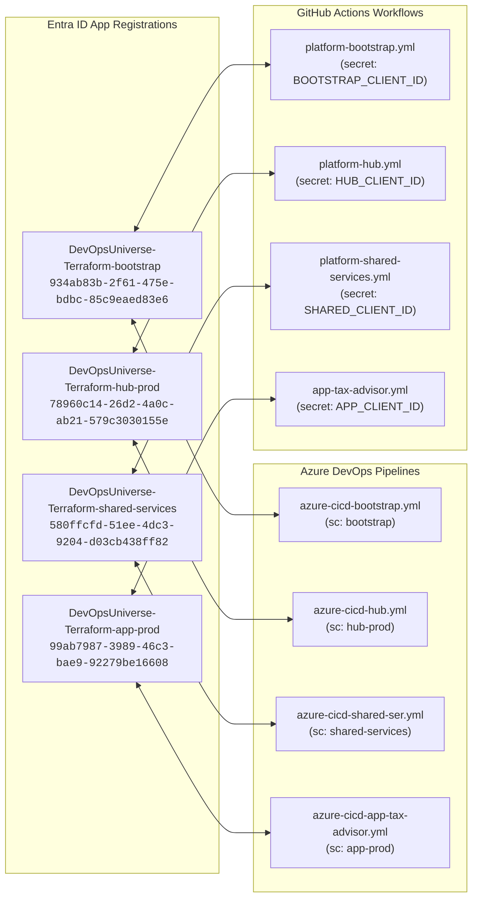
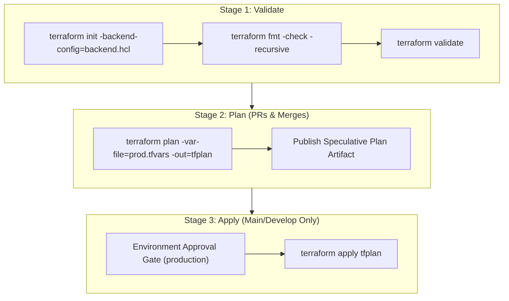

# Platform Guide 03 — Dual CI/CD Pipelines & WIF Authentication

[← Back to Master Index](../README.md) | [View Platform Guide Index](README.md)

---

## ⚡ Overview & Dual Engine Strategy

This repository supports **Dual CI/CD Automation**:
1. **Azure DevOps Pipelines (`pipelines/*.yml`)**: Enterprise-grade YAML pipelines with manual approvals and environments.
2. **GitHub Actions Workflows (`.github/workflows/*.yml`)**: Reusable workflow templates powered by OIDC authentication and central templates in `RepoCodeGanesh/.github`.

Both engines enforce **Workload Identity Federation (WIF / OIDC)**—eliminating stored secret keys or service principal passwords.

---

## 🔑 Workload Identity Federation (OIDC) Matrix



---

## 🛠️ Infrastructure IaC Pipeline Stages (3-Stage Lifecycle)

All Terraform IaC pipelines (`bootstrap`, `hub`, `shared-services`, `tax-advisor`) execute through a strict 3-stage governance lifecycle:



---

## 🚀 Application CI/CD Pipeline Stages (`app-tax-advisor.yml`)

The application deployment workflow delegates execution to central reusable templates in `RepoCodeGanesh/.github` across **4 parallelized phases**:

```mermaid
flowchart TD
    subgraph Phase1["Phase 1: DevSecOps Scanning"]
        J0["devsecops-scan<br><i>(Bandit, pip-audit, npm audit, SonarCloud)</i>"]
    end

    subgraph Phase2["Phase 2: ⚡ Parallel Build, Deploy & Sync"]
        J1["deploy-backend<br><i>(ZipDeploy functionapp.zip)</i>"]
        J2["deploy-frontend<br><i>(React SPA to Static Web App)</i>"]
        J3["upload-documents<br><i>(RAG statutory text sync)</i>"]
    end

    subgraph Phase3["Phase 3: CORS & Network Config"]
        J4["configure-cors<br><i>(Dynamic SWA Hostname CORS binding)</i>"]
    end

    subgraph Phase4["Phase 4: Release & SemVer Tagging"]
        J5["create-release<br><i>(SemVer tag + GitHub Release)</i>"]
    end

    J0 -->|needs: devsecops-scan| J1
    J0 -->|needs: devsecops-scan| J2
    J0 -->|needs: devsecops-scan| J3

    J1 -->|needs: [deploy-backend, deploy-frontend]| J4
    J2 -->|needs: [deploy-backend, deploy-frontend]| J4

    J4 -->|needs: [configure-cors, upload-documents]| J5
    J3 -->|needs: [configure-cors, upload-documents]| J5
```

### Central Called Workflow Templates Summary Table

| Called Workflow Template (`RepoCodeGanesh/.github`) | Role & Governance Controls | Target Resource / Action |
| :--- | :--- | :--- |
| **`app-sec-scan.yml`** | Runs Bandit SAST, pip-audit SCA, npm audit, and SonarCloud scan. | Code Repository |
| **`app-deploy-func.yml`** | Installs `manylinux2014` wheels, packages `functionapp.zip`, ZipDeploy, and healthcheck. | `func-ht-taxb-p-cin-01` |
| **`app-sync-docs.yml`** | Syncs statutory text files using Entra ID RBAC & `environment: tax-advisor-prod`. | `sthttaxbpcin01/documents` |
| **`app-deploy-swa.yml`** | Fetches deployment token from Key Vault, builds React SPA, and uploads to SWA. | `stapp-ht-taxb-p-cin-01` |
| **`app-config-cors.yml`** | Queries SWA default hostname & sets Function App CORS allowed origins. | Function App & APIM |
| **`app-tag-semver.yml`** | Generates SemVer git tag (`vX.Y.Z`) & creates GitHub Release with attached `functionapp.zip`. | GitHub Releases |
| **`pr-title-check.yml`** | Enforces Conventional Commit PR titles (`feat:`, `fix:`) for automatic SemVer tagging. | Pull Request Governance |

---

## 🔒 Azure OIDC WIF Environment Claim Standards
All GitHub Actions workflows authenticate via Entra ID Workload Identity Federation using specific `-prod` environment subject claims.

| Workflow File | Target Subscription | Entra ID App Registration Client ID | GitHub Environment (`environment_name`) | OIDC Subject Claim |
| :--- | :--- | :--- | :--- | :--- |
| **`platform-governance.yml`** | `bootstrap` (`7689ad81`) | `BOOTSTRAP_CLIENT_ID` (`934ab83b-...`) | `bootstrap-prod` | `repo:RepoCodeGanesh/terraform-azure-iac:environment:bootstrap-prod` |
| **`platform-bootstrap.yml`** | `bootstrap` (`7689ad81`) | `BOOTSTRAP_CLIENT_ID` (`934ab83b-...`) | `bootstrap-prod` | `repo:RepoCodeGanesh/terraform-azure-iac:environment:bootstrap-prod` |
| **`platform-hub.yml`** | `Hub-prod` (`3eb8cc01`) | `HUB_CLIENT_ID` (`78960c14-...`) | `hub-prod` | `repo:RepoCodeGanesh/terraform-azure-iac:environment:hub-prod` |
| **`platform-shared-services.yml`**| `Shared-services` (`859a785c`) | `SHARED_CLIENT_ID` (`580ffcfd-...`) | `shared-services-prod` | `repo:RepoCodeGanesh/terraform-azure-iac:environment:shared-services-prod` |
| **`workload-tax-advisor.yml`** | `Apps-prod` (`f4ffefe1`) | `APP_CLIENT_ID` (`99ab7987-...`) | `tax-advisor-prod` | `repo:RepoCodeGanesh/terraform-azure-iac:environment:tax-advisor-prod` |
| **`workload-bank-compliance-aks.yml`**| `Apps-prod` (`f4ffefe1`)| `APP_CLIENT_ID` (`99ab7987-...`) | `bank-compliance-prod` | `repo:RepoCodeGanesh/terraform-azure-iac:environment:bank-compliance-prod` |

> [!IMPORTANT]
> **Environment Claim Requirement**: Azure Entra ID App Registrations strictly enforce subject matching against the `-prod` environment names above. Never omit the `-prod` suffix in workflow `environment_name` inputs.
