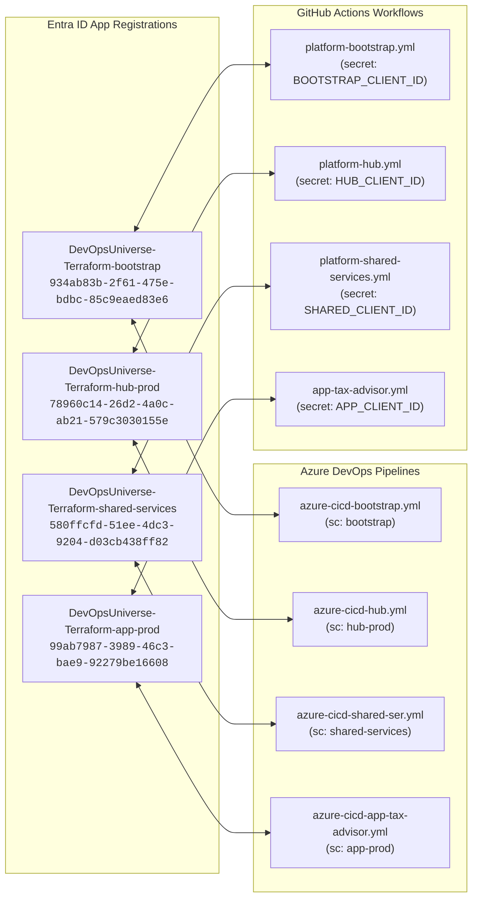
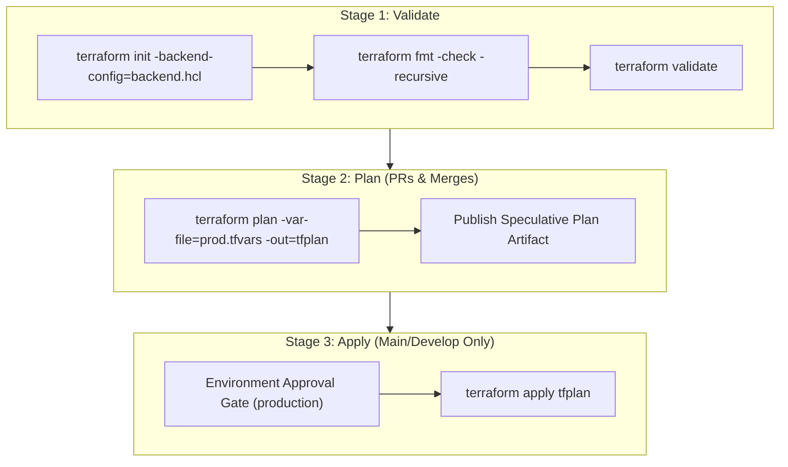
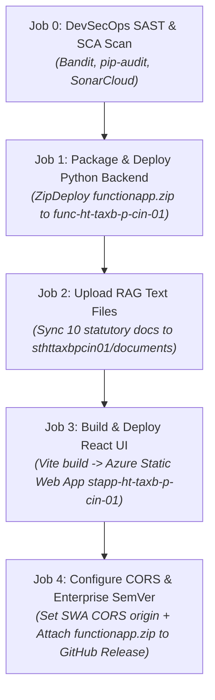
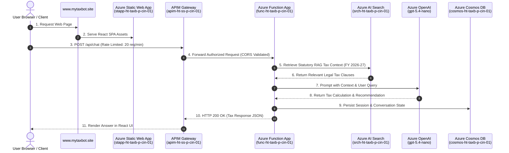

# Platform Guide 03 — Dual CI/CD Pipelines & WIF Authentication

[← Back to Master Index](README.md)

---

## ⚡ Overview & Dual Engine Strategy

This repository supports **Dual CI/CD Automation**:
1. **Azure DevOps Pipelines (`pipelines/*.yml`)**: Enterprise-grade YAML pipelines with manual approvals and environments.
2. **GitHub Actions Workflows (`.github/workflows/*.yml`)**: Reusable workflow templates powered by OIDC authentication.

Both engines enforce **Workload Identity Federation (WIF / OIDC)**—eliminating all stored secret keys or service principal passwords.

---

## 🔑 Workload Identity Federation (OIDC) Matrix



---

## 🛠️ Infrastructure IaC Pipeline Stages (3-Stage Lifecycle)

All Terraform IaC pipelines (`bootstrap`, `hub`, `shared-services`, `tax-advisor`) execute through a strict 3-stage governance lifecycle:



---

## 🚀 Application CI/CD Pipeline Stages (`app-tax-advisor.yml`)

The application deployment workflow executes across 5 sequential job stages:



### Application Job Summary Table

| Job ID | Job Name | Action & Security Controls | Target Resource |
| :---: | :--- | :--- | :--- |
| **Job 0** | DevSecOps SAST/SCA Scan | Runs `Bandit` (Python SAST), `pip-audit` (SCA vulnerabilities), `npm audit`, and `SonarCloud`. | Source Code Repository |
| **Job 1** | Deploy Python Backend | Installs `manylinux2014` wheels into `.python_packages`, archives `functionapp.zip`, uploads build artifact, and executes ZipDeploy with healthcheck. | `func-ht-taxb-p-cin-01` |
| **Job 2** | Upload RAG Documents | Syncs 10 statutory tax files from `app/tax-advisor/documents/` using Entra ID RBAC. | `sthttaxbpcin01/documents` |
| **Job 3** | Build & Deploy React UI | Fetches deployment token from Key Vault (`kv-ht-ss-p-cin-01`), runs `npm run build`, and deploys to Static Web App. | `stapp-ht-taxb-p-cin-01` |
| **Job 4** | CORS & SemVer Release | Queries SWA default hostname, configures Function App CORS allowed origins, tags commit (`vX.Y.Z`), and publishes GitHub Release with attached `functionapp.zip`. | Function App & GitHub Releases |

---

## 🌐 Live Runtime Sequence Architecture



---

## 🏷️ Automated SemVer & Release Asset Attachment

When a push occurs on `main` or a `release/*` branch, the pipeline automatically:
1. Calculates the next Semantic Version tag (`v1.0.X` for fixes, `v1.1.X` for features).
2. Pushes the Git tag (`v1.2.0`).
3. Downloads `functionapp.zip` build artifact and attaches it to the official GitHub Release assets tab.

```yaml
- name: Create Official GitHub Release with Attached Build Artifacts
  uses: ncipollo/release-action@v1
  with:
    tag: ${{ steps.tag_version.outputs.new_tag }}
    name: Release ${{ steps.tag_version.outputs.new_tag }}
    body: ${{ steps.tag_version.outputs.changelog }}
    artifacts: "functionapp.zip"
    token: ${{ secrets.GITHUB_TOKEN }}
```
