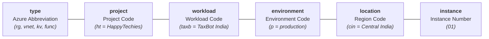

# Platform Guide 04 — CAF Naming Conventions & Tagging Standards

[← Back to Master Index](../README.md) | [View Platform Guide Index](README.md)

---

## 🏷️ Microsoft CAF Resource Naming Syntax

All Azure infrastructure resources in this repository strictly adhere to the **Microsoft Cloud Adoption Framework (CAF)** standardized resource naming convention:

```
[type]-[project]-[workload]-[environment]-[location_short]-[instance]
```



---

## 📋 Azure Resource Naming Reference Table

| Resource Type | Resource Abbreviation (`type`) | CAF Naming Pattern | TaxBot India Production Example |
| :--- | :---: | :--- | :--- |
| **Resource Group** | `rg` | `rg-[proj]-[workload]-[env]-[loc]-[no]` | `rg-ht-taxb-p-cin-01` |
| **Virtual Network** | `vnet` | `vnet-[proj]-[workload]-[env]-[loc]-[no]` | `vnet-ht-taxb-p-cin-01` |
| **Subnet** | `snet` | `snet-[proj]-[workload]-[env]-[loc]-[no]` | `snet-app-integration` |
| **Storage Account** | `st` | `st[proj][workload][env][loc][no]` *(no hyphens)* | `sthttaxbpcin01` |
| **Key Vault** | `kv` | `kv-[proj]-[workload]-[env]-[loc]-[no]` | `kv-ht-ss-p-cin-01` |
| **Log Analytics** | `law` | `law-[proj]-[workload]-[env]-[loc]-[no]` | `law-ht-ss-p-cin-01` |
| **API Management** | `apim` | `apim-[proj]-[workload]-[env]-[loc]-[no]` | `apim-ht-ss-p-cin-01` |
| **Function App** | `func` | `func-[proj]-[workload]-[env]-[loc]-[no]` | `func-ht-taxb-p-cin-01` |
| **Static Web App** | `stapp` | `stapp-[proj]-[workload]-[env]-[loc]-[no]` | `stapp-ht-taxb-p-cin-01` |
| **Azure OpenAI** | `oai` | `oai-[proj]-[workload]-[env]-[loc]-[no]` | `oai-ht-taxb-p-eus-01` |
| **AI Search** | `srch` | `srch-[proj]-[workload]-[env]-[loc]-[no]` | `srch-ht-taxb-p-cin-01` |
| **Cosmos DB** | `cosmos` | `cosmos-[proj]-[workload]-[env]-[loc]-[no]` | `cosmos-ht-taxb-p-cin-01` |

---

## 💡 Enterprise Exceptions: Where Human-Understandable Display Names MUST Be Used

In enterprise Cloud Adoption Framework setups, **UI display layers, user-facing endpoints, and operational alerts SHOULD NOT use cryptic system abbreviations**. They MUST use clear, human-understandable display names:

```
┌─────────────────────────────────────────────────────────────────────────────┐
│                       System Naming vs. Display Naming                      │
├──────────────────────────────────────┬──────────────────────────────────────┤
│ ⚙️ System Name (IaC / Azure ARM)     │ 👤 Display Name (Human-Understandable)│
│ (Mandatory for Automation & Syntax)  │ (Mandatory for UI, Alerts & End-Users)│
├──────────────────────────────────────┼──────────────────────────────────────┤
│ dash-ht-taxb-p-cin-01                │ TaxBot India - Telemetry Dashboard   │
│ stapp-ht-taxb-p-cin-01.azure...net   │ https://www.mytaxbot.site            │
│ alert-func-high-5xx-errors           │ Critical: Function App 5xx Errors    │
│ sp-012938-app-prod                   │ DevOpsUniverse - TaxBot Prod CI/CD   │
│ apim-api-01                          │ TaxBot India Income Tax API (v1)     │
└──────────────────────────────────────┴──────────────────────────────────────┘
```

### The 6 Enterprise Display Name Exception Rules:

1. **Azure Portal Dashboard Titles (`hidden-title` Tag)**:
   - **Rule**: Dashboards are designed for executives, engineers, and ops teams.
   - **Good**: `"TaxBot India - Telemetry Dashboard"`
   - **Avoid**: `"dash-ht-taxb-p-cin-01"` or raw GUIDs (`faa92774...`).

2. **Public User URLs & Custom Domains**:
   - **Rule**: End-users must never see underlying Azure default hostnames.
   - **Good**: `https://www.mytaxbot.site`
   - **Avoid**: `stapp-ht-taxb-p-cin-01.azurestaticapps.net`

3. **Azure Monitor Alerts & Action Groups**:
   - **Rule**: On-call engineers reading SMS/Slack/Email alerts at 2 AM need instant clarity.
   - **Good**: `"Critical: Function App High 5xx Errors"`
   - **Avoid**: `"alert-rule-01"`

4. **Entra ID App Registrations & Enterprise Applications**:
   - **Rule**: Security auditors and Azure administrators inspecting Azure AD need plain-English identities.
   - **Good**: `"DevOpsUniverse-Terraform-app-prod"`
   - **Avoid**: `"app-reg-01"`

5. **API Management Gateway Products & Display Names**:
   - **Rule**: Developers integrating with your API Developer Portal need clean API names.
   - **Good**: `"TaxBot India Income Tax API (v1.0)"`
   - **Avoid**: `"api-backend-01"`

6. **Log Analytics Saved Queries & Workbooks**:
   - **Rule**: Analytics queries must describe what business/tech insight they deliver.
   - **Good**: `"Azure OpenAI Token Cost & Usage Analysis"`
   - **Avoid**: `"query_1"`

---

## 🏷️ Mandatory Enterprise Resource Tagging

All resources provisioned by Terraform must inject the standard local tags defined in `locals.tf`:

```hcl
locals {
  common_tags = {
    Project     = "ht"
    Workload    = "taxb"
    Environment = "p"
    ManagedBy   = "Terraform"
    CostCenter  = "taxbot-india"
    Owner       = "ai-platform-team"
    Company     = "HappyTechies"
  }
}
```

### 🏷️ Tag Specification Card

> [!NOTE]
> - **`ManagedBy`**: Always set to `Terraform` to distinguish IaC-provisioned infrastructure from manual portal edits.
> - **`CostCenter`**: Enables granular Azure Cost Management filtering by workload across subscriptions.
> - **`Environment`**: Single letter indicator (`p` = Production, `d` = Development, `s` = Staging).
> - **`hidden-title`**: Special Azure Portal display tag used to set human-understandable titles for Shared Dashboards (e.g. `"TaxBot India - Telemetry Dashboard"`).

