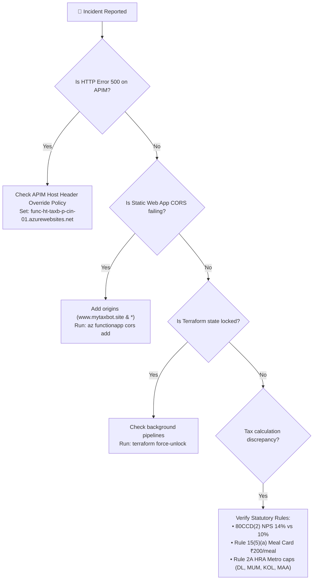

# Platform Guide 05 — Troubleshooting & Incident Response Playbook

[← Back to Master Index](file:///c:/Users/RichT/OneDrive/Documents/Repos/migrate/terraform-azure-iac/docs/platform-guide/README.md)

---

## 🚦 Incident Response Decision Flowchart



---

## 🛠️ Incident Troubleshooting Cards

### Card 1: APIM Gateway Returns 500 Internal Server Error

> [!CAUTION]
> **Symptom**: Requests routed through `apim-ht-ss-p-cin-01` return `HTTP 500 Internal Server Error`, while direct calls to `func-ht-taxb-p-cin-01.azurewebsites.net` succeed.

* **Root Cause**: The API Management inbound policy is missing the `Host` header override or backend service assignment. Function Apps running on Consumption plans reject requests whose `Host` header does not match their default Azure hostname.
* **Resolution**: Ensure the APIM policy includes the exact `Host` header override:
```xml
<policies>
    <inbound>
        <base />
        <set-header name="Host" exists-action="override">
            <value>func-ht-taxb-p-cin-01.azurewebsites.net</value>
        </set-header>
        <set-backend-service backend-id="func-backend-taxb" />
    </inbound>
</policies>
```

---

### Card 2: Static Web App CORS Failure ("Failed to fetch")

> [!WARNING]
> **Symptom**: React SPA UI at `www.mytaxbot.site` logs CORS errors in browser developer tools: `Access to fetch at 'https://apim-ht-ss-p-cin-01...' from origin 'https://www.mytaxbot.site' has been blocked by CORS policy`.

* **Root Cause**: Custom domain `www.mytaxbot.site` or Static Web App preview host is missing from the Function App CORS allowed origins list.
* **Resolution**: Execute Azure CLI command to append custom origins:
```bash
az functionapp cors add \
  --name "func-ht-taxb-p-cin-01" \
  --resource-group "rg-ht-taxb-p-cin-01" \
  --allowed-origins "https://www.mytaxbot.site" "https://mytaxbot.site" "*"
```

---

### Card 3: Income Tax Calculation Edge Cases (FY 2026-27 / AY 2027-28)

> [!IMPORTANT]
> **Audit Requirement**: TaxBot RAG engine calculations must strictly follow Indian Income Tax Rules:

1. **Section 80CCD(2) Employer NPS Contribution**:
   * **New Tax Regime (Section 115BAC)**: **14%** of Basic + DA is tax-exempt for **BOTH** Private & Government sector employees.
   * **Old Tax Regime**: **10%** of Basic + DA for Private sector employees, and **14%** for Central/State Government employees.
2. **Rule 15(5)(a) Meal Card Exemption Cap**:
   * Up to **₹200 per meal** (maximum ₹8,800/month or ₹1,05,600/year) is **100% EXEMPT** under **BOTH** New and Old Tax Regimes.
3. **Rule 2A HRA Metro City Exemption**:
   * Metro cities (50% Basic exemption cap) are **strictly limited** to Delhi (including NCR), Mumbai, Kolkata, and Chennai.
   * **Bengaluru, Hyderabad, and Pune legally remain Non-Metro (40% Basic cap)** under the explicit text of Income Tax Rule 2A.

---

### Card 4: Terraform Remote State Lock Error

> [!NOTE]
> **Symptom**: `terraform plan` or `terraform apply` fails with `Error acquiring the state lock: Storage blob sthtbootpcin01/tfstate/... is locked`.

* **Root Cause**: A previous CI/CD pipeline run timed out or was cancelled abruptly, leaving an active lock on the remote state blob.
* **Resolution**:
  1. Verify no active pipeline run is executing.
  2. Copy the Lock ID from the error message.
  3. Execute force unlock:
```bash
terraform force-unlock <LOCK-ID>
```
