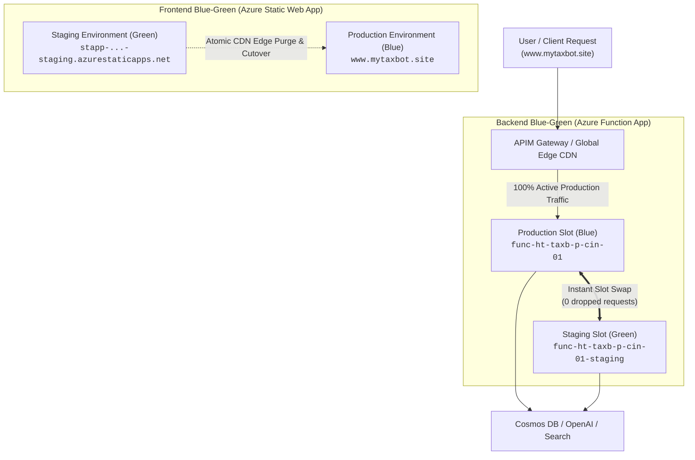
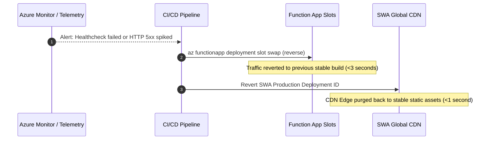

# Platform Guide 06 — Blue-Green Zero-Downtime Deployments

[← Back to Master Index](file:///c:/Users/RichT/OneDrive/Documents/Repos/migrate/terraform-azure-iac/docs/platform-guide/README.md)

---

## ⚡ Zero-Downtime Deployment Topology

The Blue-Green deployment architecture for TaxBot India guarantees **zero user downtime**, **pre-warmed database connections**, and **1-click automated rollbacks** across both backend and frontend layers.



---

## 🐍 Backend Blue-Green Strategy (Python Function App)

### 1. Provision Deployment Slots
* **Production Slot (Blue)**: Serves live traffic at `func-ht-taxb-p-cin-01.azurewebsites.net`.
* **Staging Slot (Green)**: Isolated environment at `func-ht-taxb-p-cin-01-staging.azurewebsites.net`.

### 2. Deployment & Pre-warming Flow
1. CI/CD pipeline packages Python code (`.python_packages`) and deploys to the **Staging Slot**.
2. Managed Identity authentication, Cosmos DB connections, and OpenAI client pools pre-warm in staging without affecting production.

### 3. Automated Healthcheck & Slot Swap
The pipeline pings the staging healthcheck endpoint before performing swap:

```bash
# 1. Healthcheck Gate
curl -s -m 10 "https://func-ht-taxb-p-cin-01-staging.azurewebsites.net/api/health"

# 2. Instant Slot Swap
az functionapp deployment slot swap \
  --name "func-ht-taxb-p-cin-01" \
  --resource-group "rg-ht-taxb-p-cin-01" \
  --slot staging \
  --target-slot production
```

> [!TIP]
> **Zero Downtime**: Azure App Service performs an in-memory routing swap. Active HTTP requests are completed by the previous instance while new incoming requests are instantly routed to the new warm instance.

---

## 🌐 Frontend Blue-Green Strategy (Azure Static Web App)

### 1. SWA Environment Isolation
* **Production Environment (Blue)**: Serves live traffic at `www.mytaxbot.site`.
* **Staging Environment (Green)**: Serves PR preview builds at `stapp-ht-taxb-p-cin-01-staging.azurestaticapps.net`.

### 2. Global Atomic CDN Cutover
1. React SPA production bundle builds (`npm run build`).
2. Deployment CLI uploads static assets to the staging environment.
3. Smoke tests verify asset loading and APIM connectivity.
4. CI/CD promotes staging to production. Azure CDN performs an **instant atomic edge cache purge** (<1 second cutover).

---

## ⏪ 1-Click Automated Rollback Playbook

If telemetry metrics degrade post-deployment, execute automated rollback:



* **Backend Rollback Command**:
```bash
az functionapp deployment slot swap \
  --name "func-ht-taxb-p-cin-01" \
  --resource-group "rg-ht-taxb-p-cin-01" \
  --slot staging \
  --target-slot production
```
