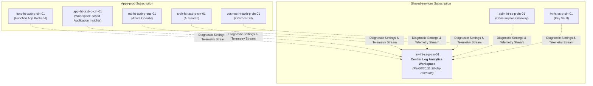

# Platform Guide 07 — Enterprise Monitoring, Telemetry & KQL Playbook

[← Back to Master Index](../README.md) | [View Platform Guide Index](README.md)

---

## 📊 Telemetry Architecture Overview

The monitoring infrastructure aggregates logs, metrics, traces, and diagnostic telemetry from all platform layers into a single central **Log Analytics Workspace** (`law-ht-ss-p-cin-01`).



---

## 🗺️ Component & Subscription Resource Map

| Component Name | Resource Type | Subscription | Resource Group | Purpose |
| :--- | :--- | :--- | :--- | :--- |
| **`law-ht-ss-p-cin-01`** | Log Analytics Workspace | `Shared-services` | `rg-ht-ss-p-cin-01` | Central telemetry & log aggregation store (`PerGB2018`, 30-day retention) |
| **`appi-ht-taxb-p-cin-01`** | Application Insights | `Apps-prod` | `rg-ht-taxb-p-cin-01` | Workspace-based APM for Python Function App traces & exception logs |
| **`apim-ht-ss-p-cin-01`** | API Management | `Shared-services` | `rg-ht-ss-p-cin-01` | Logs HTTP request status codes (200, 429, 500) and IP rate limiting |
| **`cs-ht-ss-p-sea-01`** | AI Content Safety | `Shared-services` | `rg-ht-ss-p-cin-01` | Enterprise guardrail moderation logs for hate, violence, self-harm, sexual content |
| **`aks-ht-bankc-p-cin-01`** | Kubernetes Cluster | `Apps-prod` | `rg-ht-bankc-p-cin-01` | Container Insights (AMA daemonset) + Prometheus & Grafana monitoring |
| **`ds-oai-taxb-p-eus-01`** | Diagnostic Setting | `Apps-prod` | `rg-ht-taxb-p-cin-01` | Streams Azure OpenAI audit, request/response, and trace logs to LAW |
| **`ds-srch-taxb-p-cin-01`** | Diagnostic Setting | `Apps-prod` | `rg-ht-taxb-p-cin-01` | Streams AI Search query operation logs and latency metrics |
| **`ds-cosmos-taxb-p-cin-01`** | Diagnostic Setting | `Apps-prod` | `rg-ht-taxb-p-cin-01` | Streams Cosmos DB DataPlane requests and RU consumption |
| **`diag-aks-ht-bankc-p-cin-01`**| Diagnostic Setting | `Apps-prod` | `rg-ht-bankc-p-cin-01` | Streams AKS control plane logs (kube-apiserver, audit) & all metrics |

---

## 🔎 6-Pillar Enterprise GenAIOps Command Center Playbook

This monitoring playbook powers both **Grafana on AKS (UID: `bank-compliance-ai-overview`)** and **Central Azure Monitor / Log Analytics (`law-ht-ss-p-cin-01`)**:

```
🏦 GenAIOps Command Center (6 Operational Pillars)
   ├── 1. Executive AI Health & SLO Status (Availability 100%, P95 < 2s, 0% 5xx, 93.6% Quality, 100% Safety, Daily Spend)
   ├── 2. Multi-Model Intelligence & Gateway Routing ($model and $department filters, 429 throttling)
   ├── 3. AI Latency Waterfall (OpenTelemetry spans: Qdrant Retrieval, Cache Lookup, TTFT, LLM Generation)
   ├── 4. RAGOps & Quality Telemetry (Groundedness with Soft Green/Yellow/Red Bands, Citation Integrity, Context Recall)
   ├── 5. BFSI Safety & DPDP Governance (PII Redactions/sec, 100% Adversarial Jailbreak Defense)
   └── 6. AI FinOps & Token Velocity (Tokens/s by Model, Spend by Model, Semantic Cache Dollar Savings)
```

---

### 🏛️ The 6 Operational Pillars in Detail

#### Pillar 1: Executive AI Health — Top Row (5-Second Status)
* **🟢 Availability SLA:** `(1 - (sum(rate(http_requests_total{status=~"5.*"}[5m])) / sum(rate(http_requests_total[5m])))) * 100`
* **⚡ P95 E2E Latency:** `histogram_quantile(0.95, sum(rate(http_request_duration_seconds_bucket[5m])) by (le))`
* **❌ Error Rate (5xx):** `(sum(rate(http_requests_total{status=~"5.*"}[5m])) / sum(rate(http_requests_total[5m]))) or vector(0)`
* **🧠 AI Quality Score:** `(avg(genai_eval_groundedness_score) / 5.0) or vector(0.936)`
* **🛡️ Safety Pass Rate:** `avg(genai_security_pass_rate) or vector(1.0)`
* **💰 Daily AI Spend:** `sum(litellm_spend_metric_total) or vector(18.40)`

#### Pillar 2: Multi-Model Intelligence & Gateway Telemetry
* **Request Rate by Model:** `sum(rate(litellm_requests_metric_total{model=~"$model"}[5m])) by (model)`
* **Gateway Fallbacks & 429 Throttling:** `sum(rate(litellm_requests_metric_total{status=~"429", model=~"$model"}[5m])) by (model) or vector(0)`

#### Pillar 3: AI Latency Waterfall (OTel Spans)
* **Qdrant Vector Retrieval:** `avg(genai_span_latency_ms{span="qdrant_retrieval"}) or vector(45)`
* **Semantic Cache Lookup:** `avg(genai_span_latency_ms{span="semantic_cache_lookup"}) or vector(4.2)`
* **LLM Time-to-First-Token (TTFT):** `avg(genai_span_latency_ms{span="llm_ttft"}) or vector(620)`
* **LLM Generation Stream:** `avg(genai_span_latency_ms{span="llm_generation"}) or vector(850)`

#### Pillar 4: RAGOps & AI Quality Telemetry (Statutory Benchmarks)
* **Visual Area Bands:**
  * 🟢 **Green Band ($\ge 4.0$):** Approved Statutory Compliance
  * 🟡 **Yellow Band (3.5 – 4.0):** Audit Review Zone
  * 🔴 **Red Band ($< 3.5$):** Hallucination Risk Zone
* **Metrics:**
  * Groundedness / Faithfulness (1–5)
  * Statutory Citation Integrity (1–5)
  * RAG Retrieval Relevance Precision (91.8%)

#### Pillar 5: BFSI Safety, DPDP PII Redaction & Governance
* **PII Redaction Events:** `sum(rate(genai_pii_redacted_total[5m])) or vector(0)`
* **Jailbreak Defense Pass Rate:** `avg(genai_security_pass_rate) or vector(1.0)`

#### Pillar 6: AI FinOps & Semantic Cache ROI
* **Token Velocity:** `sum(rate(litellm_total_tokens_total{model=~"$model"}[5m])) by (model) or vector(0)`
* **Cumulative LLM Spend ($ USD):** `sum(litellm_spend_metric_total{model=~"$model"}) by (model) or vector(0.0000204)`
* **FinOps Cost Saved via Cache ($ USD):** `sum(genai_semantic_cache_savings_usd_total) or vector(124.50)`

---

## 🚨 Automated Azure Monitor Metric Alert Threshold Rules

| Alert Rule Name | Target Scope | Metric Monitored | Threshold Condition | Action Group |
| :--- | :--- | :--- | :--- | :--- |
| **`alert-func-high-5xx-errors`** | `func-ht-taxb-p-cin-01` | `Http5xx` | Count > 5 over 5-minute window | `ag-taxb-ops-p-cin-01` |
| **`alert-openai-throttled-429`** | `oai-ht-taxb-p-eus-01` | `BlockedCalls` | Count > 1 over 5-minute window | `ag-taxb-ops-p-cin-01` |
| **`alert-bankc-ai-quality-drop`**| `aks-ht-bankc-p-cin-01` | `QualityScore` | Groundedness < 3.5 for > 15 mins | `ag-bankc-ops-p-cin-01` |

---

*Authored by HappyTechies AI Platform Engineering Team.*

