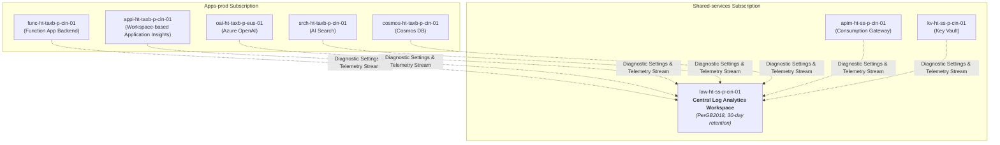

# Platform Guide 07 — Monitoring, Telemetry & KQL Playbook

[← Back to Master Index](README.md)

---

## 📊 Telemetry Architecture Overview

The monitoring infrastructure aggregates logs, metrics, traces, and diagnostic telemetry from all platform layers into a single central **Log Analytics Workspace** (`law-ht-ss-p-cin-01`).



---

## 🗺️ Component & Subscription Resource Map

| Component Name | Resource Type | Subscription | Resource Group | Purpose |
| :--- | :--- | :--- | :--- | :--- |
| `law-ht-ss-p-cin-01` | Log Analytics Workspace | `Shared-services` | `rg-ht-ss-p-cin-01` | Central telemetry & log aggregation store (`PerGB2018`, 30-day retention) |
| `appi-ht-taxb-p-cin-01` | Application Insights | `Apps-prod` | `rg-ht-taxb-p-cin-01` | Workspace-based APM for Python Function App traces & exception logs |
| `apim-ht-ss-p-cin-01` | API Management | `Shared-services` | `rg-ht-ss-p-cin-01` | Logs HTTP request status codes (200, 429, 500) and IP rate limiting |

---

## 🔎 Essential KQL Query Cheat Sheet

### 1. Function App Latency & Request Throughput
Tracks HTTP request volume, average duration, P95 latency, and failure counts:

```kql
requests
| where timestamp > ago(24h)
| summarize 
    TotalRequests = count(),
    AvgDurationMs = avg(duration),
    P95DurationMs = percentiles(duration, 95),
    Failures = countif(success == false) 
    by name
| order by TotalRequests desc
```

### 2. Backend Exceptions & Exception Stack Traces
Captures unhandled Python exceptions and problem IDs:

```kql
exceptions
| where timestamp > ago(24h)
| project timestamp, problemId, type, outerMessage, innermostMessage, operation_Name
| order by timestamp desc
```

### 3. APIM Gateway HTTP 429 Rate-Limit Throttling
Monitors client IPs being rate-limited by APIM policies (20 calls/min):

```kql
ApiManagementGatewayLogs
| where ResponseCode == 429
| summarize ThrottledRequests = count() by ClientTime, CallerIpAddress, ApiId
| order by ClientTime desc
```

### 4. Azure OpenAI Token Consumption & Latency
Tracks token usage (`prompt_tokens`, `completion_tokens`, `total_tokens`) across deployments:

```kql
AzureDiagnostics
| where ResourceType == "COGNITIVESERVICES"
| summarize 
    TotalTokens = sum(toint(properties_s.total_tokens)),
    Requests = count() 
    by Resource, Model_s = tostring(properties_s.model)
```

---

## 🚨 Azure Monitor Metric Alert Threshold Rules

| Alert Rule Name | Target Scope | Metric Monitored | Threshold Condition | Notification Channel |
| :--- | :--- | :--- | :--- | :--- |
| **Function App HTTP 5xx Alert** | `func-ht-taxb-p-cin-01` | `Http5xx` | Count > 0 over 5-minute window | Email / PagerDuty / Webhook |
| **APIM Rate Limit Spikes (429)** | `apim-ht-ss-p-cin-01` | `Gateway Requests` (429 filtered) | Count > 5 over 5-minute window | Email / Slack Notification |
| **Cosmos DB Serverless Throttling** | `cosmos-ht-taxb-p-cin-01` | `Total Requests` (412/429 filtered) | Count > 0 over 5-minute window | Email Notification |
