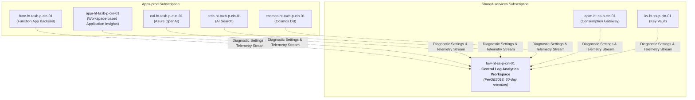

# Platform Guide 07 — Enterprise Monitoring, Telemetry & KQL Playbook

[← Back to Master Index](../README.md) | [View Platform Guide Index](README.md)

---

## 📊 Telemetry Architecture Overview

The monitoring infrastructure aggregates logs, metrics, traces, and diagnostic telemetry from all platform layers into a single central **Log Analytics Workspace** (`law-ht-ss-p-cin-01`).



---

## 🗺️ Component & Subscription Resource Map

| Component Name | Resource Type | Subscription | Resource Group | Purpose |
| :--- | :--- | :--- | :--- | :--- |
| **`law-ht-ss-p-cin-01`** | Log Analytics Workspace | `Shared-services` | `rg-ht-ss-p-cin-01` | Central telemetry & log aggregation store (`PerGB2018`, 30-day retention) |
| **`appi-ht-taxb-p-cin-01`** | Application Insights | `Apps-prod` | `rg-ht-taxb-p-cin-01` | Workspace-based APM for Python Function App traces & exception logs |
| **`apim-ht-ss-p-cin-01`** | API Management | `Shared-services` | `rg-ht-ss-p-cin-01` | Logs HTTP request status codes (200, 429, 500) and IP rate limiting |
| **`cs-ht-ss-p-sea-01`** | AI Content Safety | `Shared-services` | `rg-ht-ss-p-cin-01` | Enterprise guardrail moderation logs for hate, violence, self-harm, sexual content |
| **`aks-ht-bankc-p-cin-01`** | Kubernetes Cluster | `Apps-prod` | `rg-ht-bankc-p-cin-01` | Container Insights (AMA daemonset) + Prometheus & Grafana monitoring |
| **`ds-oai-taxb-p-eus-01`** | Diagnostic Setting | `Apps-prod` | `rg-ht-taxb-p-cin-01` | Streams Azure OpenAI audit, request/response, and trace logs to LAW |
| **`ds-srch-taxb-p-cin-01`** | Diagnostic Setting | `Apps-prod` | `rg-ht-taxb-p-cin-01` | Streams AI Search query operation logs and latency metrics |
| **`ds-cosmos-taxb-p-cin-01`** | Diagnostic Setting | `Apps-prod` | `rg-ht-taxb-p-cin-01` | Streams Cosmos DB DataPlane requests and RU consumption |
| **`diag-aks-ht-bankc-p-cin-01`**| Diagnostic Setting | `Apps-prod` | `rg-ht-bankc-p-cin-01` | Streams AKS control plane logs (kube-apiserver, audit) & all metrics |

---

## 🔎 5-Pillar Enterprise GenAI Dashboard KQL Playbook

This playbook powers both **Azure Monitor Workbooks** and **Central Log Analytics (`law-ht-ss-p-cin-01`)** dashboards:

```
Application
   ├── 1. Token Consumption (Prompt vs Completion vs Cached Tokens)
   ├── 2. Cost ($ USD Spend by Model & FinOps Savings)
   ├── 3. Latency (P50, P95, P99 & Span Breakdown)
   ├── 4. Quality Score (Groundedness, Citation Integrity & Hallucination Index)
   └── 5. SLA (Availability %, 5xx Error Rate, Throttling Rate)
```

### 1. Token Consumption (Prompt vs Completion by Model)
```kql
AzureDiagnostics
| where ResourceType == "COGNITIVESERVICES"
| extend Model = tostring(properties_s.model)
| extend PromptTokens = toint(properties_s.prompt_tokens)
| extend CompletionTokens = toint(properties_s.completion_tokens)
| summarize 
    TotalPromptTokens = sum(PromptTokens),
    TotalCompletionTokens = sum(CompletionTokens),
    TotalTokens = sum(PromptTokens + CompletionTokens)
    by bin(TimeGenerated, 1h), Model
| render timechart
```

### 2. AI FinOps Cost Tracking & Semantic Cache Savings ($ USD)
```kql
AzureDiagnostics
| where ResourceType == "COGNITIVESERVICES"
| extend Model = tostring(properties_s.model)
| extend PromptTokens = toint(properties_s.prompt_tokens)
| extend CompletionTokens = toint(properties_s.completion_tokens)
| extend CostUSD = case(
    Model has "gpt-4o-mini", (PromptTokens * 0.00000015) + (CompletionTokens * 0.00000060),
    Model has "gpt-4o", (PromptTokens * 0.00000250) + (CompletionTokens * 0.00001000),
    0.0
)
| summarize CumulativeSpendUSD = sum(CostUSD) by bin(TimeGenerated, 1d), Model
| render barchart
```

### 3. Latency Percentiles (P50, P95, P99 & Time-to-First-Token)
```kql
requests
| where timestamp > ago(24h)
| summarize 
    P50_DurationMs = percentile(duration, 50),
    P90_DurationMs = percentile(duration, 90),
    P95_DurationMs = percentile(duration, 95),
    P99_DurationMs = percentile(duration, 99)
    by bin(timestamp, 15m)
| render timechart
```

### 4. GenAI Quality Score & Hallucination Metrics
```kql
AppEvents
| where Name == "GenAIOps_Evaluation_Score"
| extend Groundedness = todouble(Properties["groundedness"])
| extend CitationScore = todouble(Properties["citation_integrity"])
| extend Relevance = todouble(Properties["relevance"])
| summarize 
    AvgGroundedness = avg(Groundedness),
    AvgCitationScore = avg(CitationScore),
    AvgRelevance = avg(Relevance)
    by bin(TimeGenerated, 1d)
| render timechart
```

### 5. Application SLA & Uptime Availability (%)
```kql
requests
| where timestamp > ago(30d)
| summarize 
    TotalRequests = count(),
    SuccessfulRequests = countif(success == true),
    FailedRequests = countif(success == false)
| extend AvailabilitySLA = (todouble(SuccessfulRequests) / todouble(TotalRequests)) * 100.0
| extend ErrorRate5xx = (todouble(FailedRequests) / todouble(TotalRequests)) * 100.0
| project TotalRequests, AvailabilitySLA, ErrorRate5xx
```

---

## 🚨 Automated Azure Monitor Metric Alert Threshold Rules

| Alert Rule Name | Target Scope | Metric Monitored | Threshold Condition | Action Group |
| :--- | :--- | :--- | :--- | :--- |
| **`alert-func-high-5xx-errors`** | `func-ht-taxb-p-cin-01` | `Http5xx` | Count > 5 over 5-minute window | `ag-taxb-ops-p-cin-01` |
| **`alert-openai-throttled-429`** | `oai-ht-taxb-p-eus-01` | `BlockedCalls` | Count > 1 over 5-minute window | `ag-taxb-ops-p-cin-01` |

