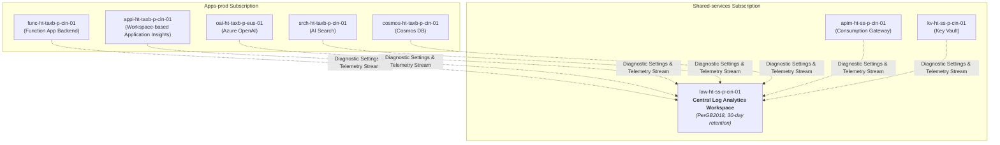

# Platform Guide 07 — Enterprise Monitoring, Telemetry & KQL Playbook

[← Back to Master Index](../README.md) | [View Platform Guide Index](README.md)

---

## 📊 Telemetry Architecture Overview

The monitoring infrastructure aggregates logs, metrics, traces, and diagnostic telemetry from all platform layers into a single central **Log Analytics Workspace** (`law-ht-ss-p-cin-01`).



---

## 🗺️ Component & Subscription Resource Map

| Component Name | Resource Type | Subscription | Resource Group | Purpose |
| :--- | :--- | :--- | :--- | :--- |
| **`law-ht-ss-p-cin-01`** | Log Analytics Workspace | `Shared-services` | `rg-ht-ss-p-cin-01` | Central telemetry & log aggregation store (`PerGB2018`, 30-day retention) |
| **`appi-ht-taxb-p-cin-01`** | Application Insights | `Apps-prod` | `rg-ht-taxb-p-cin-01` | Workspace-based APM for Python Function App traces & exception logs |
| **`apim-ht-ss-p-cin-01`** | API Management | `Shared-services` | `rg-ht-ss-p-cin-01` | Logs HTTP request status codes (200, 429, 500) and IP rate limiting |
| **`cs-ht-ss-p-sea-01`** | AI Content Safety | `Shared-services` | `rg-ht-ss-p-cin-01` | Enterprise guardrail moderation logs for hate, violence, self-harm, sexual content |
| **`aks-ht-bankc-p-cin-01`** | Kubernetes Cluster | `Apps-prod` | `rg-ht-bankc-p-cin-01` | Container Insights (AMA daemonset) + Prometheus & Grafana monitoring |
| **`ds-oai-taxb-p-eus-01`** | Diagnostic Setting | `Apps-prod` | `rg-ht-taxb-p-cin-01` | Streams Azure OpenAI audit, request/response, and trace logs to LAW |
| **`ds-srch-taxb-p-cin-01`** | Diagnostic Setting | `Apps-prod` | `rg-ht-taxb-p-cin-01` | Streams AI Search query operation logs and latency metrics |
| **`ds-cosmos-taxb-p-cin-01`** | Diagnostic Setting | `Apps-prod` | `rg-ht-taxb-p-cin-01` | Streams Cosmos DB DataPlane requests and RU consumption |
| **`diag-aks-ht-bankc-p-cin-01`**| Diagnostic Setting | `Apps-prod` | `rg-ht-bankc-p-cin-01` | Streams AKS control plane logs (kube-apiserver, audit) & all metrics |

---

## 🔎 Essential KQL Query Cheat Sheet

### 1. Function App Latency & Request Throughput
Tracks HTTP request volume, average duration, P95 latency, and failure counts:

```kql
requests
| where timestamp > ago(24h)
| summarize 
    TotalRequests = count(),
    AvgDurationMs = avg(duration),
    P95DurationMs = percentiles(duration, 95),
    Failures = countif(success == false) 
    by name
| order by TotalRequests desc
```

### 2. Backend Exceptions & Exception Stack Traces
Captures unhandled Python exceptions and problem IDs:

```kql
exceptions
| where timestamp > ago(24h)
| project timestamp, problemId, type, outerMessage, innermostMessage, operation_Name
| order by timestamp desc
```

### 3. APIM Gateway HTTP 429 Rate-Limit Throttling
Monitors client IPs being rate-limited by APIM policies (20 calls/min):

```kql
ApiManagementGatewayLogs
| where ResponseCode == 429
| summarize ThrottledRequests = count() by ClientTime, CallerIpAddress, ApiId
| order by ClientTime desc
```

### 4. Azure OpenAI Token Consumption & Latency
Tracks token usage (`prompt_tokens`, `completion_tokens`, `total_tokens`) across deployments:

```kql
AzureDiagnostics
| where ResourceType == "COGNITIVESERVICES"
| summarize 
    TotalTokens = sum(toint(properties_s.total_tokens)),
    Requests = count() 
    by Resource, Model_s = tostring(properties_s.model)
```

### 5. Cosmos DB Request Unit (RU) Consumption & Latency
Tracks RU consumption per query operation:

```kql
AzureDiagnostics
| where ResourceType == "DOCUMENTDBS"
| summarize 
    TotalRU = sum(todouble(requestCharge_s)),
    AvgDurationMs = avg(todouble(duration_s)),
    Requests = count()
    by CollectionName_s, OperationName
```

---

## 🚨 Automated Azure Monitor Metric Alert Threshold Rules

| Alert Rule Name | Target Scope | Metric Monitored | Threshold Condition | Action Group |
| :--- | :--- | :--- | :--- | :--- |
| **`alert-func-high-5xx-errors`** | `func-ht-taxb-p-cin-01` | `Http5xx` | Count > 5 over 5-minute window | `ag-taxb-ops-p-cin-01` |
| **`alert-openai-throttled-429`** | `oai-ht-taxb-p-eus-01` | `BlockedCalls` | Count > 1 over 5-minute window | `ag-taxb-ops-p-cin-01` |
