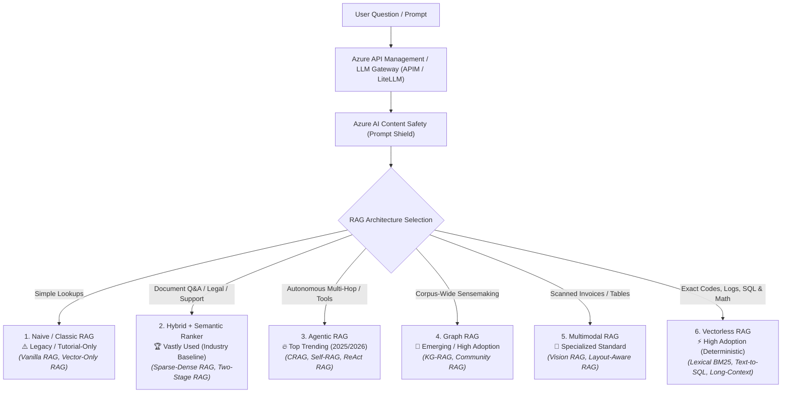
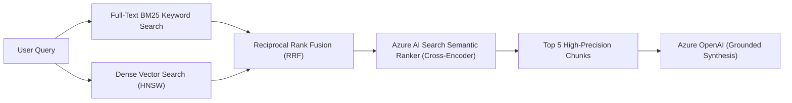
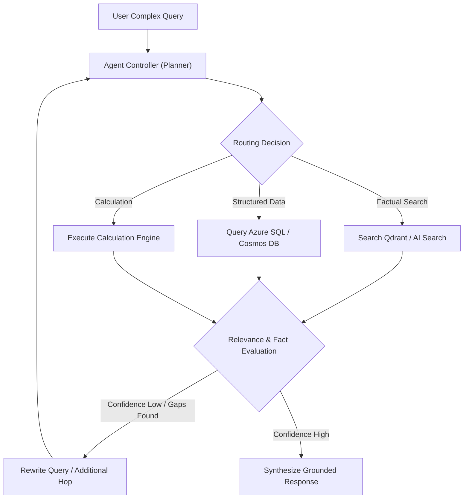
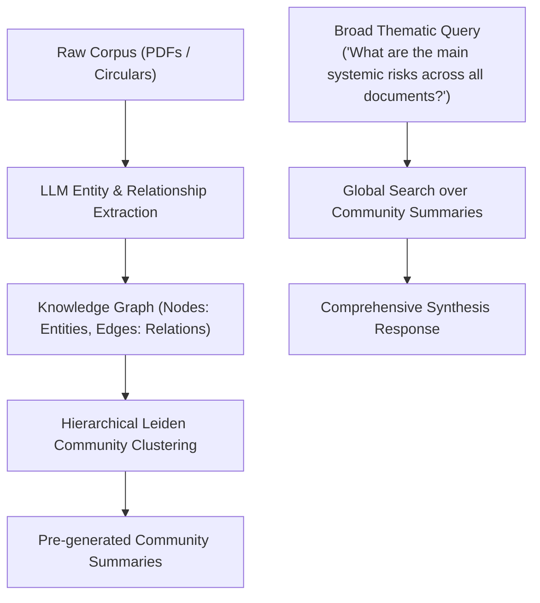
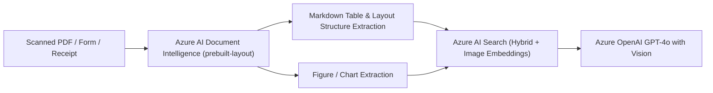

# 🧠 Enterprise Azure RAG Architectural Patterns & Adoption Guide

## 📌 Executive Summary

Retrieval-Augmented Generation (RAG) is the dominant architecture for grounding Large Language Models (LLMs) on private enterprise knowledge. In Microsoft Azure and modern AI platform engineering, RAG has evolved far beyond simple vector similarity search into sophisticated multi-stage, agentic, graph-augmented, and deterministic vectorless pipelines.

This document serves as the authoritative technical reference for **RAG Architectural Patterns on Microsoft Azure**, detailing the 6 major RAG paradigms, their **industry alternate names & aliases**, enterprise adoption lifecycle status, real-world production companies utilizing them, architectural components, cost-accuracy tradeoffs, and production implementations within this repository.

---

## 🗺️ Master Taxonomy of Azure RAG Types



---

## 📊 Master Azure RAG Comparison & Adoption Matrix

| RAG Pattern | Industry Alternate Names & Aliases | Industry Adoption Status | Accuracy & Precision | Latency Profile | Cost & Complexity | Recommended Azure Stack | Enterprise Production Verdict & Real-World Users |
| :--- | :--- | :--- | :--- | :--- | :--- | :--- | :--- |
| **1. Naive / Classic RAG** | • Vanilla RAG<br>• Basic Vector RAG<br>• Dense Retrieval RAG<br>• Bi-Encoder RAG<br>• Single-Hop Vector Search | ⚠️ **Legacy / Tutorial-Only**<br>*(Phase-out in Prod)* | ⭐⭐ (Low)<br>Misses exact keywords, section numbers & structural tables | ⚡ Ultra-Fast<br>(< 1.0s) | 💰 Lowest<br>🟢 Simple | Azure Cosmos DB Vector / AI Search (Free Tier) + GPT-4o-mini | **Do NOT use in Enterprise Production.** Great for quick POCs, but suffers from high hallucination rates and misses exact section numbers, error codes, and IDs. |
| **2. Hybrid RAG + Semantic Ranker** | • Sparse-Dense RAG<br>• Two-Stage Retrieval<br>• Retrieve-then-Rerank<br>• Fusion RAG (RRF)<br>• Cross-Encoder RAG<br>• Late-Interaction RAG | 🏆 **Vastly Used**<br>*(Current Industry Baseline)* | ⭐⭐⭐⭐⭐ (Very High)<br>Combines exact match + semantic intent + cross-encoder rerank | ⚡ Fast<br>(1.0 – 2.0s) | 💰 Low-Medium<br>🟡 Moderate | **Azure AI Search** (`Semantic Ranker`) + Azure OpenAI + APIM | **The Gold Standard for 80% of Enterprise Apps.** Balances low latency, high accuracy, and low maintenance. Default pattern for compliance, legal, support chatbots, and knowledge bases *(Implemented in TaxBot India)*. |
| **3. Agentic RAG** | • Autonomous RAG<br>• Corrective RAG (CRAG)<br>• Self-Reflective RAG (Self-RAG)<br>• Multi-Hop / Iterative RAG<br>• ReAct RAG (Reason + Act)<br>• Tool-Augmented RAG | 🔥 **Top Trending**<br>*(Fastest Growing in 2025/2026)* | ⭐⭐⭐⭐⭐ (Exceptional)<br>Self-evaluates & critiques retrieved context before responding | ⏳ Variable<br>(2.0 – 6.0s depending on reasoning hops) | 💰 Medium<br>🔴 High | **AKS / Container Apps** (LiteLLM, Qdrant) + **Semantic Kernel / LangGraph** | **The Future of Complex AI Systems.** Best when answers require multi-step reasoning, external calculators, SQL lookups, and auto-query rewriting upon low confidence *(Implemented in BankCompliance AI)*. |
| **4. Graph RAG** | • Knowledge-Graph RAG (KG-RAG)<br>• Entity-Centric RAG<br>• Community-Clustered RAG<br>• Microsoft GraphRAG<br>• Global Sensemaking RAG<br>• Topological RAG | 🔬 **Emerging / High Hype**<br>*(Rapid Enterprise Adoption)* | ⭐⭐⭐⭐⭐ (Holistic Sensemaking)<br>Superior for corpus-wide thematic synthesis | ⏳ Slow<br>(3.0 – 8.0s for global search) | 💰 High (LLM-heavy index phase)<br>🔴 High | **Microsoft GraphRAG** + **Azure Cosmos DB** (Gremlin/NoSQL) + Azure OpenAI | **Essential for "Sensemaking" & Auditing.** Solves the major blind spot of vector search: answering global questions like *"What are the top 5 recurring compliance risks across all 300 circulars?"* High indexing compute. |
| **5. Multimodal RAG** | • Vision RAG (V-RAG)<br>• Layout-Aware RAG<br>• Visual Document Understanding (VDU) RAG<br>• Table-Aware RAG<br>• OCR-Augmented RAG | 📄 **Specialized Standard**<br>*(Production Standard for Scans/PDFs)* | ⭐⭐⭐⭐ (High Visual Precision)<br>Preserves tables, graphs, and formatting | ⏳ Moderate<br>(2.0 – 4.0s) | 💰 Medium<br>🟡 Moderate | **Azure AI Document Intelligence** (`prebuilt-layout`) + Azure AI Search + **GPT-4o Vision** | **Indispensable for Real-World Paperwork.** Regular OCR loses table structures; Document Intelligence converts balance sheets, tax returns, and scanned invoices into Markdown tables before vectorizing. |
| **6. Vectorless RAG** | • Lexical / BM25-Only RAG<br>• Text-to-SQL / Schema RAG<br>• AST / Grep Code RAG<br>• In-Context / Long-Context RAG<br>• Deterministic IR RAG | ⚡ **High Adoption (Deterministic)**<br>*(Dominates Logs, Code, SQL & Math)* | ⭐⭐⭐⭐⭐ (Exact Match & Math)<br>Zero vector fuzziness; deterministic SQL calculations | ⚡ Ultra-Fast for BM25 (<0.1s)<br>⏳ Slower for 1M Long-Context | 💰 Lowest for BM25<br>💰 High for 1M Tokens | **Azure AI Search** (BM25 only) / **Azure SQL** / **Cosmos DB SQL** / **GPT-4o (128k)** | **Crucial for Structured Data & Deterministic Search.** Used by **GitHub Copilot** (code search), **Stripe/Klarna** (Text-to-SQL financial math), **Elastic/CrowdStrike** (log telemetry), and **Google NotebookLM** (Long-Context). |

---

## 🏷️ Complete RAG Terminology & Industry Aliases Cheat Sheet

When discussing architectures with cross-functional engineering teams, academic researchers, and cloud providers, use this vocabulary mapping:

```
┌────────────────────────────────────────────────────────────────────────────────────────┐
│                        RAG INDUSTRY VOCABULARY MAPPING TABLE                           │
├─────────────────────────┬──────────────────────────────────────────────────────────────┤
│ Architecture Category   │ Synonyms, Framework Terms & Industry Aliases                 │
├─────────────────────────┼──────────────────────────────────────────────────────────────┤
│ 1. Naive RAG            │ Vanilla RAG, Basic RAG, Vector-Only RAG, Dense Retrieval,    │
│                         │ Bi-Encoder Search, Flat Cosine Lookup, Single-Hop Retrieval. │
├─────────────────────────┼──────────────────────────────────────────────────────────────┤
│ 2. Hybrid RAG           │ Sparse-Dense Retrieval, Keyword+Vector Search, Two-Stage     │
│                         │ Retrieval, RRF Fusion, Cross-Encoder Rerank, Cohere Rerank,  │
│                         │ Azure Semantic Ranker, ColBERT Late-Interaction.             │
├─────────────────────────┼──────────────────────────────────────────────────────────────┤
│ 3. Agentic RAG          │ Corrective RAG (CRAG), Self-RAG, Adaptive RAG, ReAct Agent,  │
│                         │ Multi-Hop RAG, Toolformer RAG, Iterative RAG, Plan-and-Solve.│
├─────────────────────────┼──────────────────────────────────────────────────────────────┤
│ 4. Graph RAG            │ Knowledge Graph RAG (KG-RAG), Leiden Community RAG,          │
│                         │ Microsoft GraphRAG, Entity-Relationship RAG, Graph-Hop RAG.  │
├─────────────────────────┼──────────────────────────────────────────────────────────────┤
│ 5. Multimodal RAG       │ Vision RAG (V-RAG), LayoutLM RAG, OCR-RAG, Document RAG,     │
│                         │ Visual Document Understanding (VDU), Table-Preserving RAG.   │
├─────────────────────────┼──────────────────────────────────────────────────────────────┤
│ 6. Vectorless RAG       │ Lexical RAG, BM25-Only RAG, Text-to-SQL RAG, Schema-RAG,     │
│                         │ AST Code RAG, Long-Context In-Context RAG, Non-Vector RAG.   │
└─────────────────────────┴──────────────────────────────────────────────────────────────┘
```

---

## 🏢 Who Uses What in Real-World Production?

```
┌────────────────────────────────────────────────────────────────────────────────────────┐
│                        REAL-WORLD PRODUCTION IMPLEMENTATIONS                           │
├─────────────────────────┬─────────────────────────────┬────────────────────────────────┤
│ Company / Product       │ RAG Pattern Used            │ Why They Selected It           │
├─────────────────────────┼─────────────────────────────┼────────────────────────────────┤
│ 1. TaxBot India (Repo)  │ Hybrid + Semantic Ranker    │ Guarantees exact matches on    │
│                         │ (Azure AI Search)           │ tax sections (80C, 80CCD) with │
│                         │                             │ deep semantic understanding.   │
├─────────────────────────┼─────────────────────────────┼────────────────────────────────┤
│ 2. BankCompliance (Repo)│ Agentic RAG                 │ Multi-hop reasoning across RBI │
│                         │ (AKS + LiteLLM + Qdrant)    │ Master Directions & tool math. │
├─────────────────────────┼─────────────────────────────┼────────────────────────────────┤
│ 3. GitHub Copilot,      │ Vectorless AST / Grep RAG   │ Vector search fails on exact   │
│    Cursor & Sourcegraph │ (Language Server Protocol)  │ symbol names & function calls. │
│                         │                             │ AST/Ripgrep is 100x faster.    │
├─────────────────────────┼─────────────────────────────┼────────────────────────────────┤
│ 4. Stripe & Klarna      │ Vectorless Text-to-SQL RAG  │ Financial metrics & totals     │
│                         │ (PostgreSQL, Snowflake)     │ must be deterministic SQL math │
│                         │                             │ (vectors hallucinate numbers). │
├─────────────────────────┼─────────────────────────────┼────────────────────────────────┤
│ 5. Elastic & Splunk     │ Vectorless Inverted Index   │ Log telemetry contains exact   │
│                         │ (BM25 Elasticsearch)        │ IP hashes & error stack codes. │
├─────────────────────────┼─────────────────────────────┼────────────────────────────────┤
│ 6. Google NotebookLM    │ Vectorless Long-Context     │ Feeds whole 500-page handbooks │
│                         │ (1M-2M Token In-Context)    │ into context with zero chunks. │
└─────────────────────────┴─────────────────────────────┴────────────────────────────────┘
```

---

## 🔍 Deep-Dive: The 6 RAG Architectural Patterns

```
                               ┌────────────────────────────────────────────────────────┐
                               │                 6 RAG ARCHITECTURES                    │
                               └────────────────────────────────────────────────────────┘
            ┌──────────────────┬──────────────────┬──────────────────┬──────────────────┬──────────────────┬──────────────────┐
            ▼                  ▼                  ▼                  ▼                  ▼                  ▼
     1. NAIVE RAG       2. HYBRID + RERANK 3. AGENTIC RAG     4. GRAPH RAG       5. MULTIMODAL RAG  6. VECTORLESS RAG
     ┌────────────┐     ┌────────────────┐ ┌────────────────┐ ┌────────────────┐ ┌────────────────┐ ┌────────────────┐
     │ Embed Query│     │ BM25 + Vectors │ │ Planning Agent │ │ Entity Extract │ │ Doc Intelligence│ │ Deterministic  │
     │      ▼     │     │       ▼        │ │       ▼        │ │       ▼        │ │ (Markdown/OCR) │ │ Lexical / SQL  │
     │ Cosine Sim │     │   RRF Fusion   │ │ Dynamic Search │ │ Community Clust│ │       ▼        │ │       ▼        │
     │      ▼     │     │       ▼        │ │       ▼        │ │       ▼        │ │ Hybrid Vector  │ │ Exact Matches  │
     │ Direct LLM │     │Semantic Ranker │ │ Self-Correction│ │ Hierarchical Sum│ │       ▼        │ │       ▼        │
     │ Generation │     │       ▼        │ │       ▼        │ │       ▼        │ │  GPT-4o Vision │ │ Grounded LLM   │
     │            │     │ Grounded LLM   │ │ Tool Execution │ │ Thematic Synth │ │ Generation     │ │ Generation     │
     └────────────┘     └────────────────┘ └────────────────┘ └────────────────┘ └────────────────┘ └────────────────┘
```

---

### 1. Naive / Classic RAG (Single Vector Lookup)

> **Also Known As:** *Vanilla RAG, Basic Vector RAG, Dense Retrieval RAG, Bi-Encoder RAG, Flat Cosine Lookup.*

#### Architecture:
1. Ingest documents ➔ Chunk by character/token count ➔ Generate embeddings via `text-embedding-3-small`.
2. Store in vector database (Azure Cosmos DB Vector Search / Azure AI Search).
3. User query ➔ Convert to embedding ➔ Calculate Cosine Similarity ➔ Send Top-$K$ chunks to LLM.

#### Critical Failure Modes in Production:
* **The Exact-Match Blindspot:** Vector embeddings struggle with precise identifiers (e.g., Section numbers like `Section 80C`, error codes `ERR-403`, or Aadhaar/PAN formats).
* **Lost in the Middle:** Providing top-10 chunks without reranking overburdens the context window with low-relevance noise.
* **Structural Oblivion:** Splitting tables or markdown structures across chunk boundaries creates unintelligible fragments.

---

### 2. Advanced / Hybrid RAG with Semantic Reranking

> **Also Known As:** *Sparse-Dense RAG, Two-Stage Retrieval, Retrieve-then-Rerank, Fusion RAG (RRF), Cross-Encoder RAG, Late-Interaction RAG.*



#### Why It Is the Industry Baseline:
* **Dual Retrieval:** BM25 ensures exact keywords/identifiers are never missed, while dense vectors capture semantic synonyms and contextual intent.
* **Cross-Encoder Semantic Reranker:** Unlike bi-encoders (which compare embedding distances in isolation), Azure's Semantic Ranker reads the query and document chunk simultaneously through a deep transformer model, scoring true relevance.
* **Contextual Compression:** Condenses retrieved text from 50 candidates to the 3–5 highest quality passages, slashing token cost by 70% and drastically reducing hallucination.

#### Azure Production Stack:
* **Search Engine:** **Azure AI Search** (`Standard` or `Basic` tier with `Semantic Ranker` add-on).
* **Storage:** Azure Blob Storage for raw PDF/JSON regulatory documents.
* **API Gateway:** Azure API Management (APIM) with rate-limiting and prompt caching.
* **Compute:** Serverless Azure Functions (Python / TypeScript).

---

### 3. Agentic RAG (Autonomous Multi-Hop & Self-Correcting)

> **Also Known As:** *Autonomous RAG, Corrective RAG (CRAG), Self-Reflective RAG (Self-RAG), Multi-Hop RAG, ReAct RAG (Reason + Act), Tool-Augmented RAG.*



#### Why It Is Trending #1 in 2025/2026:
* **Corrective RAG (CRAG):** The retrieval evaluator grades retrieved passages. If low quality, it automatically reformulates the search query or triggers fallback retrieval paths.
* **Multi-Hop Reasoning:** Decomposes complex queries (e.g. *"Compare RBI capital adequacy ratios for NBFCs vs Commercial Banks and calculate the capital deficit for Bank X"*) into sequential sub-tasks.
* **Tool-Augmented Action:** The model doesn't just generate text—it invokes deterministic Python functions, database queries, and external APIs.

#### Azure Production Stack:
* **Orchestration:** **Microsoft Semantic Kernel**, **LangGraph**, or **Azure AI Agent Service**.
* **Microservices Compute:** **Azure Kubernetes Service (AKS)** with KEDA scale-to-zero.
* **LLM Gateway:** **LiteLLM Proxy** for multi-model failover, load balancing, and budget enforcement.
* **Vector Engine:** Self-hosted **Qdrant** on AKS with Azure Managed Disks.

---

### 4. Graph RAG (Knowledge Graph Augmented RAG)

> **Also Known As:** *Knowledge-Graph RAG (KG-RAG), Entity-Centric RAG, Community-Clustered RAG, Microsoft GraphRAG, Global Sensemaking RAG.*



#### Why It Is Emerging & Transformative:
* **The "Sensemaking" Problem:** Vector RAG excels at local needle-in-a-haystack search, but fails at global queries (e.g. *"What are the top 5 overarching compliance themes across 300 circulars?"*).
* **Hierarchical Community Summaries:** GraphRAG detects dense clusters of related entities across disparate documents and pre-summarizes them at multiple levels of granularity.
* **Graph Traversal:** Follows multi-degree connections between organizations, legal precedents, and regulatory circulars that vector proximity misses.

#### Azure Production Stack:
* **Framework:** **Microsoft Research GraphRAG** (Open Source).
* **Graph & Metadata Store:** **Azure Cosmos DB** (Apache Gremlin API / NoSQL).
* **Vector Store:** Azure AI Search.
* **LLM:** Azure OpenAI `gpt-4o` (for extraction and community summarization).

---

### 5. Multimodal RAG (Vision, Complex Tables & Scans)

> **Also Known As:** *Vision RAG (V-RAG), Layout-Aware RAG, Visual Document Understanding (VDU) RAG, Table-Aware RAG, OCR-Augmented RAG.*



#### Why It Is the Production Standard for Paperwork:
* **Preserves Structural Semantics:** Normal OCR turns tables into jumbled text strings where column headers lose alignment with row values. Azure AI Document Intelligence reconstructs tables into structured Markdown.
* **Visual Grounding:** Uses Vision-enabled LLMs (`gpt-4o`) to inspect charts, stamps, handwritten annotations, and visual signatures.

#### Azure Production Stack:
* **Document Extraction:** **Azure AI Document Intelligence** (`prebuilt-layout`).
* **Vector Index:** Azure AI Search with vector and text fields.
* **LLM:** Azure OpenAI `gpt-4o` (Multimodal).

---

### 6. Vectorless RAG (Lexical, Text-to-SQL & Long-Context)

> **Also Known As:** *Non-Vector RAG, Lexical BM25 RAG, Text-to-SQL RAG, Schema-Driven RAG, AST Code RAG, Long-Context In-Context RAG.*

```mermaid
flowchart TD
    Prompt["User Prompt"] --> Router{"Vectorless Strategy"}
    
    Router -->|Exact Keyword / Log Query| BM25["BM25 Inverted Index (Azure AI Search / Elasticsearch)"]
    Router -->|Financial Math & Analytics| SQL["Text-to-SQL Engine (Azure SQL / Cosmos DB)"]
    Router -->|Codebase Symbol Navigation| AST["AST / Language Server Protocol (Ripgrep / Tree-sitter)"]
    Router -->|Entire Manual (< 1M Tokens)| InContext["Direct Long-Context Window (GPT-4o 128k / Gemini 2M)"]
    
    BM25 & SQL & AST & InContext --> LLM["LLM Synthesis (Grounded Without Vector DB)"]
```

#### The 4 Production Flavors of Vectorless RAG:

1. **Lexical / BM25 Inverted Index RAG:**
   - Uses classical search tokenizers, inverted indexes, and BM25 scoring.
   - **Why:** 100% deterministic exact keyword matches on SKU codes, legal statute numbers (`Section 80CCD(2)`), and error codes (`ERR-502`). Zero embedding generation latency.
   - **Azure Stack:** Azure AI Search with full-text search analyzers (vector indexing disabled).

2. **Structured / Text-to-SQL RAG:**
   - The LLM receives database DDL schemas, writes SQL queries, executes them against relational databases, and explains the resulting rows.
   - **Why:** Vectors fail at mathematical sums, averages, and aggregations. Text-to-SQL produces 100% accurate financial computations.
   - **Azure Stack:** Azure SQL Database, Azure Cosmos DB (SQL API), or Azure Database for PostgreSQL.

3. **Codebase AST / LSP RAG:**
   - Used by AI IDEs and code copilots. Parses files into Abstract Syntax Trees (AST) and uses deterministic symbol definitions, references, and `ripgrep` instead of fuzzy vector embeddings.
   - **Why:** Exact method calls, interface implementations, and type definitions are retrieved with zero semantic fuzziness.

4. **In-Context Long-Context RAG (No-Retrieval):**
   - Feeds entire 500-page regulatory handbooks directly into modern large context windows (128k – 2M tokens) without chunking or vector databases.
   - **Why:** Zero retrieval engineering; preserves 100% of inter-chapter context.

---

## 🧭 Architectural Decision Playbook

```mermaid
graph TD
    Start["What is the primary business requirement?"] --> Q1{"What format is the raw source data?"}
    
    Q1 -->|Scanned PDFs, Invoices, Financial Tables| MM["5. Multimodal RAG<br>(Document Intelligence + GPT-4o)"]
    Q1 -->|Tabular Data, Relational SQL, Math| VLessSQL["6. Vectorless Text-to-SQL RAG<br>(Azure SQL / Cosmos DB)"]
    Q1 -->|Source Code, Function Symbols, Logs| VLessCode["6. Vectorless AST / BM25 RAG<br>(Ripgrep / Elasticsearch)"]
    Q1 -->|Digital Text, Articles, Markdown, HTML| Q2{"What nature of queries will users submit?"}
    
    Q2 -->|Direct Fact Extraction ('What is Rule 4?')| Hybrid["2. Hybrid RAG + Semantic Ranker<br>🏆 (Vastly Used Industry Standard)"]
    Q2 -->|Whole-Corpus Synthesis ('Summarize all 500 audit reports')| Graph["4. Graph RAG<br>🔬 (Emerging Sensemaking)"]
    Q2 -->|Multi-Step Reasoning, Calculations & Tools| Agent["3. Agentic RAG<br>🔥 (Top Trending in 2026)"]
```

---

## 🏗️ Implementations in This Repository

| Workload | RAG Type Implemented | Industry Aliases | Compute & Hosting | Retrieval Engine | LLM / Gateway | Key Files & References |
| :--- | :--- | :--- | :--- | :--- | :--- | :--- |
| **TaxBot India** | **Type 2: Hybrid RAG + Semantic Ranker** | Two-Stage RAG, Sparse-Dense RAG | Azure Functions (Consumption Y1) | Azure AI Search (F1/Basic) | Azure OpenAI (`gpt-4o-mini`) via APIM | [`workloads/tax-advisor/`](../../workloads/tax-advisor/)<br>[`app/tax-advisor/`](../../app/tax-advisor/) |
| **BankCompliance AI** | **Type 4: Agentic & Containerized RAG** | Corrective RAG (CRAG), Toolformer RAG | Azure Kubernetes Service (AKS Free Tier) | Qdrant Vector DB (StatefulSet) | LiteLLM Proxy + Content Safety | [`workloads/bank-compliance-ai-aks/`](../../workloads/bank-compliance-ai-aks/)<br>[`app/bank-compliance/`](../../app/bank-compliance/) |

---

## 📚 Related Documentation & Further Reading

* [Platform Overview & Subscriptions](01-platform-overview.md)
* [Terraform Infrastructure as Code Guide](02-terraform-iac-guide.md)
* [Monitoring & Telemetry Guide](07-monitoring-telemetry-guide.md)
* [BankCompliance AI Troubleshooting & Learnings](../BANK_COMPLIANCE_TROUBLESHOOTING_AND_LEARNINGS.md)
