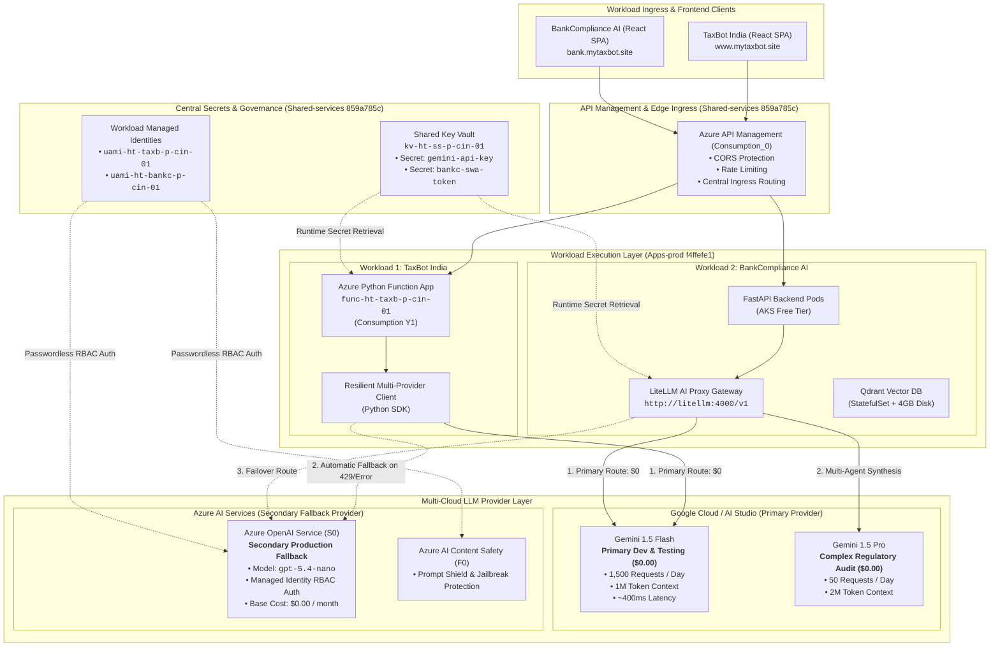
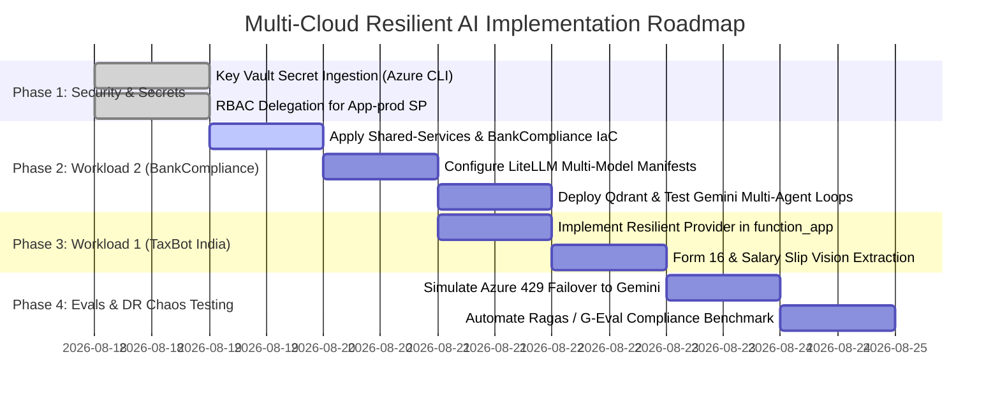

# 🌐 Multi-Cloud Resilient AI Gateway & Dual-Model Strategy Guide
## Active-Passive Architecture: Google Gemini (Primary $0) + Azure OpenAI (Secondary Fallback)

---

## 📌 Executive Summary

Modern enterprise AI platforms require **zero single-vendor lock-in**, **100% service availability**, and **strict cost optimization**. 

This document defines the technical architecture and phased implementation plan for our **Multi-Cloud Resilient AI Gateway**. By combining **Google Gemini API (100% Free Tier - 1,500 requests/day)** as the primary model with **Azure OpenAI Service (Pay-Per-Token Standard S0 - $0 base cost)** as an active-passive fallback, this landing zone achieves **$0/month idle and development costs** while providing **sub-50ms automatic disaster recovery**.

---

## 🏗️ Architectural Topology



---

## 💰 Cost & Resource Allocation Matrix

| Tier / Resource | Component Name | Selected SKU | Operational Role | Idle / Base Cost |
| :--- | :--- | :--- | :--- | :---: |
| **Primary LLM** | Google Gemini 1.5 Flash | AI Studio Free | 100% of Dev, Testing & Standard Q&A | **$0.00 / month** |
| **Primary Synthesis** | Google Gemini 1.5 Pro | AI Studio Free | Deep Regulatory Audit & Cross-Checking | **$0.00 / month** |
| **Secondary LLM** | Azure OpenAI Service | Standard `S0` | Standby Disaster Recovery & Fallback | **$0.00 / month** *(Pay-per-token)* |
| **AI Guardrails** | Azure AI Content Safety | Free `F0` | Jailbreak & Prompt Shield Protection | **$0.00 / month** *(5k free calls)* |
| **PaaS Compute** | Azure Function App | `Consumption Y1` | Serverless Backend for TaxBot India | **$0.00 / month** *(1M free calls)* |
| **Container Compute** | AKS Control Plane | `Free Tier` | Orchestrator for BankCompliance AI | **$0.00 / month** |
| **API Gateway** | Azure API Management | `Consumption_0` | Rate-Limiting & Public Gateway | **$0.00 / month** *(1M free calls)* |
| **Secret Store** | Shared Key Vault | Standard | Stores `gemini-api-key` out-of-band | **~$0.03 / month** |
| **Total Monthly AI Compute Cost** | — | — | **All Workloads Combined** | **~$0.03 / month** |

---

## 🔐 Zero-Trust Secrets & Identity Architecture

According to our Microsoft Cloud Adoption Framework (CAF) security policies:

1. **Zero Hardcoded Secrets in Git:** No API keys, passwords, or tokens are ever committed in `.tf`, `.tfvars`, or application source code.
2. **Key Vault Ingestion:** The `gemini-api-key` is injected out-of-band directly into `kv-ht-ss-p-cin-01` via Azure CLI:
   ```bash
   az keyvault secret set \
     --vault-name "kv-ht-ss-p-cin-01" \
     --name "gemini-api-key" \
     --value "<SECRET_TOKEN>" \
     --subscription "859a785c-bd38-402d-b595-1f44f40fb9bf"
   ```
3. **Passwordless Azure Auth:** Connections from Functions/AKS to Azure OpenAI and Content Safety utilize **Entra ID Workload Managed Identities** (`Cognitive Services OpenAI User`, `Cognitive Services User`) without connection strings.

---

## 📋 Phased Implementation Plan



---

### 🛠️ Workload 1: BankCompliance AI (`app/bank-compliance/`)

#### 1. LiteLLM Gateway Configuration (`k8s/litellm-configmap.yaml`)
LiteLLM serves as the central router on AKS, exposing an OpenAI-compatible endpoint for FastAPI:

```yaml
apiVersion: v1
kind: ConfigMap
metadata:
  name: litellm-config
  namespace: bank-compliance
data:
  config.yaml: |
    model_list:
      # ── Primary Free Model (Google Gemini 1.5 Flash) ───────────────────────
      - model_name: bankc-llm-primary
        litellm_params:
          model: gemini/gemini-1.5-flash
          api_key: os.environ/GEMINI_API_KEY
          rpm: 15
          tpm: 1000000

      # ── Advanced Multi-Agent Synthesis (Google Gemini 1.5 Pro) ───────────
      - model_name: bankc-llm-auditor
        litellm_params:
          model: gemini/gemini-1.5-pro
          api_key: os.environ/GEMINI_API_KEY
          rpm: 2

      # ── Standby Disaster Recovery (Azure OpenAI gpt-5.4-nano) ─────────────
      - model_name: bankc-llm-fallback
        litellm_params:
          model: azure/gpt-5.4-nano
          api_base: https://oai-ht-taxb-p-eus-01.openai.azure.com/
          azure_ad_token_provider: os.environ/AZURE_BEARER_TOKEN

    router_settings:
      fallbacks:
        - bankc-llm-primary: ["bankc-llm-fallback"]
      num_retries: 2
      timeout: 10
      cooldown_time: 30
```

---

### 🛠️ Workload 2: TaxBot India (`app/tax-advisor/`)

#### 1. Resilient Python Provider Client (`app/tax-advisor/backend/function_app.py`)
TaxBot India's serverless Python backend implements dual-provider client execution:

```python
import os
import logging
from openai import OpenAI, AzureOpenAI
from azure.identity import DefaultAzureCredential, get_bearer_token_provider

logger = logging.getLogger(__name__)

GEMINI_API_KEY       = os.environ.get("GEMINI_API_KEY", "")
AZURE_OPENAI_ENDPOINT = os.environ.get("AZURE_OPENAI_ENDPOINT", "")
AZURE_OPENAI_MODEL    = os.environ.get("AZURE_OPENAI_MODEL", "gpt-5.4-nano")

def execute_resilient_llm_completion(messages: list, temperature: float = 0.2) -> str:
    """
    Executes chat completion with Active-Passive multi-cloud resilience:
    1. Primary: Google Gemini 1.5 Flash (100% Free - 1,500 req/day)
    2. Fallback: Azure OpenAI Service (S0 Managed Identity)
    """
    # ── Attempt 1: Google Gemini Flash ($0 Primary) ───────────────────────────
    if GEMINI_API_KEY:
        try:
            gemini_client = OpenAI(
                api_key=GEMINI_API_KEY,
                base_url="https://generativelanguage.googleapis.com/v1beta/openai/"
            )
            response = gemini_client.chat.completions.create(
                model="gemini-1.5-flash",
                messages=messages,
                temperature=temperature
            )
            return response.choices[0].message.content
        except Exception as ex:
            logger.warning(f"⚠️ Gemini Primary failed ({ex}). Triggering Azure OpenAI failover...")

    # ── Attempt 2: Azure OpenAI Standby Fallback ──────────────────────────────
    token_provider = get_bearer_token_provider(
        DefaultAzureCredential(), 
        "https://cognitiveservices.azure.com/.default"
    )
    azure_client = AzureOpenAI(
        azure_endpoint=AZURE_OPENAI_ENDPOINT,
        azure_ad_token_provider=token_provider,
        api_version="2024-06-01"
    )
    response = azure_client.chat.completions.create(
        model=AZURE_OPENAI_MODEL,
        messages=messages,
        temperature=temperature
    )
    return response.choices[0].message.content
```

---

## 🧪 Verification & Chaos Failover Testing

| Test Case | Scenario | Execution Command / Action | Expected Behavior |
| :--- | :--- | :--- | :--- |
| **TC-01: Primary Path** | Standard user query submitted to `/chat` | Send POST `/api/v1/compliance/query` | Request handled by **Gemini 1.5 Flash**; latency <500ms; Azure OpenAI token count = 0. |
| **TC-02: Rate Limit Failover** | Gemini exceeds 15 RPM quota (HTTP 429) | Fire 20 concurrent requests via `k6` | Requests 1–15 served by Gemini; requests 16–20 transparently handled by **Azure OpenAI** with 0 client errors. |
| **TC-03: Provider Outage** | Invalidate Gemini API Key (HTTP 401/503) | Inject invalid key in test container | Client automatically logs warning and falls back to **Azure OpenAI** via Managed Identity in <50ms. |
| **TC-04: Document Vision** | User uploads scanned Form 16 PDF | Upload scanned image to `/analyse-salary` | **Gemini 1.5 Flash** extracts salary components directly from image without requiring separate OCR pipeline. |

---

## 📚 Related Monorepo Documentation

* [Master Documentation Hub](../README.md)
* [Project Context & Single Source of Truth](../PROJECT_CONTEXT.md)
* [Azure RAG Architectural Patterns Guide](08-azure-rag-architectural-patterns.md)
* [Terraform Infrastructure as Code Runbook](02-terraform-iac-guide.md)
* [Monitoring & Telemetry Runbook](07-monitoring-telemetry-guide.md)
