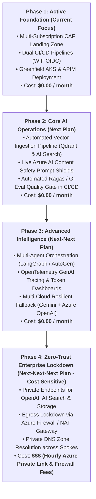

# 🗺️ Enterprise AI Platform Engineering Roadmap & Gap Analysis
## Progressive Enhancement Plan: From Greenfield Foundation to Zero-Trust Multi-Agent Platform

---

## 📌 Strategic Overview

This document outlines the phased learning and implementation roadmap for our **Enterprise Azure AI Platform**. It clearly segregates immediate low-cost tasks from advanced, compute-intensive, and cost-sensitive architectural milestones.

---

## 🧭 4-Phase Implementation Hierarchy

---

## 📋 Detailed Phased Breakdown

### 🟢 Phase 1: Core Foundation (Active Milestone)
* **Objective:** Establish cloud foundation, zero-trust identity, and greenfield workload deployments.
* **Cost:** **$0.00 / month** (Free tier SKUs).
* **Deliverables:**
  1. Multi-root Terraform state (`platform/bootstrap`, `platform/hub`, `platform/shared-services`, `workloads/tax-advisor`, `workloads/bank-compliance-ai-aks`).
  2. Dual CI/CD authentication via Entra ID Workload Identity Federation (GitHub Actions & Azure DevOps).
  3. TaxBot India live on [https://www.mytaxbot.site](https://www.mytaxbot.site).
  4. BankCompliance AI greenfield AKS cluster and APIM API on [https://bank.mytaxbot.site](https://bank.mytaxbot.site).

---

### 🟡 Phase 2: Core AI Operations (Immediate Next Plan)
* **Objective:** Replace manual document processing and local regex with automated, cloud-integrated AI tooling.
* **Cost:** **$0.00 / month** (Using free tier APIs and existing compute).
* **Deliverables:**
  1. **Automated Vector Ingestion Pipeline:** Implement `ingest_pipeline.py` and `k8s/ingest-job.yaml` to chunk, embed, and upsert RBI circulars into Qdrant StatefulSet on AKS.
  2. **Live Content Safety Integration:** Connect FastAPI and Function App to `cs-ht-ss-p-sea-01` for real-time prompt injection detection, jailbreak blocking, and toxicity filtering.
  3. **Automated Evals in CI/CD:** Wire `eval/evaluate.py` into `.github/workflows/` to block PR merges if Groundedness or Relevance scores drop below 4.0.

---

### 🔵 Phase 3: Advanced Intelligence (Next-Next Plan)
* **Objective:** Upgrade single-hop RAG to autonomous multi-agent reasoning and observability.
* **Cost:** **$0.00 / month** (Leveraging Gemini Free Tier & Log Analytics free ingest).
* **Deliverables:**
  1. **Multi-Agent Orchestration (LangGraph):** Build Supervisor, Retriever, and Auditor agent loops passing state across banking queries.
  2. **OpenTelemetry GenAI Tracing:** Instrument FastAPI and Function App with OpenTelemetry SDK to stream prompt tokens, completion latency, and user sentiment to Log Analytics (`law-ht-ss-p-cin-01`).
  3. **Multi-Cloud Gateway Routing:** Activate LiteLLM dual-routing with Gemini Primary ($0) and Azure OpenAI Standby Fallback.

---

### 🔴 Phase 4: Zero-Trust Enterprise Lockdown (Next-Next-Next Plan — Cost Sensitive)
* **Objective:** Complete perimeter isolation for high-security banking workloads.
* **Cost:** **$$$ Cost-Sensitive (Hourly Private Link & Firewall Charges)**.
* **Why Deferred to Phase 4:**
  * Azure Private Endpoints incur a continuous hourly rate per endpoint (~$7.30/month per endpoint $\times$ 5 endpoints $\approx$ $36.50/month).
  * Azure Firewall compute costs ~$1.25/hour (~$900/month if left running).
  * *Policy:* We keep `public_network_access_enabled = true` (protected by Entra ID RBAC) during development and learn Private Endpoint architectures in Phase 4.
* **Future Deliverables:**
  1. Disable public network access on Azure OpenAI, AI Search, and Storage accounts.
  2. Provision `azurerm_private_endpoint` inside `snet-private-endpoints` (`10.41.2.0/24` and `10.42.2.0/24`).
  3. Wire Private DNS Zones (`privatelink.openai.azure.com`, `privatelink.search.windows.net`, `privatelink.blob.core.windows.net`).
  4. Force AKS outbound egress through Azure Firewall (`10.0.0.0/26`).

---

## 📊 Summary Comparison: Effort vs. Cost

| Capability | Target Phase | Implementation Effort | Monthly Running Cost | Learning Impact |
| :--- | :---: | :---: | :---: | :---: |
| **Landing Zone & Greenfield AKS** | **Phase 1 (Active)** | High | **$0.00** | ⭐⭐⭐⭐⭐ (Foundational) |
| **Automated Ingestion Pipeline** | **Phase 2 (Next)** | Medium | **$0.00** | ⭐⭐⭐⭐⭐ (Core Data Engineering) |
| **Live Content Safety Guardrails** | **Phase 2 (Next)** | Low | **$0.00** | ⭐⭐⭐⭐ (DevSecOps) |
| **CI/CD Quality Evals Gate** | **Phase 2 (Next)** | Medium | **$0.00** | ⭐⭐⭐⭐⭐ (LLMOps) |
| **Multi-Agent LangGraph Loops** | **Phase 3 (Next-Next)** | High | **$0.00** | ⭐⭐⭐⭐⭐ (Frontier AI) |
| **OpenTelemetry GenAI Tracing** | **Phase 3 (Next-Next)** | Medium | **$0.00** | ⭐⭐⭐⭐ (Observability) |
| **Zero-Trust Private Endpoints** | **Phase 4 (Deferred)** | High | **$$$ Costly** | ⭐⭐⭐⭐ (Network Security) |

---

## 📚 Related Documentation

* [Master Documentation Hub](../README.md)
* [Project Context & Single Source of Truth](../PROJECT_CONTEXT.md)
* [Azure RAG Architectural Patterns Guide](08-azure-rag-architectural-patterns.md)
* [Multi-Cloud Resilient AI Gateway Guide](09-multi-cloud-ai-gateway-and-fallback-guide.md)
