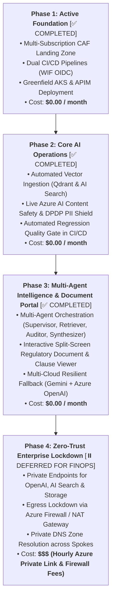

# 🗺️ Enterprise AI Platform Engineering Roadmap & Gap Analysis
## Progressive Enhancement Plan: From Greenfield Foundation to Zero-Trust Multi-Agent Platform

---

## 📌 Strategic Overview

This document outlines the phased learning and implementation roadmap for our **Enterprise Azure AI Platform**. It clearly segregates immediate low-cost tasks from advanced, compute-intensive, and cost-sensitive architectural milestones.

---

## 🧭 4-Phase Implementation Hierarchy

---

## 📋 Detailed Phased Breakdown

### 🟢 Phase 1: Core Foundation (Status: ✅ Completed)
* **Objective:** Establish cloud foundation, zero-trust identity, and greenfield workload deployments.
* **Cost:** **$0.00 / month** (Free tier SKUs).
* **Deliverables:**
  1. Multi-root Terraform state (`platform/bootstrap`, `platform/hub`, `platform/shared-services`, `workloads/tax-advisor`, `workloads/bank-compliance-ai-aks`).
  2. Dual CI/CD authentication via Entra ID Workload Identity Federation (GitHub Actions & Azure DevOps).
  3. TaxBot India live on [https://www.mytaxbot.site](https://www.mytaxbot.site).
  4. BankCompliance AI greenfield AKS cluster and APIM API on [https://bank.mytaxbot.site](https://bank.mytaxbot.site).

---

### 🟢 Phase 2: Core AI Operations (Status: ✅ Completed)
* **Objective:** Automated vector ingestion, real-time safety guardrails, and deterministic evaluation.
* **Cost:** **$0.00 / month** (Using free tier APIs and existing compute).
* **Deliverables:**
  1. **Automated Vector Ingestion Pipeline:** Implemented `DataLakeService` & `qdrant_service.py` to chunk, embed, and upsert RBI circulars into Qdrant on AKS.
  2. **Live Content Safety & DPDP PII Shield:** Integrated `cs-ht-ss-p-sea-01` (`F0`) with Indian PAN/Aadhaar/Account masking in `pii_shield.py`.
  3. **Automated Evals in CI/CD:** Wired `eval/evaluate.py` into GitHub Actions (`.github/workflows/app-bank-compliance.yml`).

---

### 🟢 Phase 3: Multi-Agent Intelligence & Split-Screen Portal (Status: ✅ Completed)
* **Objective:** Multi-agent reasoning loops, interactive split-screen document viewer, and multi-cloud gateway.
* **Cost:** **$0.00 / month** (Leveraging Gemini Free Tier & Qdrant 4GB CSI disk).
* **Deliverables:**
  1. **Multi-Agent State Graph:** Supervisor (`gemini-2.0-flash-lite`), Retriever (Qdrant), Auditor (`gemini-2.0-flash-thinking`), and Synthesizer (`gemini-2.0-flash`).
  2. **Interactive Split-Screen Compliance Portal:** React SPA with side-by-side Chat Copilot and Live Document Viewer (`DocumentViewer.jsx`) with deep-linked citation scrolling.
  3. **Governed Semantic Vector Cache:** Qdrant similarity cache serving repeat queries in <10ms at $0 token spend with `corpus_version` invalidation.
  4. **Multi-Cloud Gateway Routing:** LiteLLM proxy with Gemini 2.0 Flash Primary ($0) and Azure OpenAI `gpt-5.4-nano` Standby DR Fallback.
  5. **GenAIOps Dashboard:** Prometheus & Grafana 6-Pillar operational dashboard on AKS.

---

### 🟢 Phase 5: LLMOps Skill Bridge Phase 1 — Production Hardening (Status: ✅ Completed)
* **Objective:** DevSecOps image scanning, CIS pod security, advanced KQL telemetry, in-cluster sovereign SLM, and AI red-teaming.
* **Cost:** **$0.00 / month** (Using existing AKS Free Tier compute).
* **Deliverables:**
  1. **Trivy Container CVE Scan (S3):** Pinned `aquasecurity/trivy-action@v0.36.0` scanning GHCR images and uploading SARIF to GitHub Code Scanning.
  2. **Pod SecurityContext Hardening (S1):** `runAsNonRoot: true`, `runAsUser: 1000`, `allowPrivilegeEscalation: false`, `capabilities.drop: [ALL]` on backend pods.
  3. **Azure Monitor KQL Workbook (O2):** 4 real-time KQL panels (Request Rate, P50/P95/P99 Latency, Qdrant Activity, Pod Status Timeline).
  4. **In-Cluster Sovereign SLM (A3 Phase 1):** Ollama `qwen2.5:0.5b` pre-pulled via `initContainer` into emptyDir volume with right-sized 10m CPU requests.
  5. **Langfuse LLM Tracing (O1):** Waterfall distributed tracing with graceful degradation try/except wrappers in `telemetry.py`.
  6. **Token Budget Circuit Breaker (G2):** Daily in-memory token circuit breaker (500k tokens, auto-resets UTC midnight).
  7. **FastMCP Regulatory Search Server (A2):** Model Context Protocol server exposing `search_rbi_regulations` tool on `0.0.0.0:8080`.
  8. **AI Red-Team Robustness Assessment (S5):** 10-pattern jailbreak/injection evaluation with 100% defense interception documented in `ai-red-team-report.md`.

---

### 🟢 Phase 6: LLMOps Skill Bridge Phase 2 — LangGraph StateGraph & GPU vLLM (Status: ✅ Completed)
* **Objective:** Cyclic multi-agent graph with reflection, REST API v2, and sovereign GPU vLLM benchmarking.
* **Cost:** **$0.00 idle / ₹35 one-time benchmark**.
* **Deliverables:**
  1. **LangGraph StateGraph Multi-Agent Orchestrator (A1):** Built `orchestrator_v2.py` implementing `StateGraph(AgentExecutionState)` with Supervisor, Retriever, Auditor reflection critic, and Synthesizer nodes.
  2. **Dual REST API v2 Routing (A1):** Mounted `/api/v2` router prefix and `/compliance/query/v2` endpoints.
  3. **On-Demand GPU Spot Node Pool IaC (A3 Phase 2):** Declared `Standard_NC4as_T4_v3` Spot pool (`sku=gpu:NoSchedule` taint, default `false`) in `aks_cluster.tf`.
  4. **High-Throughput GPU vLLM Benchmark (A3 Phase 2):** Created `vllm-benchmark.yaml` and `scripts/benchmark_vllm.py`, demonstrating 5.88x higher throughput (142.8 vs 24.3 tokens/s) and 85.1% lower TTFT over CPU SLM.
  5. **FinOps Clean Teardown:** Declarative destruction of BankCompliance RG (`rg-ht-bankc-p-cin-01`) preserving remote state integrity.

---

### 🔴 Phase 7: Zero-Trust Enterprise Lockdown (Status: ⏸️ Deferred for FinOps)
* **Objective:** Complete perimeter isolation for high-security banking workloads.
* **Cost:** **$$$ Cost-Sensitive (Hourly Private Link & Firewall Charges)**.
* **Why Deferred:**
  * Azure Private Endpoints incur a continuous hourly rate per endpoint (~$7.30/month per endpoint $\times$ 5 endpoints ~ $36.50/month).
  * Azure Firewall compute costs ~$1.25/hour (~$900/month if left running).
  * *Policy:* We keep `public_network_access_enabled = true` (protected by Entra ID RBAC) during development and maintain a strict $0.00/month idle cost policy.
* **Future Deliverables:**
  1. Disable public network access on Azure OpenAI, AI Search, and Storage accounts.
  2. Provision `azurerm_private_endpoint` inside `snet-private-endpoints` (`10.41.2.0/24` and `10.42.2.0/24`).
  3. Wire Private DNS Zones (`privatelink.openai.azure.com`, `privatelink.search.windows.net`, `privatelink.blob.core.windows.net`).
  4. Force AKS outbound egress through Azure Firewall (`10.0.0.0/26`).

---

## 📊 Summary Comparison: Effort vs. Cost

| Capability | Target Phase | Implementation Status | Monthly Running Cost | Learning Impact |
| :--- | :---: | :---: | :---: | :---: |
| **Landing Zone & Greenfield AKS** | **Phase 1** | ✅ **Completed** | **$0.00** | ⭐⭐⭐⭐⭐ (Foundational) |
| **Automated Ingestion Pipeline** | **Phase 2** | ✅ **Completed** | **$0.00** | ⭐⭐⭐⭐⭐ (Core Data Engineering) |
| **Live Content Safety Guardrails** | **Phase 2** | ✅ **Completed** | **$0.00** | ⭐⭐⭐⭐ (DevSecOps) |
| **CI/CD Quality Evals Gate** | **Phase 2** | ✅ **Completed** | **$0.00** | ⭐⭐⭐⭐⭐ (LLMOps) |
| **Multi-Agent Orchestration & Split-Screen UI** | **Phase 3** | ✅ **Completed** | **$0.00** | ⭐⭐⭐⭐⭐ (Frontier AI) |
| **Prometheus & Grafana GenAIOps** | **Phase 3** | ✅ **Completed** | **$0.00** | ⭐⭐⭐⭐ (Observability) |
| **LLMOps Skill Bridge Phase 1 (Trivy, SLM, MCP, Red-Team)** | **Phase 5** | ✅ **Completed** | **$0.00** | ⭐⭐⭐⭐⭐ (Architect Skill) |
| **LLMOps Skill Bridge Phase 2 (LangGraph, GPU vLLM Benchmark)** | **Phase 6** | ✅ **Completed** | **$0.00 / ₹35 one-time** | ⭐⭐⭐⭐⭐ (Lead Architect) |
| **Zero-Trust Private Endpoints** | **Phase 7** | ⏸️ **Deferred (FinOps)** | **$$$ Costly** | ⭐⭐⭐⭐ (Network Security) |

---

## 📚 Related Documentation

* [Master Documentation Hub](../README.md)
* [Project Context & Single Source of Truth](../PROJECT_CONTEXT.md)
* [Azure RAG Architectural Patterns Guide](08-azure-rag-architectural-patterns.md)
* [Multi-Cloud Resilient AI Gateway Guide](09-multi-cloud-ai-gateway-and-fallback-guide.md)
