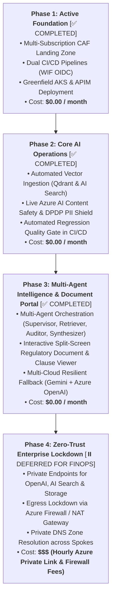

# 🗺️ Enterprise AI Platform Engineering Roadmap & Gap Analysis
## Progressive Enhancement Plan: From Greenfield Foundation to Zero-Trust Multi-Agent Platform

---

## 📌 Strategic Overview

This document outlines the phased learning and implementation roadmap for our **Enterprise Azure AI Platform**. It clearly segregates immediate low-cost tasks from advanced, compute-intensive, and cost-sensitive architectural milestones.

---

## 🧭 4-Phase Implementation Hierarchy

---

## 📋 Detailed Phased Breakdown

### 🟢 Phase 1: Core Foundation (Status: ✅ Completed)
* **Objective:** Establish cloud foundation, zero-trust identity, and greenfield workload deployments.
* **Cost:** **$0.00 / month** (Free tier SKUs).
* **Deliverables:**
  1. Multi-root Terraform state (`platform/bootstrap`, `platform/hub`, `platform/shared-services`, `workloads/tax-advisor`, `workloads/bank-compliance-ai-aks`).
  2. Dual CI/CD authentication via Entra ID Workload Identity Federation (GitHub Actions & Azure DevOps).
  3. TaxBot India live on [https://www.mytaxbot.site](https://www.mytaxbot.site).
  4. BankCompliance AI greenfield AKS cluster and APIM API on [https://bank.mytaxbot.site](https://bank.mytaxbot.site).

---

### 🟢 Phase 2: Core AI Operations (Status: ✅ Completed)
* **Objective:** Automated vector ingestion, real-time safety guardrails, and deterministic evaluation.
* **Cost:** **$0.00 / month** (Using free tier APIs and existing compute).
* **Deliverables:**
  1. **Automated Vector Ingestion Pipeline:** Implemented `DataLakeService` & `qdrant_service.py` to chunk, embed, and upsert RBI circulars into Qdrant on AKS.
  2. **Live Content Safety & DPDP PII Shield:** Integrated `cs-ht-ss-p-sea-01` (`F0`) with Indian PAN/Aadhaar/Account masking in `pii_shield.py`.
  3. **Automated Evals in CI/CD:** Wired `eval/evaluate.py` into GitHub Actions (`.github/workflows/app-bank-compliance.yml`).

---

### 🟢 Phase 3: Multi-Agent Intelligence & Split-Screen Portal (Status: ✅ Completed)
* **Objective:** Multi-agent reasoning loops, interactive split-screen document viewer, and multi-cloud gateway.
* **Cost:** **$0.00 / month** (Leveraging Gemini Free Tier & Qdrant 4GB CSI disk).
* **Deliverables:**
  1. **Multi-Agent State Graph:** Supervisor (`gemini-2.0-flash-lite`), Retriever (Qdrant), Auditor (`gemini-2.0-flash-thinking`), and Synthesizer (`gemini-2.0-flash`).
  2. **Interactive Split-Screen Compliance Portal:** React SPA with side-by-side Chat Copilot and Live Document Viewer (`DocumentViewer.jsx`) with deep-linked citation scrolling.
  3. **Governed Semantic Vector Cache:** Qdrant similarity cache serving repeat queries in <10ms at $0 token spend with `corpus_version` invalidation.
  4. **Multi-Cloud Gateway Routing:** LiteLLM proxy with Gemini 2.0 Flash Primary ($0) and Azure OpenAI `gpt-5.4-nano` Standby DR Fallback.
  5. **GenAIOps Dashboard:** Prometheus & Grafana 6-Pillar operational dashboard on AKS.

---

### 🔴 Phase 4: Zero-Trust Enterprise Lockdown (Status: ⏸️ Deferred for FinOps)
* **Objective:** Complete perimeter isolation for high-security banking workloads.
* **Cost:** **$$$ Cost-Sensitive (Hourly Private Link & Firewall Charges)**.
* **Why Deferred to Phase 4:**
  * Azure Private Endpoints incur a continuous hourly rate per endpoint (~$7.30/month per endpoint $\times$ 5 endpoints ~ $36.50/month).
  * Azure Firewall compute costs ~$1.25/hour (~$900/month if left running).
  * *Policy:* We keep `public_network_access_enabled = true` (protected by Entra ID RBAC) during development and maintain a strict $0.00/month idle cost policy.
* **Future Deliverables:**
  1. Disable public network access on Azure OpenAI, AI Search, and Storage accounts.
  2. Provision `azurerm_private_endpoint` inside `snet-private-endpoints` (`10.41.2.0/24` and `10.42.2.0/24`).
  3. Wire Private DNS Zones (`privatelink.openai.azure.com`, `privatelink.search.windows.net`, `privatelink.blob.core.windows.net`).
  4. Force AKS outbound egress through Azure Firewall (`10.0.0.0/26`).

---

## 📊 Summary Comparison: Effort vs. Cost

| Capability | Target Phase | Implementation Status | Monthly Running Cost | Learning Impact |
| :--- | :---: | :---: | :---: | :---: |
| **Landing Zone & Greenfield AKS** | **Phase 1** | ✅ **Completed** | **$0.00** | ⭐⭐⭐⭐⭐ (Foundational) |
| **Automated Ingestion Pipeline** | **Phase 2** | ✅ **Completed** | **$0.00** | ⭐⭐⭐⭐⭐ (Core Data Engineering) |
| **Live Content Safety Guardrails** | **Phase 2** | ✅ **Completed** | **$0.00** | ⭐⭐⭐⭐ (DevSecOps) |
| **CI/CD Quality Evals Gate** | **Phase 2** | ✅ **Completed** | **$0.00** | ⭐⭐⭐⭐⭐ (LLMOps) |
| **Multi-Agent Orchestration & Split-Screen UI** | **Phase 3 / 10** | ✅ **Completed** | **$0.00** | ⭐⭐⭐⭐⭐ (Frontier AI) |
| **Prometheus & Grafana GenAIOps** | **Phase 3** | ✅ **Completed** | **$0.00** | ⭐⭐⭐⭐ (Observability) |
| **Zero-Trust Private Endpoints** | **Phase 4** | ⏸️ **Deferred (FinOps)** | **$$$ Costly** | ⭐⭐⭐⭐ (Network Security) |

---

## 📚 Related Documentation

* [Master Documentation Hub](../README.md)
* [Project Context & Single Source of Truth](../PROJECT_CONTEXT.md)
* [Azure RAG Architectural Patterns Guide](08-azure-rag-architectural-patterns.md)
* [Multi-Cloud Resilient AI Gateway Guide](09-multi-cloud-ai-gateway-and-fallback-guide.md)
