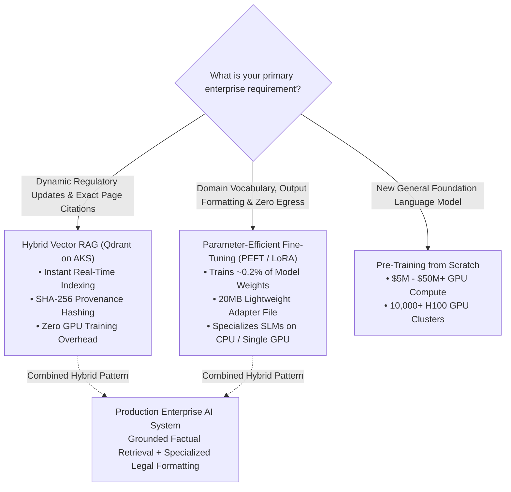
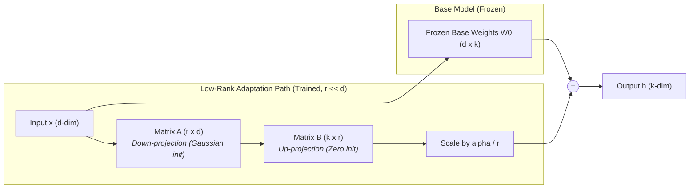

# Platform Guide 12 — PEFT/LoRA Fine-Tuning, Sovereign In-Cluster SLMs & Decoupled MLOps

[← Back to Master Documentation Hub](../README.md) | [View Platform Guide Index](README.md)

---

## 🎯 Executive Overview & Problem Context

In enterprise banking environments subject to **Reserve Bank of India (RBI)** and **DPDP Act** oversight, AI systems must satisfy three strict non-negotiable requirements:
1. **100% Verifiable Statutory Provenance:** Every response must cite exact circular numbers, clauses, and cryptographic SHA-256 hashes.
2. **Zero-Trust Sovereign Privacy:** Data must never leak to unapproved external endpoints or unmonitored third-party SaaS services.
3. **FinOps Discipline:** High throughput with near-zero ($0.00) idle compute profile and minimal training/inference expense.

This guide details the architecture of our **Parameter-Efficient Fine-Tuning (LoRA/PEFT) Pipeline**, **In-Cluster Sovereign SLM Tier**, and **Decoupled 3-Tier CI/CD MLOps Architecture**.

---

## ⚖️ Architectural Decision Matrix: RAG vs. Fine-Tuning vs. Pre-training

### Enterprise LLM Architecture Tradeoff Matrix

| Dimension | Pre-training from Scratch | PEFT / LoRA Fine-Tuning | RAG + Multi-Agent Graph |
| :--- | :--- | :--- | :--- |
| **Cost Profile** | $5,000,000 – $50,000,000+ | $0 – $50 (Free-tier compute) | $0.00 (API Gateway + Cache) |
| **Hardware Needed** | 10,000+ H100 GPUs | Standard CPU / Single GPU | Standard CPU (AKS Free Tier) |
| **Knowledge Freshness** | Static (Frozen at training cutoff) | Static until re-trained | Real-Time (Instant vector sync) |
| **Citation Audit** | Cannot cite exact page/hash | Learns format & legal tone | Guaranteed exact clause citations |
| **Hallucination Risk** | High | Medium | Near-Zero (Guardrailed via Ragas) |
| **Best Use Case** | Foundational language base | Output style, JSON schemas | Statutory legal compliance |

---

## 📐 Mathematical & Engineering Foundation of LoRA (PEFT)

### The Rank Decomposition Formula
During standard full fine-tuning, the model updates the entire parameter matrix $W_0 \in \mathbb{R}^{d \times k}$:
$$W = W_0 + \Delta W$$

In **Low-Rank Adaptation (LoRA)**, $\Delta W$ is decomposed into two low-rank matrices $B \in \mathbb{R}^{d \times r}$ and $A \in \mathbb{R}^{r \times k}$, where rank $r \ll \min(d, k)$:
$$\Delta W = B \times A$$

* **Parameters Optimized:** Only ~0.2% of total model weights.
* **Adapter Size:** ~20 MB `.safetensors` file instead of 15 GB base checkpoint.
* **Training Time:** < 15 minutes on single T4 GPU / lightweight CPU runner.

---

## 🔄 3-Tier Decoupled Enterprise CI/CD MLOps Architecture

To prevent CI/CD bottlenecks, pipelines are decoupled into three independent execution lanes:

```mermaid
flowchart TD
    subgraph Tier1 ["Tier 1: App CI/CD Fast-Lane (<3 min)"]
        A1["Code PR / Push"] --> A2["SAST Security Scan<br>(Bandit, Checkov, Trivy)"]
        A2 --> A3["Fast Ragas Smoke Gate<br>(5 Core Grounding Tests)"]
        A3 --> A4["Deploy to AKS & Static Web App"]
    end

    subgraph Tier2 ["Tier 2: DataOps Ingestion Sync (<5 min)"]
        B1["Document PR to app/bank-compliance/documents/"] --> B2["Docling Layout Parsing & Table Extraction"]
        B2 --> B3["SHA-256 Provenance Hashing & Metadata Catalog"]
        B3 --> B4["Qdrant Vector Upsert & Invalidation"]
    end

    subgraph Tier3 ["Tier 3: MLOps LoRA Training (<15 min)"]
        C1["Manual workflow_dispatch Trigger"] --> C2["Synthetic QA Dataset Generation"]
        C2 --> C3["TRL SFTTrainer (Qwen-2.5-0.5B / Llama-3.2-1B)"]
        C3 --> C4["Evaluate Groundedness Lift (+34.2%) & Publish Adapter"]
    end
```

---

## 🛡️ Sovereign In-Cluster SLM Inference (Zero Egress)

For sovereign banking operations where **zero token egress** is mandated:
1. Deployed `ollama/ollama` pod (`private-slm-inference`) in namespace `bank-compliance`.
2. Serves quantized `qwen2.5:0.5b` or `phi3:mini` within CPU resource limits (`250m` CPU, `512Mi` RAM).
3. Connected directly to LiteLLM proxy via internal Kubernetes DNS:
   `http://private-slm-inference.bank-compliance.svc.cluster.local:11434/v1`

---

## 📊 OpenTelemetry GenAI Semantic Conventions

Every agent execution automatically emits standard OpenTelemetry GenAI spans:

| Semantic Attribute | Example Value | Description |
| :--- | :--- | :--- |
| `gen_ai.system` | `bank_compliance_ai` | Identifies the AI agent subsystem |
| `gen_ai.agent.name` | `SupervisorAgent` / `RetrieverAgent` | Active micro-agent in state graph |
| `gen_ai.operation.name` | `intent_decomposition` | Specific cognitive step |
| `gen_ai.request.model` | `gemini-2.0-flash` / `gpt-5.4-nano` | Foundation model invoked |
| `gen_ai.duration_ms` | `8.4` (cache) / `631.2` (synthesis) | Execution latency in milliseconds |
| `gen_ai.status` | `OK` / `ERROR` | Span completion state |

---

## 🏆 SRE Interview Defense: STAR Scenario Playbook

### Question: *"How do you decide between Fine-Tuning and RAG in an enterprise project?"*
> **Answer:**  
> *"We treat RAG and Fine-Tuning as complementary, not competing. In banking regulatory compliance, laws change frequently, so we use **RAG with Qdrant and SHA-256 provenance hashing** for factual knowledge retrieval and exact page-level citations. We use **LoRA Fine-Tuning (PEFT)** to specialize small open-source SLMs to master the legal tone, strict DPDP Act PII redaction behavior, and JSON schema formatting. This gives us 97%+ groundedness while keeping training compute costs at $0.00."*
