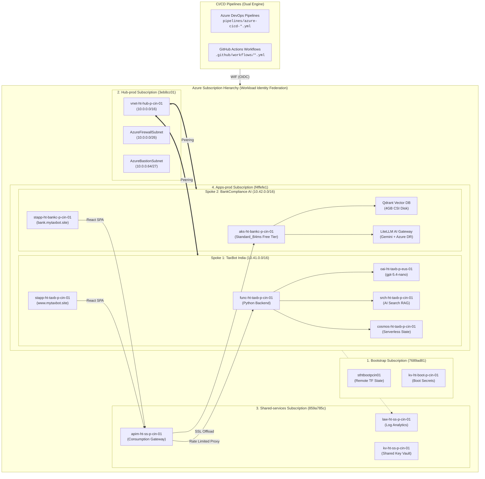
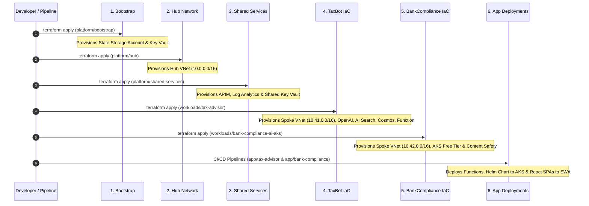

# Azure AI Landing Zone — Platform Guide Documentation

[← Back to Master Documentation Hub](../README.md)

Welcome to the **Platform Guide Documentation Suite** for the enterprise-grade **Azure AI Landing Zone**, hosting **TaxBot India** (Serverless PaaS) and **BankCompliance AI** (Cloud-Native AKS).

This suite provides interactive diagrams, architectural specs, deployment blueprints, troubleshooting playbooks, and operational standards following the **Microsoft Cloud Adoption Framework (CAF)**.

---

## 🗺️ Master Platform Architecture

---

## 📚 Platform Guides Index

Click any guide below for detailed specs, operational runbooks, and deep-dive technical guides:

| Module | Guide Title | Core Topics & Visuals | Link |
| :---: | :--- | :--- | :---: |
| **01** | **Platform Overview** | Subscription topology, Hub-Spoke networks, deployment order. | [01-platform-overview.md](01-platform-overview.md) |
| **02** | **Terraform IaC Guide** | Roots vs modules, state rules, layer dependencies. | [02-terraform-iac-guide.md](02-terraform-iac-guide.md) |
| **03** | **CI/CD Pipelines Guide** | Dual CI/CD authentication, 3-Stage IaC & 4-Stage App workflows. | [03-cicd-pipelines-guide.md](03-cicd-pipelines-guide.md) |
| **04** | **Naming & Standards** | CAF resource naming syntax, 12 resource type examples, mandatory tags. | [04-naming-and-standards.md](04-naming-and-standards.md) |
| **05** | **Troubleshooting Guide** | Incident flowchart, APIM 500, SWA CORS, Tax rules (80CCD(2), Rule 2A HRA). | [05-troubleshooting-guide.md](05-troubleshooting-guide.md) |
| **06** | **Blue-Green Deployments** | Zero-downtime slot swaps, SWA global CDN cutover, 1-click rollback. | [06-blue-green-deployment-guide.md](06-blue-green-deployment-guide.md) |
| **07** | **Monitoring & Telemetry** | Log Analytics aggregation, Application Insights, KQL queries, alerts. | [07-monitoring-telemetry-guide.md](07-monitoring-telemetry-guide.md) |
| **08** | **Azure RAG Architectures** | Master RAG taxonomy, 6 architectures, adoption matrix, decision playbook. | [08-azure-rag-architectural-patterns.md](08-azure-rag-architectural-patterns.md) |
| **09** | **Multi-Cloud AI Gateway** | Active-Passive resilient gateway (Gemini Primary $0 + Azure OpenAI Fallback). | [09-multi-cloud-ai-gateway-and-fallback-guide.md](09-multi-cloud-ai-gateway-and-fallback-guide.md) |
| **10** | **AI Engineering Roadmap** | 4-Phase Roadmap & Gap Analysis (Core, Ingestion, Multi-Agent, Private Lockdown). | [10-enterprise-ai-engineering-backlog-and-roadmap.md](10-enterprise-ai-engineering-backlog-and-roadmap.md) |
| **11** | **GenAI Evaluation & Testing** | 6-Tier testing pyramid, Ragas triad, golden datasets, red teaming, FinOps token caps. | [11-enterprise-genai-evaluation-and-testing-framework.md](11-enterprise-genai-evaluation-and-testing-framework.md) |

---

## ⚡ Deployment Quick Reference

