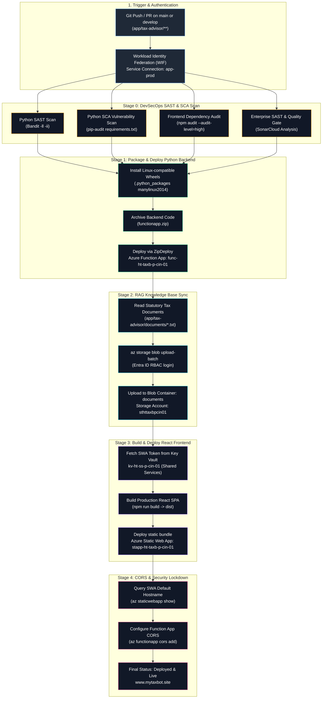
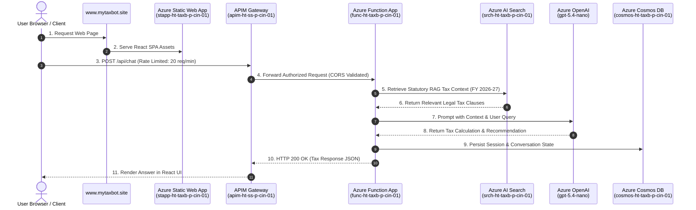

# TaxBot India — Application CI/CD Pipeline & Architecture Flow

This document details the **CI/CD Pipeline Execution Flow** and **Runtime Traffic Architecture** for the TaxBot India (`workloads/tax-advisor`) workload.

> **Pipeline Definition File**: [`pipelines/azure-cicd-app-tax-advisor.yml`](file:///c:/Users/RichT/OneDrive/Documents/Repos/migrate/terraform-azure-iac/pipelines/azure-cicd-app-tax-advisor.yml)  
> **Target Subscription**: `Apps-prod` (`f4ffefe1-d689-4059-969c-ccc73e2a11d4`) via `app-prod` Service Connection (WIF OIDC)

---

## 1. CI/CD Pipeline Execution Flow

---

## 2. Live Runtime Sequence Architecture

---

## 3. Stage & Task Breakdown

| Stage ID | Stage Name | Operational Tasks & Scans | Target Azure Resource |
| :--- | :--- | :--- | :--- |
| **Stage 0** | **DevSecOps Security Scan** | `Bandit` (Python SAST), `pip-audit` (SCA), `npm audit` (Frontend), `SonarCloud` Analysis | Build Agent / SonarCloud |
| **Stage 1** | **Deploy Backend** | Python 3.11 wheel packaging (`manylinux2014_x86_64`), `ZipDeploy` | Function App `func-ht-taxb-p-cin-01` |
| **Stage 2** | **Upload RAG Docs** | Entra ID RBAC login (`--auth-mode login`), batch upload 15 FY 2026-27 text files | Storage Account `sthttaxbpcin01/documents` |
| **Stage 3** | **Deploy Frontend** | Fetch token from Key Vault `kv-ht-ss-p-cin-01`, Vite React build (`npm run build`), SWA deploy | Static Web App `stapp-ht-taxb-p-cin-01` |
| **Stage 4** | **CORS & Security** | Resolve SWA hostname, update allowed origins on Function App | Azure Function App CORS config |
